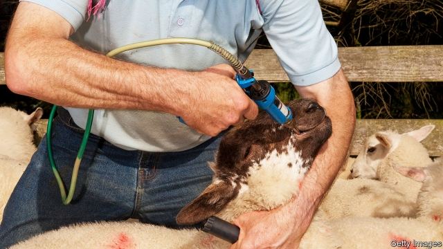

###### Animal husbandry

# Nematode parasites kill a lot of sheep 

 

> print-edition iconPrint edition | Science and technology | Nov 23rd 2019 

CROWD ANIMALS together and one likely outcome is parasitic infestation. This has been a problem since the beginning of animal husbandry. Many scholars, for instance, suspect that the origins of religious dietary laws forbidding the consumption of pig meat lie in pigs’ susceptibility to worms that are harmful to human beings. But they are also harmful to animals. They are, for example, the largest cause of natural death among the world’s sheep. 

Nowadays, at least where farmers have access to modern veterinary facilities, the usual approach to infestation is to administer vermicidal drugs (see picture). These often work. But, as with any such approach to parasites and pathogens, extensive use has encouraged the evolution of resistance. Many worms have become immune to at least one of the commonly used vermicides. Some are immune to all three. 

What has not been tried until recently is to apply the principles of selective breeding that are employed to improve meat, milk, wool and hide production to the question of parasite control. That has changed with work done in Britain by Hannah Vineer at the University of Bristol and Eric Morgan at Queen’s University Belfast. As they report in the International Journal for Parasitology, selective breeding of sheep for resistance to nematode-worm infestation works. And, crucially, it works without detriment to the desirable characteristics of lamb weight, ewe weight and milk yield. 

That worms like nematodes are, to human sensibilities, revolting creatures with revolting lives is surely the result of millions of years of co-evolution that has favoured avoiding any contact with them. Infestation starts when a host accidentally consumes a nematode’s eggs. The parasites then hatch, grow and mature in the host’s stomach or intestines, where they consume nutrients which that host would otherwise absorb. Once mature, they release eggs that are broadcast into the world in the host’s faeces, and the cycle starts again. 

Dr Vineer and Dr Morgan knew from earlier work that the number of eggs so broadcast varies a lot from animal to animal. This led them to wonder if selectively mating together individuals that passed few eggs in their faeces, and so seemed resistant to infestation, might result in strains that were parasite-free. 

To find out, they teamed up with two farmers in south-west England who had already been experimenting informally with such breeding programmes. Following up on a decade of this informal work, farmers and academics spent a further four years systematising and recording in detail what was happening. They discovered that the approach worked. On one farm the faecal nematode-egg count per animal dropped by a quarter. On the other it fell by a third. In neither case were desirable characteristics of body weight or milk yield harmed. 

Falls in infestation of a quarter to a third are not as dramatic as those caused by vermicides. However, the hostile physiological environment that has brought about such falls is likely to have many dimensions, making it harder to evolve around than the toxic effect of a single drug molecule—or even three of them. So, though this is a small pilot study, it certainly looks worth following up. If larger investigations confirm Dr Vineer’s and Dr Morgan’s findings, then explicitly breeding sheep, and possibly other livestock, for parasite resistance would seem a good idea. Animals would start out healthier and would need less worming-by-drug. And that would make resistance to those drugs less likely to evolve in the first place.■ 

