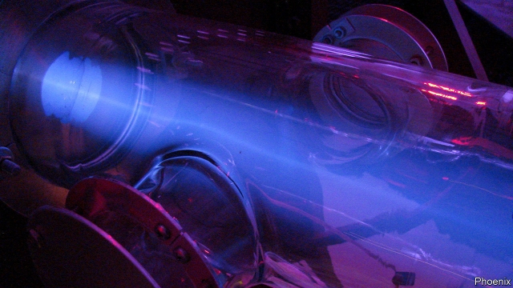

###### Diagnostic nuclear-imaging

# New ways to make molybdenum-99 

 

> print-edition iconPrint edition | Science and technology | Nov 23rd 2019 

ONE FEAR raised by those who oppose Britain’s leaving the European Union without a deal is that the import of radioactive isotopes for medicine would be at risk. These short-lived substances might, people worry, encounter bureaucratic obstacles that slowed down their delivery and thus increased the fraction lost to radioactive decay. 

Particular concern surrounds molybdenum-99 (99Mo), the workhorse of diagnostic nuclear-imaging. 99Mo, which has a half-life of just 66 hours, decays into a substance called technetium-99m (99mTc) that has a half-life of six hours. 99mTc emits gamma rays, so its location in the body is easy to see using appropriate cameras. And it can be incorporated into a variety of chemicals, called radiopharmaceuticals, that accumulate preferentially in different bodily organs. This lets doctors observe what is going on in those organs. About 80% of diagnostic nuclear-imaging of this kind involves 99mTc, so without a continuous supply of 99Mo to make it from, this whole branch of medicine would grind to a halt. 

For American doctors, who carry out 40,000 scans a day involving 99mTc, the threat is not hypothetical. In 2009 America’s clinics and hospitals were cut off for several weeks from their main supplier, Canadian Nuclear Laboratories, by a leak that caused the shutdown of the reactor used to make the isotope. Last year the cut-off became permanent when the reactor was closed. There are other manufacturers, but they are in Europe, South Africa and Australia. So the American government is encouraging new ones to step in—and is sponsoring new ways to make the stuff. 

The current process bombards uranium enriched in a fissile isotope, 235U, with high-velocity neutrons from a reactor. Absorbing a neutron causes an atom of 235U to split in two (the same process lies at the heart of nuclear power stations and uranium atom bombs). 99Mo is a common product of this fission, and can be separated chemically from the bombarded uranium with reasonable ease. 

Some people, however, think they have better ways to make 99Mo—ways that do not involve a reactor. Niowave, a firm in Lansing, Michigan, is one such. Instead of neutrons, its researchers are firing high-velocity electrons at enriched uranium. They speed the electrons up to something approaching that of light using a machine called a linear accelerator, then launch them into a uranium target, splitting its 235U atoms, after which 99Mo can be extracted from the target in the normal way. 

Niowave’s accelerator employs superconductivity to generate the powerful electric currents needed to achieve all this. That requires a suitable material, niobium, to carry the current, and a suitable temperature, that of liquid helium, to make the niobium superconducting. 

Mike Zamiara, Niowave’s boss, says the firm has already made test batches of 99Mo. The company plans to pump up the volume over the next few years. The aim is to reach commercial levels in 2025. By 2026, Mr Zamiara says, Niowave should be able to supply 40% of American demand. 

Phoenix, a firm in Monona, Wisconsin, plans to make 99Mo more conventionally—by neutron bombardment. The unconventional part of its approach is the neutrons’ source. Instead of a fission reactor, Phoenix employs a small-scale version of a process that some hope will one day lead to fusion reactors (and which already lies at the heart of hydrogen bombs). Like Niowave’s, this method starts with a particle accelerator. The particles accelerated, though, are not electrons but deuterons. 

A deuteron is the atomic nucleus of a type of heavy hydrogen called deuterium, and consists of a proton and a neutron. Phoenix’s neutron generators fire deuterons into chambers full of tritium, an even heavier form of hydrogen that has a proton and two neutrons as its nucleus. A high-speed collision between a deuteron and a tritium nucleus causes the two to fuse, creating helium (two protons and two neutrons) and spitting out a neutron. Properly tweaked, such a neutron generator can produce 46 trillion of the particles a second. 

Evan Sengbusch, Phoenix’s president, says the company is supplying eight accelerators for a new isotope factory to be run by its collaborator, SHINE Medical of Janesville, also in Wisconsin. SHINE’s boss, Greg Piefer, says the facility will be finished in 2021, with the first production shortly thereafter. By 2023, he hopes, SHINE will be the biggest supplier of 99Mo in the world. ■ 

