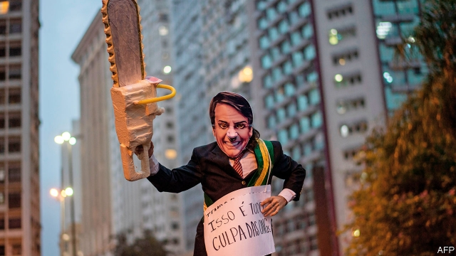

###### Paper strongman

# The strange passivity of Jair Bolsonaro 

 

> print-edition iconPrint edition | The Americas | Nov 23rd 2019 

THE PRESIDENTS of Brazil’s two houses of congress live side by side in modern mansions in Brasília, the capital. In May they built a door in the wall that divides their gardens, so they could meet without attracting notice. The political mood was fevered. A scandal involving the oldest son of President Jair Bolsonaro was dominating the news. Worries about whether the government would reform the unaffordable pension system had pushed the real, Brazil’s currency, to less than 25 American cents for the first time since October. 

The garden-gate gambit seemed to work. On October 22nd congress enacted a constitutional reform of the pension system that will save the government 800bn reais ($196bn) over ten years, about 10% of this year’s GDP. The change is a big step towards solving two of the country’s main problems: a massive public debt; and state spending that is both too high and skewed towards transfers and salaries. (The real remains weak for other reasons.) 

Mr Bolsonaro, a right-wing populist who has been in office since January, had little to do with the reform. The fight was led by Rodrigo Maia, the president of the lower house of congress, and his counterpart in the senate, Davi Alcolumbre. Their main ally in government was the pro-market economy minister, Paulo Guedes. The president, normally the main pitchman for any reform, kept a low profile. 

His bystander role is one of the many oddities of his administration. Brazilians elected the former army captain, until 2017 an obscure congressman with a fondness for dictators, to express anger at crime, corruption and economic decline. Although he entered office sounding like a strongman, he has been hemmed in by congress, by his advisers and by his own ill-judged behaviour and that of his family. This balance of forces has contained some of his dangerous impulses while allowing better policies, like pension reform, to get through. It has also frustrated progress in areas where voters most expect it. 

Mr Bolsonaro’s plans for fighting crime and corruption are in tatters. Unemployment is high and economic growth remains sluggish. The president’s approval rating is an unimpressive 35%. His socially conservative agenda, which includes loosening gun laws and curbing “socialism” in schools, has made little progress, even though he seems to care most about it. In other areas he has reversed himself: for example, he has dropped his earlier hostility towards China. 

The clearest way in which Mr Bolsonaro has put his stamp on Brazil is negative. On November 18th the space agency reported that the pace of deforestation of the Amazon had risen by nearly 30% in August 2018-July 2019 from the same period a year before. It reached its highest level since 2008. He has been a cheerleader for economic development in the Amazon and weakened enforcement of environmental laws. 

The splintering of power in Brasília makes it hard to guess how the remaining three years of Mr Bolsonaro’s presidency will play out. The release from jail on November 8th of Luiz Inácio Lula da Silva, who was Brazil’s president from 2003 to 2010, gives the left-wing opposition the leader it has lacked until now. Some observers wonder whether scandals surrounding Mr Bolsonaro’s sons, who are given to anti-democratic rants, will bring his presidency to an early end. 

Optimists think that strife and chaos in Brasília will not hinder reforms, and might even help. A member of the government’s economic team contends that Mr Bolsonaro’s preoccupation with fighting culture wars serves as a “smokescreen” that allows Mr Guedes and Mr Maia to take the lead on economic legislation. In congress there is “an unprecedented consensus that we must make progress on the economic agenda, independent of the government”, says the lower-house leader, Mr Maia. 

That consensus may not hold. This month Mr Guedes proposed a trio of constitutional changes, including one to make it possible to freeze public servants’ pay in a fiscal emergency. But he did not tell congress which to prioritise. An overhaul of the enterprise-crushing tax system is “necessary”, says Aguinaldo Ribeiro, who is co-ordinating one in the lower house, “but no one can agree on the details”. 

The mood may be shifting against the state-slimming reforms favoured by Mr Guedes. “No one is talking about health or education policy,” says Tabata Amaral, who belongs to a “parliamentary front” of first-time legislators who defied their parties to vote in favour of pensions reform. They want action to improve social services. The window for reforms is closing, warns Zeina Latif of XP Investimentos, a broker. 

On measures to fight corruption it has slammed shut. Mr Bolsonaro had raised hopes by naming as his justice minister Sergio Moro, who as a federal judge had led the Lava Jato (Car Wash) investigations. These led to the conviction of scores of politicians and businessmen. Mr Moro convicted Lula, the most prominent of the Lava Jato miscreants. 

But now all three branches of government are working against the anti-corruption agenda. Mr Bolsonaro has lost enthusiasm, perhaps because his son Flávio, a Rio de Janeiro senator, is a target of a money-laundering probe. Mr Moro has been hurt by revelations that as a judge he collaborated improperly with prosecutors. His omnibus bill to fight crime and corruption is stuck in a lower-house committee. “Moro’s agenda is dead,” says Eduardo Cury, a legislator from São Paulo. It cannot help that dozens of legislators besides Flávio Bolsonaro are under investigation. 

The judiciary itself has dealt Lava Jato a blow. This month the supreme court ruled that convicts should remain at liberty until they exhaust their appeals, the decision that led to Lula’s release. That threatens the investigations, whose success is based largely on plea bargains by suspects who avoid jail by implicating other wrongdoers. Now witnesses can put off prison instead by appealing their verdicts. 

“There’s little appetite” for Mr Bolsonaro’s socially conservative agenda, says Fernando Bezerra, the government’s leader in the senate. In the face of congressional opposition the president withdrew a decree to allow millions of Brazilians to carry guns. The legislature has also pushed back against destruction of the Amazon. As wildfires raged in September Mr Maia pushed through the lower house a measure to compensate small farmers and indigenous groups for preserving forest. 

Congress’s more assertive role is among the bigger surprises of Mr Bolsonaro’s surprising presidency. “For the first time the legislature is not just an appendix of the executive,” says Michel Temer, who was Brazil’s president from 2016 to 2018. That has helped economic reform. But congress cannot be trusted to contain corruption. Nor is it likely to still the chainsaws. ■ 

