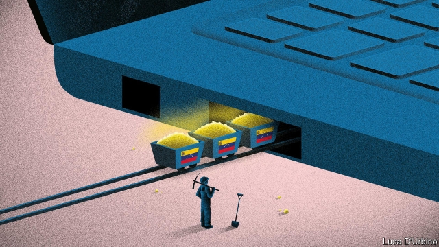

###### Fantasy economics

# Venezuela’s paper currency is worthless, so its people seek virtual gold 

 

> print-edition iconPrint edition | The Americas | Nov 23rd 2019 

CORRUPTION, INCOMPETENCE and sanctions have devastated Venezuela’s oil industry, the country’s main source of hard currency. But Venezuela’s economic crisis has encouraged the growth of another: the “farming” of virtual gold in the artificial worlds created by video games. Venezuelans spend hours on end playing massively multiplayer online roleplaying games (MMORPGS) to extract gold coins (the currency in RuneScape) or crystal ones (Tibia). They sell these for real money, via intermediary websites, to other gamers, who spend them on such virtual valuables as weapons, armour and magic potions. 

Venezuelans playing RuneScape can earn 500,000-2m gold pieces an hour by mass-murdering dragons and mass-producing runes. At current exchange rates 1m coins are worth about 50 cents. A gold farmer can earn $40 a month, a tidy sum in a country where the minimum wage is worth $7.50 a month. Some farmers trade the coins for Bitcoin, which, though more volatile than most conventional currencies, is more stable than Venezuela’s bolívar. (The mining of real gold, some of it illegal, is another source of income for desperate Venezuelans.) 

“Real-world trading” is not new. It began in the smoke-filled gaming rooms of South Korea in the late 1990s. In China in the mid-2000s perhaps 50,000 “gold farms” harvested virtual gold round the clock. The farmers collectively earned hundreds of millions of untaxed dollars. 

Game developers resisted. Gold farmers are not really playing the game, they contend. Some hack into other people’s accounts and steal their virtual gold. Excess gold farming can cause in-game inflation—though less than the 200,000% that the IMF forecasts for Venezuela this year. Some providers of free games sell virtual gold themselves, and dislike competition from unlicensed gold farmers. 

After its heyday in the 2000s gold farming declined. MMORPGS became less popular. Game developers beefed up their compliance teams. EBay, where gamers auctioned virtual goods, banned gold farming, as did South Korea. Lately, though, MMORPGs have had a nostalgia-fuelled comeback, and gold farmers in crisis-hit Venezuela have been quick to profit. 

Their assiduity irks other players. It has degraded the buying power of gold coins on the Grand Exchange, a RuneScape market where players can buy virtual necessities such as coal, maple logs, scimitars and green dragon hides (which can be turned into armour). When Venezuela suffered nationwide power cuts this year, sales of these goods nosedived. That is because “farmers” without electricity could not produce any gold, and the lack of virtual coin forced up the prices of imaginary kit. 

Two years ago a Reddit user who calls himself Cerael published a racially abusive guide on how to kill Venezuelans in the “player-v-player” places where gold farming occurs. Moderators removed the post and the intemperate comments on it. Jagex, RuneScape’s British developer, has banned real-world trading and intermediary websites. This month the company won a lawsuit that put two gold farming websites out of business. 

Yet the industry will not die. Although developers want the games to be competitions of skill and dedication, illicit markets will form wherever supply and demand exist (a truth that is lost on Venezuela’s socialist leaders). When one intermediary website is shut down, a new one pops up to replace it. The resources required to shut down each small-scale Venezuelan gold farmer are too large to make the effort cost-effective. It is not worth the game developer’s time “to enforce the rules at that level of granularity”, says Edward Castronova, who researches virtual worlds at Indiana University. 

The recent re-release of “World of Warcraft Classic”, the 15-year-old original version of a popular MMORPG, will probably give gold farming another fillip. And so long as it is hard to make a living in the real Venezuela, plenty of Venezuelans will toil in the world of fantasy.■ 

