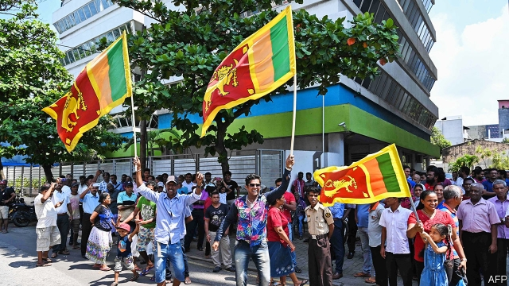
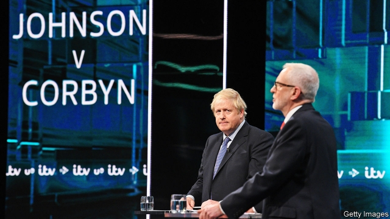

###### Hong Kong in revolt

# Politics this week 

 

> Nov 23rd 2019 

Sri Lanka’s presidential election was won by Gotabaya Rajapaksa, the younger brother of Mahinda Rajapaksa, a former president who oversaw the bloody end to an insurrection by Tamil separatists. Gotabaya Rajapaksa was defence secretary during the fighting. His Sinhala-Buddhist nationalist campaign pledged to wipe out terrorism, following attacks at Easter by jihadists, in which 268 people died. The elder Mr Rajapaska will be prime minister. See article. 

Police shot rubber bullets at the protesters occupying Hong Kong Polytechnic University. Most of the students eventually left the campus. Meanwhile, a court in Hong Kong overturned a ban on wearing masks in the protests, finding it contravened the territory’s Basic Law. The decision was denounced by China’s National People’s Congress, which suggested that only it had the power to rule on constitutional issues in Hong Kong. See article. 

The American Congress passed the Hong Kong Freedom and Democracy bill, a largely symbolic act that will anger China and encourage the protesters. Donald Trump is expected to sign it. 

America walked out of talks in Seoul with South Korea in a dispute about paying for American troops stationed in the country. South Korean politicians say America wants $5bn a year, five times what it is getting now from the South Korean government. See article. 

The Taliban released two academics, one American and one Australian, whom it had held captive since 2016, in exchange for three militants. Afghanistan’s president, Ashraf Ghani, said the swap of hostages for prisoners was necessary to kick-start peace talks with the jihadists. 

Gordon Sondland, America’s ambassador to the EU and the star witness in the impeachment inquiry into Donald Trump, gave his public testimony to the House. Mr Sondland said he and others had followed orders from the president to put pressure on Ukraine to dig up dirt on Joe Biden and that the Ukrainians knew there would be a clear “quid pro quo” if they co-operated. He also said “everyone was in the loop”, including Mike Pompeo, the secretary of state, and Mike Pence, the vice-president. See article. 

A jury found Roger Stone guilty on all charges related to obstruction of the Mueller investigation into Russian interference in American politics. Mr Stone is a Republican operative who earned his stripes on Richard Nixon’s campaign. He once claimed to have “launched the idea” of Mr Trump for president. 

Large protests erupted in Iran after the government increased the price of heavily subsidised fuel. Demonstrators blocked traffic, torched banks and burnt petrol stations. Ayatollah Ali Khamenei, the supreme leader, called the protesters “thugs” and blamed foreign powers for the unrest. Dozens of people have been killed by the authorities, say human-rights groups. See article. 

Mike Pompeo, America’s secretary of state, announced that Israeli settlements in the occupied West Bank are consistent with international law. Most of Israel’s other allies disagree. Past American administrations largely dodged the question. The decision will have no immediate effect on the ground, but it may embolden Israeli politicians who want to annex the settlements. Meanwhile, Benny Gantz missed the deadline to form a government in Israel, raising the possibility of another election, as Binyamin Netanyahu faced mounting legal woes. See article. 

Israel carried out air strikes in Syria, hitting targets belonging to the government and its Iranian allies. The attacks were in response to rockets fired at Israel by Iranian forces. 

Escalating conflicts in Burkina Faso, Mali and Niger have created a humanitarian crisis in which 2.4m people need urgent food aid, said the UN’s World Food Programme. The worst affected is Burkina Faso, where more than half a million people have fled their homes. 

The pace of deforestation of the Brazilian Amazon in the year to July reached its highest level in a decade, said the country’s space agency. It was nearly 30% faster than in the previous year. Environmentalists blame Brazil’s populist president, Jair Bolsonaro, who wants to open the region to miners and ranchers. See article. 

Following a wave of political protests, Chile’s government agreed to hold a referendum in April on whether the country should write a new constitution. Chileans will be able to decide what sort of body should draft it and will also be able to vote on the final text of a constitution. See article. 

The death toll in the unrest leading up to and after Evo Morales’s resignation as Bolivia’s president rose to at least 32 people. Security forces fired on pro-Morales demonstrators who had blocked a fuel plant near the capital, La Paz. The protesters want the interim president, Jeanine Áñez, to resign. They also want new elections. A decree by the interim government appeared to encourage the police to be overzealous in their efforts to quell protests. 

 

Britain’s two main party leaders clashed in the first televised election debate. The courts rejected demands from the Liberal Democrats and the Scottish National Party that they should be included. Boris Johnson, the Conservative prime minister, did slightly better than Jeremy Corbyn, the far-left leader of the Labour Party. The Conservatives’ press office altered its Twitter account to look like a fact-checking service. See article. 

Prosecutors in Sweden formally ended an investigation into rape allegations made against Julian Assange, the founder of WikiLeaks, a website that publishes official secrets. Mr Assange remains in custody in London while a case for his extradition to America is considered. 

Parliamentary elections were held in Belarus, the former Soviet republic whose president, Alexander Lukashenko, has been in uncontested power for the past 25 years. The opposition won no seats at all. 

