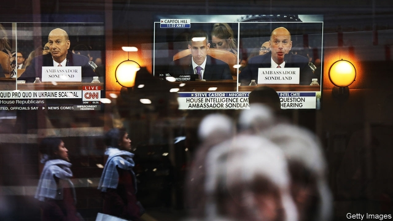

###### They were all in on it

# Gordon Sondland weakens Republican defences against impeachment 

 

> print-edition iconPrint edition | United States | Nov 21st 2019 

AN ODDITY OF President Donald Trump’s defence against the allegation that he hijacked American policy towards Ukraine in search of a political advantage is that he admitted much of what he was accused of from the start. Even as his defenders denied he had offered President Volodymyr Zelensky a quid pro quo—military aid in return for a corruption investigation into a son of Joe Biden—Mr Trump released an edited transcript of a call between the two leaders that suggested this was precisely what he had done. The testimony given to the House impeachment inquiry on November 20th by Gordon Sondland, Mr Trump’s ambassador to the European Union, suggests this was a savvy tactic. 

Facing a possible charge of lying to Congress—on account of his previous testimony—Mr Sondland went all in. Good-relations-for-investigations is exactly what Mr Zelensky was offered, said the Trump political appointee and hotel magnate. To get an Oval Office meeting with Mr Trump, Mr Zelensky needed to announce the opening of two investigations: one into Hunter Biden—who once sat on the board of a Ukrainian energy firm, Burisma—and another into a debunked conspiracy theory that Ukraine, not Russia, was responsible for cyber-meddling in America’s 2016 election. 

Mr Sondland said he had heard this from Rudy Giuliani, the president’s lawyer and fixer: “Mr Giuliani’s requests were a quid pro quo.” He said he was not expressly told, but had assumed, that Mr Trump also held up $391m of military aid to Ukraine shortly before his call with Mr Zelensky as part of the same attempted bargain. 

Previous witnesses to the impeachment probe being conducted by the House Intelligence Committee had characterised the disruption in American policy towards Ukraine in similar terms. Yet, in the absence of higher-level testimony, some Republicans had tried to characterise this as a rogue play by middle-rankers. Not so, said Mr Sondland. He had discussed Mr Trump’s proposal to Mr Zelensky with Vice-President Mike Pence; Mike Pompeo, the secretary of state; and Mick Mulvaney, the White House chief of staff. “We followed the president’s orders,” he said. “Everyone was in the loop. It was no secret.” 

The response of Adam Schiff, the Democratic chairman of the committee, was also significant. He asked Mr Sondland to confirm, as the ambassador then seemed to, that Mr Trump was asking Mr Zelensky to do him a valuable favour. The Democrats seem to believe this will support an impeachment charge of attempted bribery. Mr Schiff also hinted at another charge, contempt of Congress (the third count against Richard Nixon), when he lamented that the administration had refused to release Mr Sondland’s documents as evidence. 

Mr Schiff’s Republican counterpart Devin Nunes appeared not to know what had hit him. His earlier remarks to Mr Sondland, in which he commiserated with him on being drawn into the Democrats’ “sham impeachment”, suggested he did not expect him to cause trouble. Instead Mr Sondland, looking relaxed and good-humoured, had blown up many of the defences Republicans have tried to surround Mr Trump with. Had the president himself denied the allegations against him, instead of admitting most of them while rubbishing his accusers, he might look as starkly exposed as Nixon was. 

Where does this leave his defenders? Probably not close to deserting him: most Republican voters are still with Mr Trump. For committed partisans, the ambassador’s testimony left a chink of plausible deniability. He claimed not to have been aware until recently that the president’s interest in Burisma was linked to Hunter Biden. Despite having had much direct communication with him, Mr Sondland also did not claim Mr Trump outlined the quid pro quo to him personally. Even as he spoke, meanwhile, those he had implicated rushed to knock him. Mr Trump suddenly claimed not to know him terribly well. Mr Pence’s office denied the account was accurate. 

Yet defending Mr Trump has undoubtedly got harder. An underhand coercion exercise that Republicans have variously claimed did not exist, or had been exaggerated by vindictive liberals, or was carried out by rogue officials, appears to have been extensive and directed by the president. That might seem to leave his defenders with only one cogent fallback: Mr Trump’s suspicions against Hunter Biden and Ukrainian election-hackers, however sketchily based, were sincere enough to warrant his pressure on Mr Zelensky. Yet Mr Sondland also made this hard to maintain. The Ukrainians did not need to actually launch any investigations, according to Mr Sondland. “He had to announce the investigations,” the ambassador said. “He didn’t actually have to do them, as I understood it.” 

In the absence of any powerful debunking of his testimony, there may be only two arguments left for Mr Trump’s defenders to marshal against his accusers. The first, which may take the form of any manner of distraction or conspiracy theory, is: Go whistle. Most Republican voters love the president, don’t care about Ukraine, and their elected representatives are not about to disappoint them. This is probably good enough for most House Republicans. 

The other argument is a slightly loftier version of the same, and goes like this. Mr Trump, an unconventional president, was ill-advised, even wrong, on Ukraine. But the allegations against him, though partially proved, are insufficient to justify his impeachment and removal, an unprecedented step—especially in an election year. Indeed to remove Mr Trump, the Republican senators who are already settling on this line will suggest, would be undemocratic. Call this the “Merrick Garland argument”—or, go whistle in McConnell-ese. 

The advantage of both arguments for Mr Trump’s defenders is that they are impervious to further revelations. Their weakness is only that they might seem to leave future presidents free to suborn foreign policy for personal gain without fear of sanction.■ 

