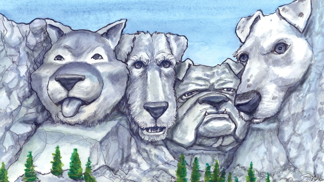

###### Lexington

# Impoochment 

 

> print-edition iconPrint edition | United States | Nov 23rd 2019 

AFTER ALMOST two decades of visiting and living in India, it was only after your columnist had his first child there that he glimpsed the soul of the place. Everyone loves a baby, but Indians seem to love them more. Housewives and security guards would trip over themselves to greet Lexington’s newborn on his morning promenades through Delhi. On domestic flights, suited executives would unbuckle and demand to walk it shushingly up and down the aisle. With a baby to hand, Indian social constraints melt away. 

Lexington experienced something similar while travelling home from North Carolina with a six-week-old Jack Russell terrier bitch. The sight of the small white dog reduced most other travellers to a gurgling mess. Oohs and aahs tracked your columnist’s progress across the airport concourse in Charlotte. Beaming executives proffered phones for a selfie with the puppy—or to display a picture of their own pooch. Getting Betsy (as the white dog would become known) through security caused pandemonium. 

Most rich countries have become strikingly pro-dog in recent decades. But Americans seem to love dogs more. They are likelier to own a dog than any other nationality—with a dog for every four people, they are twice as likely as the French. Not even the doggy British can match the canine dramas that colour American public life. Nothing was more damaging to Mitt Romney’s career than the revelation that one summer holiday he strapped an Irish setter called Seamus to the roof of his family station wagon. (His presidential campaigns will be remembered for the image of Seamus defecating in fear.) Nothing is more emblematic of Pete Buttigieg’s claim to be boringly conventional than his and his husband’s dogs Truman and Buddy. Dog love is an American condition. 

To ponder this your columnist visited the National Dog Show in Philadelphia. One of only three large “benched” shows—meaning its 2,000-odd canine entrants are easily accessible to the public, for petting and one-way conversation—it is also a Thanksgiving staple. Airing at noon, right after the Macy’s Parade, the show will be watched on television next week by up to 25m people (roughly twice as many as Donald Trump’s pre-impeachment hearings). 

The show-dogs excited predictable emotions in the crowds milling around them. “It just brings happiness to see all these dogs in one space,” said Shari Marder, all aglow beside a parade of Portuguese water dogs. “You just feel really good inside,” said her husband Mitch. “They’re wannabe humans and I love them,” said their daughter Eva. Divining human emotions in dogs is a symptom of canine mania that has reached its apogee in America. It is hard to switch on television without seeing a dog schooling its owner somehow, often for the purpose of selling cars or acid-reflux tablets. Indeed, while canine theorists point to the role of loneliness in fuelling the dog craze, American capitalism appears to be equally important. Led by the $70bn pet-products industry (represented at the national show by a thousand stands selling dog accoutrements), it has rebranded canines as people, in effect, only better. 

The fact that America’s dog obsession took off in the go-go 1950s and 1960s supports that. Word searches suggests America became suddenly vastly likelier to use the word “pet” at the end of that period. The initial beneficiaries were pedigree dogs, a creation of 19th-century upper-class Britons that America’s thriving middle-classes embraced with gusto. It is even tempting to view this development, to paraphrase an Indian cricket writer, as a case of pedigree dogs being an American pastime accidentally invented in Britain. Nothing is more American than the triumph of man over nature represented by the weirdly sheeplike Bedlington terrier or devilish snout on a Bull terrier. Yet the appeal of pure breeds probably owed less to eugenics than aspiration—and still does. The Pembroke Welsh corgi, best known for its association with Queen Elizabeth II, is far more popular in America than Britain. 

The example of eastern Europe suggests that a recent agrarian past is another dog booster. America has that too: dog ownership is heaviest in the heartland. Averse to regulation, it also disdains the dog-precluding rules of northern European places such as Sweden, where canines cannot be left alone for more than six hours. 

There are exceptions to the dog love these conditions have unleashed. African-Americans are much less likely to own a dog than whites. Hispanics, as on many indicators, are in-between. There are also subtler distinctions in the tenor of Americans’ love. Since the 1990s, for example, right-on coastal Americans have increasingly spurned pure breeds in favour of a rescue dog from their local pound. This has forced pedigree breeders to hawk their wares creatively. There was much talk at the National Dog Show of therapy dogs and the need to “preserve” breeds—and much of it dubious. 

The newfangled belief that dogs are good for your health (also promoted by the pet-industrial complex) appears to be exaggerated: owning a dog is no more accurate a predictor of longevity than owning a sports car. And most pedigree breeds, after a century of in-breeding, are in dire need of genetic diversity. Meanwhile demand for mutts (or “randomly bred dogs” as David Frei, the face of NBC’s dog-show coverage, considered it more respectful to call them) has outstripped supply in liberal coastal states. This is driving imports from harder-knock conservative places, such as Alabama and Texas, where dogs are still free to be dogs. 

It is heartening to see America quietly smoothing over its regional differences in this way. In the process, social-contagion theory suggests, it may erode them and America become more united, in this way and otherwise, one nation under dogs. A whimsical thought, perhaps. But your columnist offers it as one who has felt the force of canine contagion. People who bang on about their dogs are absurd, he has always thought. Yet while he was chatting to the terrier folk in Philadelphia, a strange force caused him to show them pictures of Betsy, doing all manner of clever things.■ 

