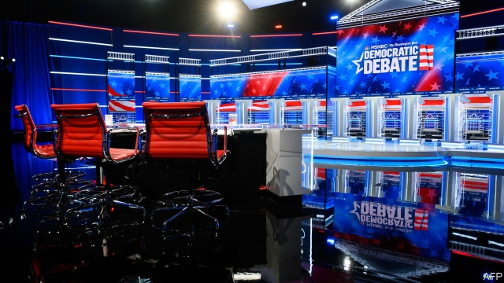
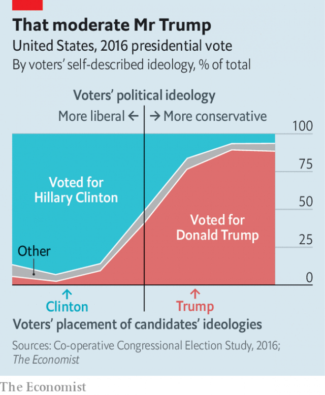

###### Everything in moderation

# Why a left-wing nominee would hurt Democrats 

 

> print-edition iconPrint edition | United States | Nov 23rd 2019 

A  THEORY of elections in America has taken root among pundits, especially on the left. It holds that partisan polarisation has pushed voters so far to their ideological sides that swing voters play little role in elections. In this view, winning is all about turning out the base. The New Republic, a left-leaning publication, has gone so far as to advise Democrats to nominate more progressive candidates that can stoke turnout among the progressives in their party. Such advice is wrong-headed. Public polling and political science provide ample evidence that moderates fare better than ideologues in American elections. 

For much of the past century, scholars and politicians alike have believed that courting swing voters is the quickest path to electoral victory. Under this “median-voter theory”, posited in the American context by Anthony Downs in “An Economic Theory of Democracy” in 1957, voters cast ballots for whichever candidate best matches their ideology. Downs’s followers today believe that the moderate middle is a better place to be than the far-left or far-right because it puts candidates closest to the largest number of voters. 

In the 2016 election, Donald Trump may have succeeded partly by taking more moderate stances on government spending and foreign policy than Republicans who came before him. According to The Economist’s analysis of survey data from the Co-operative Congressional Election Study (CCES), a 65,000-person poll overseen by Harvard University, voters thought Hillary Clinton about twice as ideologically extreme as Mr Trump, relative to their average position (see chart). Voters may have rewarded Mr Trump for ditching orthodox but unpopular conservative talking points. 

 

Recent developments have laid bare the problems with the median-voter theory, though. The country has experienced a rise in partisanship, diminishing the number of people in the moderate middle. As the parties have separated ideologically, vote-switchers have declined in number. According to the CCE, a combined 7% of voters switched from voting for Democratic to Republican presidential candidates, or vice versa, between 2012 and 2016 (5% of them were Democrats and 2% Republicans). 

If there are few swing voters, some analysts argue, then elections must be primarily about catering to the parties’ ideologically extreme bases. In such a world, politicians win simply by turning out as many voters from their side as possible. But while the median-voter theory has its problems, this new hypothesis is unfounded. So-called “mobilisation theory” posits that an extremist nominee could increase turnout among its party’s voters. It fails to account for the effects that political extremity has on turnout in the other party. 

According to research from Andrew Hall and Daniel Thompson of Stanford, extremist candidates for the House of Representatives between 2006 and 2014 did increase turnout in their own party, but they galvanised the other party’s voters even more. The authors suggest that nominating an extremist candidate increases turnout for the opposing party by between 4 and 10 percentage points more than turnout for their own party. Such candidates pay a tax on their extremity at the ballot box, because they drive opposition voters to the polling booth.■ 

