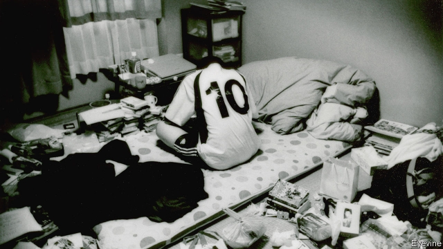

###### Mental health in Japan

# A growing number of Japanese have become recluses 

 

> print-edition iconPrint edition | Asia | Nov 30th 2019 

ABOUT A YEAR ago Mika Shibata’s youngest son returned to the family home and went wordlessly upstairs. He has yet to emerge from his bedroom. At the age of 26, he sleeps during the day and stays awake at night. His mother feeds and shelters him, hoping he will emerge from this state. But she frets he never will. “The longer this situation continues, the harder it is for him to step back into society,” she says. 

The Shibata family’s pain is shared by many others in Japan. The government says there are more than 1m hikikomori, or recluses, defined as people who have played no part in society for at least six months. Many have barely stepped outside their homes for decades. A handful of alarming crimes have pushed them back into public view. In May a recluse, aged 51, stabbed two people, including a child, to death in the city of Kawasaki before committing suicide. In June a retired official murdered his own son, a middle-aged hikikomori, because he said he feared he might hurt someone. 

When the phenomenon became widely noticed over a generation ago, few understood it. Recluses were considered lazy or odd. Mental-health care was scarce and official support nonexistent. Parents felt responsible and were too mortified to look for help. But even now, occasional crimes involving recluses stoke concerns that they are dangerous, says Morito Ishizaki, a recovered hikikomori who runs a magazine for sufferers. In fact, he explains, they are rarely criminal. Many have just buckled under pressure at school or work and have withdrawn to their childhood sanctuaries. 

Support groups are springing up around the country. Tokyo is among several cities with helplines and websites that try to reach shut-ins, who range from teenage school dropouts to salarymen who have been sacked. Ageing parents often come seeking help, says Ichiro Miyazawa of Tokyo’s metropolitan government. He says they worry that after they die, their hikikomori children will not be able to survive. 

More than half of Japan’s recluses are now aged over 40, according to a Cabinet Office survey this year. That shocked the government, which had assumed the condition mainly afflicted the young. Tamaki Saito, a psychiatrist who popularised the term hikikomori, says the government is partly to blame for turning a blind eye. Now the problem has grown. If it is not tackled seriously, many more might become recluses, he says. 

Yet luring isolated people in their 40s and 50s back into society is hard, Mr Miyazawa accepts. The city can send counsellors out to homes only if asked. But often families themselves cannot communicate with their reclusive children. Mrs Shibata speculates that her son was bullied at work, but cannot be sure. He has not said a word since he returned. His two brothers cannot talk to him. One day the bright, sensitive man she knew will bounce back, she hopes. But many may never come out of their shells. 

