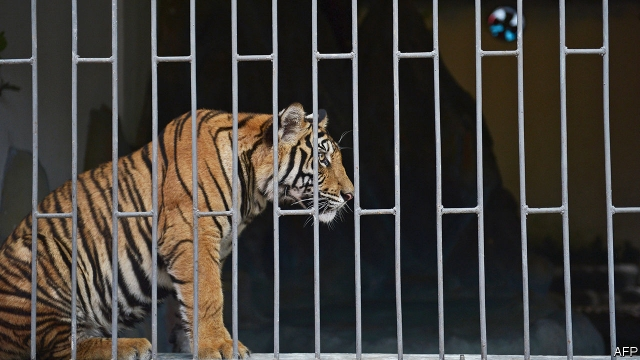

###### Tiger farms in Laos

# Laos still winks at tiger farms 

 

> print-edition iconPrint edition | Asia | Nov 30th 2019 

LIU CHUNG shakes her head: there are no more tiger zoos here, she insists. This is strange. The area around the Golden Triangle Special Economic Zone (SEZ), a swathe of north-western Laos where Ms Liu, a taxi driver, plies her trade, is famous for its tigers. Not wild ones, which have nearly all been killed in Laos, but captive animals, illegally trafficked and bred for their parts, which sell for thousands of dollars. Your correspondent points on her map to a place near the SEZ where a tiger farm is rumoured to operate. Now Ms Liu remembers. She starts up the engine.  

A century ago, around 100,000 tigers roamed the world’s jungles. Because of habitat loss and poaching, there are fewer than 4,000 wild ones today. More than twice as many are being held in at least 200 farms across East and South-East Asia, says Leigh Henry of the World Wildlife Fund. These range from small backyard operations to enclosures breeding hundreds in “battery-farm style”, says the Environmental Investigation Agency (EIA), an international NGO focusing on wildlife crime. 

Breeding tigers and trading them and their parts is banned by the Convention on International Trade in Endangered Species, but this treaty is widely flouted in Asia because of poor law-enforcement and high demand for tigers. Belief in their medicinal properties has deep roots, especially in China. Tiger-bone wine, skins and jewellery featuring claws and teeth are status symbols. In Laos, carcasses can sell for as much as $30,000, officials reckon.  

Some criminals choose to operate in Laos because “there’s no real rule of law” there, says Debbie Banks of the EIA. Indeed, the government of Laos is allegedly complicit. America’s State Department recently reported that Laos was one of three countries that had recently “actively engaged in or knowingly profited from the trafficking of endangered or threatened species”. In 2016 an investigation by Britain’s Guardian newspaper found the Lao government had licensed two tiger farms and cut lucrative deals with wildlife traffickers smuggling millions of dollars’ worth of endangered animals—including tigers—through Laos. 

The government has a 20% stake in Golden Triangle SEZ, a resort complex run by Zhao Wei, a Chinese businessman whom America’s Treasury last year accused of engaging in illegal trade in wildlife, as well as trafficking drugs and people (he denies the allegations). With its flashy casino and hotels, the SEZ is designed to attract Chinese tourists (gambling is illegal in China). In 2014 and 2015, EIA investigators found that restaurants in the SEZ were advertising “sauté tiger meat” and tiger-bone wine; shops were selling tiger skins and ivory tusks. Near the casino, 26 tigers stalked the length of their enclosure, destined for the slaughterhouse. Their bones were to infuse rice wine. Since the EIA’s report, these establishments have closed.  

Laos promised in 2016 to phase out the tiger farms. But the EIA reckons their number has increased. After a ten-minute drive towards the mountains, Ms Liu, the taxi driver, turns down a dirt road towards a compound where fencing is being put up. The guard at the gate forbids entry. But a local with inside knowledge says the facility houses ten to 20 tigers and a few elephants. The tigers are there to be bred. ■ 

