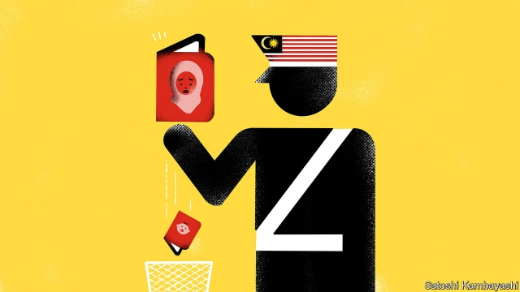

###### Citizenship in Malaysia

# Malaysia still discriminates against women over citizenship 

 

> print-edition iconPrint edition | Asia | Nov 30th 2019 

EIGHT MONTHS pregnant, Noor (not her real name) flew from Washington back home to Malaysia, desperate to arrive before her baby did. Travelling so close to a due date poses risks, but for her, giving birth overseas did too. Her child would not automatically receive Malaysian citizenship. The constitution guarantees that fathers can pass their nationality to children born abroad. But mothers must apply for it, a process that can leave foreign-born children in limbo for years. To avoid such a wait, Noor and her American husband even asked the Malaysian embassy in Washington to let her give birth there, technically on her country’s soil, but in vain. So she hid her big belly under a heavy winter coat and boarded an aircraft. “I cannot fathom how the government can expect women to take on that level of risk,” muses her husband. 

Malaysia is one of 25 countries that restricts their women from conferring their nationality to their children, and is one of roughly 50 that limit them from passing it to foreign spouses. Still more unusually, Malaysia discriminates against some fathers, too—it is one of three countries that prevent men from passing citizenship on to their children born outside marriage. Between 2012 and 2017 more than 15,000 children born in Malaysia to Malaysian fathers were denied citizenship. 

Sixty years ago most countries had nationality provisions that varied according to sex. They made assumptions about women’s roles and expectations that are now widely viewed as wrong and discriminatory. Since 2000 more than 20 countries with such laws—from Kenya and Yemen to Morocco and Zimbabwe—have reformed them. The holdouts are mostly in Africa and the Middle East. Of the ten members of the Association of South-East Asian Nations (ASEAN), Malaysia is one of only two, alongside neighbouring Brunei, to persist with gender discrimination in their citizenship rules. 

Why do they not change? “Xenophobia and a patriarchal mindset,” says Catherine Harrington of the New York-based Global Campaign for Equal Nationality Rights. The World Economic Forum ranks Malaysia 131 out of 149 countries for women’s political empowerment. 

Discriminatory citizenship laws can render children stateless. Horror stories abound: a baby born in Brunei to a Malaysian mother and stateless father has no citizenship, nor does another born in France to a Malaysian mother and a Sri Lankan refugee. Earlier this year the Malaysian Campaign for Equal Citizenship (MCEC), a pressure group, shared a video plea of one Malaysian woman who had had a baby with her Syrian husband (unable to prove his citizenship mid-conflict) in Turkey, and could not get travel documents for their child. On paper Malaysia has safeguards against statelessness, but in practice “citizenship is treated as a privilege, not a birthright,” says Hartini Zainudin, co-founder of Yayasan Chow Kit, an NGO in Kuala Lumpur, the capital. 

Advocacy outfits in Malaysia call for constitutional amendments to settle the problem for good. That should be fine with the ruling coalition, Pakatan Harapan, which took power last year and has promised to review laws that discriminate against women. Malaysia’s constitution is one that needs attention. It currently contradicts itself. One article guarantees “no discrimination against citizens” on the basis of gender, but another discriminates against married women and single men over nationality. Hannah Yeoh, the deputy minister for women and families, says she endorses calls for an amendment. But the home ministry sounds less enthusiastic. It merely talks about streamlining existing applications for citizenship. 

Ivy Josiah, an adviser to the MCEC, believes it is possible the government will make the hoped-for constitutional change by the end of next year. Noor’s husband hopes for reform, too. But he is jaded. He has been hearing speculation about possible change for more than 20 years, ever since Noor took her desperate flight back to Malaysia. She has given birth to seven children while she waits. ■ 

