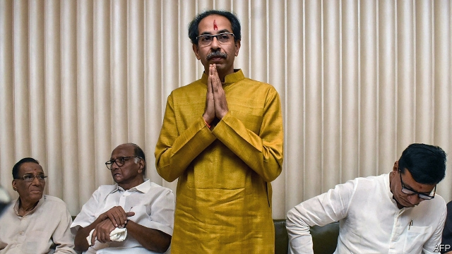

###### The villain of Maharashtra

# Political drama has gripped the home state of Bollywood 

 

> print-edition iconPrint edition | Asia | Nov 30th 2019 

THE AGEING stars, tired tunes and awkward dance moves had the makings of a box-office flop. But recent plot twists in the politics of Maharashtra, a big, rich Indian state that is home to Mumbai and its cinema industry, are proving a showstopper. Unlike a product of Bollywood, however, this protracted tale of treachery, hubris and midnight manoeuvring has real consequences for the state’s 112m people. 

It started in October, with an election that handed an easy majority of the state assembly’s 288 seats to the incumbent coalition. This alliance involved two Hindu-nationalist parties, the Bharatiya Janata party (BJP), which commands the national government in Delhi, and Shiv Sena, a hot-headed local party built on the prickly pride of the Marathas, a dominant regional caste. The pair had collaborated for decades, jointly ruling Maharashtra since 2014 with little friction, despite Shiv Sena’s resentment that the much larger BJP, led by Narendra Modi, India’s charismatic prime minister, has encroached on its turf. But rather than get quietly back to work after this election, the brothers-in-arms fought over the spoils. 

Before the vote, the two were said to have sketched a deal whereby Devendra Fadnavis of the BJP, the serving chief minister, would continue for another half of the office’s five-year term before handing it to Uddhav Thackeray, Shiv Sena’s boss. But neither party gained as many seats as expected. The BJP’s tally fell from 142 seats to 105, and Shiv Sena’s from 75 to just 56. So the bigger brother played tough, suggesting it would find another partner unless Shiv Sena dropped its demand to share the top job. After all, another local party, the National Congress (NCP) had grabbed 54 seats, enough when added to the BJP’s strength to reach the 145 needed for a majority. The NCP’s leaders sent signals they might be coaxed away from their traditional partner, the Indian National Congress, or Congress party, which has long been the BJP’s main national rival. 

Tempted by the chance to stick it to Congress and boosted by its crushing victory in spring’s national election, the BJP brushed off Shiv Sena. But Mr Fadnavis underestimated Shiv Sena’s determination to stick to its demands. It was afraid that without high office and real power, ever more Shiv Sena followers would drift into the BJP’s camp. To general surprise the party walked out on the BJP. Discarding decades of animosity towards the secular-minded Congress, which had won a handy 44 seats, Shiv Sena spoke of striking a three-party deal to isolate its arrogant former ally. 

But Congress dithered, waiting for instructions from its leadership in Delhi. The NCP’s 79-year-old leader, Sharad Pawar, played hot and cold. With days passing and no majority emerging, the state’s governor, a centrally appointed official whose duties are akin to those of a constitutional monarch, imposed “president’s rule”. This measure allows central authority to play a bridging role when state governments fail. Rumours swirled that the BJP, far richer than its rivals, was proffering huge sums to lure defectors to its side. 

On November 22nd leaders of Shiv Sena, the NCP and Congress declared that they had reached a deal and would present the governor with a majority in the morning. Maharashtrians went to sleep wary of this unlikely alliance, but pleased that the crisis was over. Front pages declared a defeat for the BJP and that Mr Thackeray of Shiv Sena would be the state’s new chief minister. 

They were wrong. During the night Ajit Pawar, who is Mr Pawar’s nephew and also a senior figure in the NCP, had defected to the BJP, claiming to bring most of its deputies with him. Mr Modi, wielding an “emergency” clause to dispense with cabinet approval, requested India’s titular president, a BJP appointee, to suspend his rule in Maharashtra. This was done at 5.47am. By 8.00am the state’s BJP-appointed governor had duly sworn Mr Fadnavis in as chief minister. The BJP has pulled off similar midnight constitutional coups before. In five other states during Mr Modi’s tenure, the party has successfully cajoled deserters to form surprise majorities. Some say it may have helped in Maharashtra that as soon as Ajit Pawar was named deputy chief minister, several investigations into alleged corruption during an earlier stint in office were abruptly dropped. 

But this time there was to be another twist. In a classic manoeuvre of Indian politics, the three underdog parties rounded up their deputies and locked them in hotels. The NCP even dispatched a team to Delhi to retrieve a few who had been whisked off by the BJP. With the supposed defectors now claiming they had been tricked into supporting Ajit Pawar, and Mr Fadnavis unable to prove his majority, India’s supreme court stepped in. It ordered a test of numbers on the floor of the state assembly. Fearing defeat, both men resigned. With well over 160 deputies appearing to back him, Mr Thackeray is poised to become chief minister. The BJP has emerged not only as the loser but the apparent villain. But the bigger loss has been suffered by voters, who naively believed their politicians wanted anything more than power. ■ 

