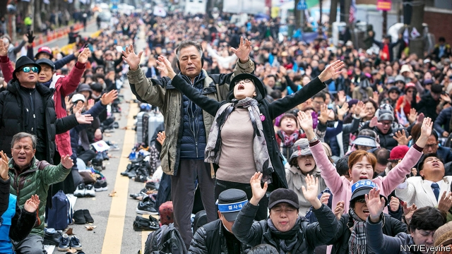

###### An unholy alliance

# Protestant evangelicals in South Korea wield outsize political power 

 

> print-edition iconPrint edition | Asia | Nov 30th 2019 

WITHOUT THE Christmas tree and wooden archway covered in Bible quotations, the entrance to the Church of Love in Seoul’s Gangnam area could be mistaken for that of a fancy shopping mall. A sky-bridge connects the megachurch’s two buildings, which occupy an enormous block. Inside, corridors are lined with polished stone and walls are decorated with abstract art and heart-shaped neon signs. A cavernous underground prayer hall can seat 9,000. On Sundays it is packed. 

Just round the corner is South Korea’s supreme court, which says the church has no legal right to much of this space. It ruled last month that the government of Seocho district, where the church is located, had abused its power by leasing land to allow the church to extend its below-ground footprint. Seocho’s then district chief, who is now a national legislator, has said he was lobbied by senior politicians to grant the lease. It was approved in 2010 when the president was Lee Myung-bak, a Protestant who flaunted his religion (he is currently in jail for unrelated corruption). The Church of Love may have to spend tens of millions of dollars to demolish the prayer hall. Or, as many observers believe, it may find a way of avoiding that. 

The favour enjoyed by the church during Mr Lee’s presidency, which ended in 2013, was a sign of the huge influence of evangelical Protestantism in South Korea. Churches such as the one in Gangnam serve as places where people make useful connections, whether for finding a spouse, securing a job or climbing high in politics. Many politicians stress the importance of their faith. Mr Lee promised he would dedicate Seoul to God when he was elected mayor. In the 1990s one of his predecessors, Kim Young-sam, installed a chapel in the presidential palace and welcomed a stream of pastors. Hwang Kyo-ahn, the leader of South Korea’s main opposition party, served as prime minister from 2015 to 2017. He called that job a gift from God. 

The role of Protestant churches is surprising in a country that is not very religious by global standards. More than half of South Koreans say they have no religion. But among South Koreans who say they do, nearly half are evangelical Protestants. The country has more Protestant organisations, about 55,000 of them, than convenience stores. Of the world’s 100 biggest churches, 20 are in South Korea, including the biggest, Yeouido Full Gospel Church in Seoul, which has 800,000 members. Around 10m Protestants now live in South Korea, far more than Catholics or Buddhists. Their numbers keep growing. 

Support from the pastor of a large church can decide elections. The current president, Moon Jae-in, is a Catholic who is less responsive to the demands of evangelicals than others in the Blue House have been. But conservative churches remain powerful. They organise large protests which can succeed in blocking events such as gay-rights rallies that offend their beliefs. Recently hundreds of thousands of believers (some are pictured) have been taking to the streets every week to demand that Mr Moon step down. They accuse him of “doing the devil’s work” and selling the country out to North Korea by trying to improve relations with it. They take credit for securing the downfall of Mr Moon’s justice minister, who resigned last month over a corruption scandal. 

Protestantism first came to Korea in the 19th century with American missionaries, but its political influence dates from the time of strongman rule. Rhee Syng-man, the country’s first dictator of that era, who was president from 1948 to 1960, was a devout Protestant who made Christmas a state holiday. “What mattered was growth, and evangelical pastors told their congregations that the state’s chosen approach to the pursuit of wealth was holy,” says Kim Duk-young of the University of Kassel in Germany. By linking North Korea’s communism with the devil, church leaders appealed to Protestant landowners who had been driven from their homes by the North’s forces during the Korean war and had taken refuge in the South. Park Chung-hee, who was president during South Korea’s rapid economic rise in the 1960s and 1970s, was a Buddhist. But he encouraged the growth of Protestant churches. 

The anti-Moon protesters are proud of their faith’s historical links with the political elite. They carry banners with the names and faces of Mr Rhee and Mr Park. They also hail the leader they say will save the country, a right-wing pastor named Jun Kwang-hoon who has called Mr Moon “worse than Hitler” for trying to befriend North Korea. Mr Jun’s critics call him the “panty pastor” because he has told female church members they will become children of God if they take off their underwear for him (Mr Jun says his remarks have been taken out of context). His followers shrug this off. “Moon Jae-in is a communist and he’s doing the devil’s work,” says one elderly protester. “This is a spiritual fight.” 

It is unlikely to be successful. The protesters have not shown convincing evidence for their claim that Mr Moon’s North Korea policy amounts to treason. Nor have they struck a chord with other South Koreans, especially not the young. 

Some Protestants stress that neither the demonstrators nor the glitzy megachurches represent their faith. They abhor the conservatives’ past links with dictators. “It’s wrong to spend all that money on fancy church buildings,” says Jung Byung-o of the Christian Ethics Movement, a Protestant group. Kim Yong-min, who runs a small church in a basement in Seoul, says his organisation is trying to stop right-wing Christians from meddling in politics. The tiny space doubles as a studio for a political talk show and is piled with left-wing literature. He says most of his congregation supports Mr Moon. ■ 

