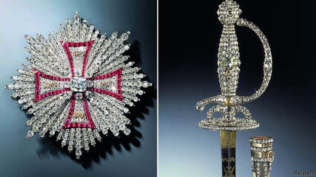

###### Ocean’s Eight on the Elbe

# A stunning, sad heist in Dresden 

 

> print-edition iconPrint edition | Books and arts | Nov 28th 2019 

IN THE 18TH CENTURY Augustus the Strong competed with Louis XIV, France’s “Sun King”, to assemble Europe’s most extravagant jewellery collection. The elector of Saxony, who ruled over Poland and Lithuania, probably triumphed in the end: he gathered multiple sets of exquisite artefacts, made of diamonds, rubies, sapphires and emeralds, a haul that was supplemented by his successors. The collection represents “a kind of world heritage”, reckons Dirk Syndram, director of the Green Vault treasury in Dresden, a baroque city on the Elbe, which houses all the gems. 

Or, it did until recently. In a swift pre-dawn raid on November 25th at least two (presumably diminutive) thieves entered the Green Vault’s jewel room through a small hole they had made in the iron grille of a ground-floor window. They had apparently disabled the museum’s alarm system by setting fire to a nearby electrical-distribution hub. Inside, they smashed a glass showcase with an axe and grabbed roughly 100 pieces from three of the jewellery sets, including several diamond brooches, a string of pearls, a duelling sword with a diamond-encrusted hilt (pictured) and the Star of the Polish White Eagle Order. 

Security guards alerted the police, but by the time they arrived, the thieves had fled; the presumed getaway car was found burned out in a nearby underground garage. One of the collection’s greatest treasures, the 41-carat Dresden Green Diamond, is safely on loan to the Metropolitan Museum of Art in New York, for an exhibition about the splendour of European courts. But the missing pieces could be worth many millions of euros. “We are devastated to hear of this theft,” said Max Hollein, the Met’s director. 

Rocketing art prices are attracting ever-more daring criminals. On November 13th intruders were walking out of the Dulwich Picture Gallery in London with two Rembrandts when they were stopped by police; they managed to escape, albeit without the paintings. Four men are currently on trial for the theft in 2017 of a giant gold coin valued at €3.75m ($4.1m) from the Bode Museum in Berlin. 

Even so, the Dresden heist—now being investigated by a 20-strong team of specialists code-named “Epaulette”—stands out. The late Martin Roth, a former director of the Dresden State Art Collections (of which the jewellery hoard is a part), claimed in 2010 that “the Green Vault is secured like Fort Knox”. Roth thought “the human factor” and “insider knowledge” posed the greatest risk, and the Green Vault’s staff will doubtless be questioned closely. On the other hand, points out Julian Radcliffe of the Art Loss Register, an art-database in London, crooks can often pick up ample intelligence as paying visitors. 

The artefacts are as storied as they are valuable. They survived the devastating Allied bombing of Dresden during the second world war, only to be seized by the Soviet Union. They were miraculously returned in their entirety to East Germany, contributing to the city’s resurgence, though the full trove has been on display only since 2006, after the painstaking restoration of Dresden Castle. The fear now is that, since the pieces are too recognisable to be sold intact, the robbers will break out the diamonds and sapphires to flog them separately. The coin stolen from the Bode Museum is widely assumed to have been melted and sold off. The loss of the Dresden jewellery would be much sadder. ■ 

