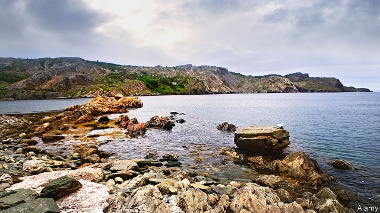

###### Alone, together

# In “The Innocents”, a brother and sister struggle to survive 

 

> print-edition iconPrint edition | Books and arts | Nov 30th 2019 

The Innocents. By Michael Crummey. Doubleday; 289 pages; $26.95. 

EVERED AND Ada Best are “still youngsters” when their parents die, leaving them alone on the bleak Newfoundland coast. “They were left together in the cove then with its dirt-floored stud tilt,” writes Michael Crummey, “with its garden of root vegetables and its scatter of outbuildings, with its looming circle of hills and rattling brook and its view of the ocean’s grey expanse beyond the harbour skerries.” In “The Innocents”, Mr Crummey, a Newfoundland native, captures in hypnotic prose the force of the driving sea and the ways of a beautiful, barren place where Evered and Ada are cast adrift. 

Their lives are bound by seasonal rhythms—of the sea rather than the land, for brother and sister must subsist as their parents did, catching cod, salting and drying it, exchanging what they preserve for the supplies they need when a ship aptly called the Hope appears over the horizon. In brutal poetry, Mr Crummey invokes the work they do to survive, “the two children wielding knives honed to a razor’s edge, up to their slender wrists in blood and offal”. The book’s tension is built on language which has the clean power of folk-tale. When is the story set? Sometime in the early 19th century, the reader can infer from references to war and convict ships, but time has little meaning here. 

As Evered and Ada huddle for warmth in winter, their closeness evolves into something else. With compelling eroticism, Mr Crummey depicts them awakening to their physical selves; Ada first learned of pleasure when, at nine, she pressed herself against the keel of the boat that Evered and their father were preparing for the season, by raking oakum from its seams. As the craft vibrated, she sensed “the quiver until she felt an answering quiver pass through her like an echo coming off a cliff face”. With their parents gone, half-asleep in their bed in the tilt, they rock against each other for comfort and gratification. They do not speak of what they do there. 

The world intrudes intermittently: the reader is in the same position as this lonely pair, waiting to see what it will bring. They find a shipwreck, but what looks at first like bounty turns out to be something else entirely. The HMS Medusa anchors offshore, bringing the raucous company of sailors. But at the centre of it all are Evered and Ada, sealed in their companionship, making their new life alone. What they discover—about the land and about themselves—is both gorgeous and terrifying. ■ 

