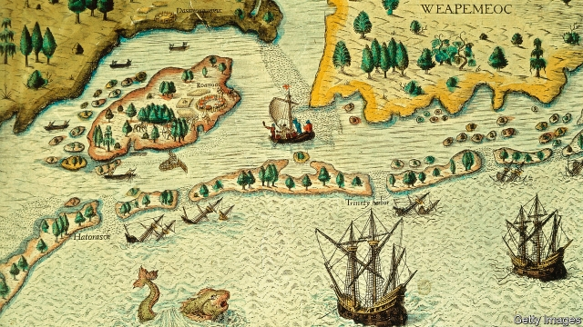

###### Caped crusader

# The world-changing life of Walter Raleigh 

 

> print-edition iconPrint edition | Books and arts | Nov 30th 2019 

Walter Ralegh: Architect of Empire. By Alan Gallay. Basic Books; 576 pages; $40 and £30.95. 

PERHAPS IT WAS the fact that he was already dead that enabled Walter Raleigh to face his execution with such equanimity. On October 19th 1618 he was led from the Tower of London; along the way he smiled and joked. Seeing a bald man in the assembled crowd, he offered him his hat (“Thou hast more need of it now than I”). Then he laid his head upon the block. Legally speaking, Raleigh had already been “dead” for 15 years, after being found guilty of plotting against James I and deprived of his rights. Now, an axe added sharpened steel to sharp legal practice. 

Life, wrote Raleigh, is a “Tragedie”, and it proved so for him. He not only had the misfortune to die twice in life; he also, Alan Gallay argues in “Walter Ralegh”, has suffered a third death posthumously, that of his reputation. (Mr Gallay employs the variant of Raleigh’s name that omits the “i”, which his subject preferred in his later years.) Much of the good in Raleigh—his humanity, his curiosity, his brilliant poetry—has been buried with him. Today, he tends to be remembered as a failed coloniser or a popinjay courtier, covering a puddle with his cloak for Elizabeth I. 

His true achievements, Mr Gallay argues, were deeper than that (apocryphal) puddle tale. In his lifetime Raleigh’s influence spanned the oceans, reshaped territories and pervaded the very air of England. He named the American state of Virginia (after the Virgin Queen) and inspired Edmund Spenser’s monumental poem, “The Faerie Queene”. He probably brought Ireland the potato; he scented the air of the English court with tobacco. The minds, lands—and lungs—of the English would never be the same again. 

Mr Gallay’s subtitle calls Raleigh “Architect of Empire”. That was a vital role in the 16th century, as the foundations of England’s empire were shaky. Elizabeth partly wanted an empire to further her own desires and partly—as Raleigh’s half-brother explained in his “Discourse on how hir Majestie may annoy the K: of Spayne”—to thwart Spain’s. So far, things had not gone well. The previous English attempt to colonise America had involved exporting Morris dancers (“to delight the Savage people”) and Catholics (to delight the Protestants at home). It failed wretchedly. The savage people were undelighted; the K: of Spayne was insufficiently annoyed. 

Then, in 1584, Elizabeth granted her favourite an exclusive patent to colonise North America. Raleigh duly set about professionalising colonisation and philosophising about it. Where the previous lot sent dancers, he dispatched a brilliant scholar and a painter; the settlement foundered, but their work shaped European views of Native Americans for centuries. 

His later explorations were intellectual as much as physical. They had to be, since the man who helped open up the globe was incarcerated in the Tower of London three times, once by Elizabeth (for secretly marrying her lady-in-waiting) and twice by James I. While inside, Raleigh wrote a history of the world and experimented with making medicines that many, including royalty, swore by. Prince Henry, a son of James I, described imprisoning such a man as like keeping “a bird in a cage”. There are moments when Mr Gallay’s prose, which includes sentences about “gendered interpretations of the New World”, can feel as though it is doing the same. Still, his affection for his subject shines through. 

By 1618, after another bungled trip to that New World, James had enough of his caged bird. Since the “civilly dead” cannot commit new crimes, the old treason charge was reactivated and Raleigh was, once again, condemned. His curiosity was undimmed. On the morning of his death, he demanded to see the axe. The executioner at first refused. Raleigh chided him: “Dost thou think I am afraid of it?” When the axeman relented, Raleigh, who had made so many cures for others, fingered the blade. He smiled. “This is a sharp Medicine,” he said. “But it is a Physitian for all Diseases.” Two blows later, he was gone. ■ 

