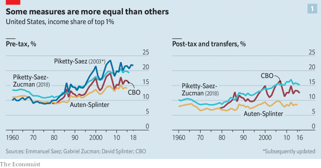
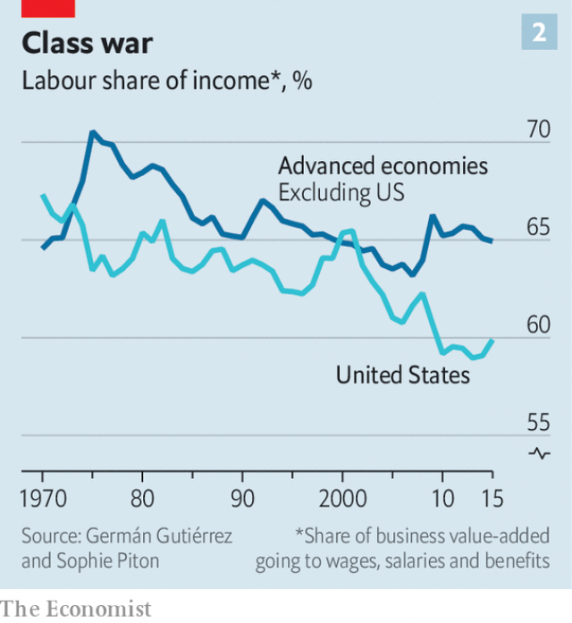
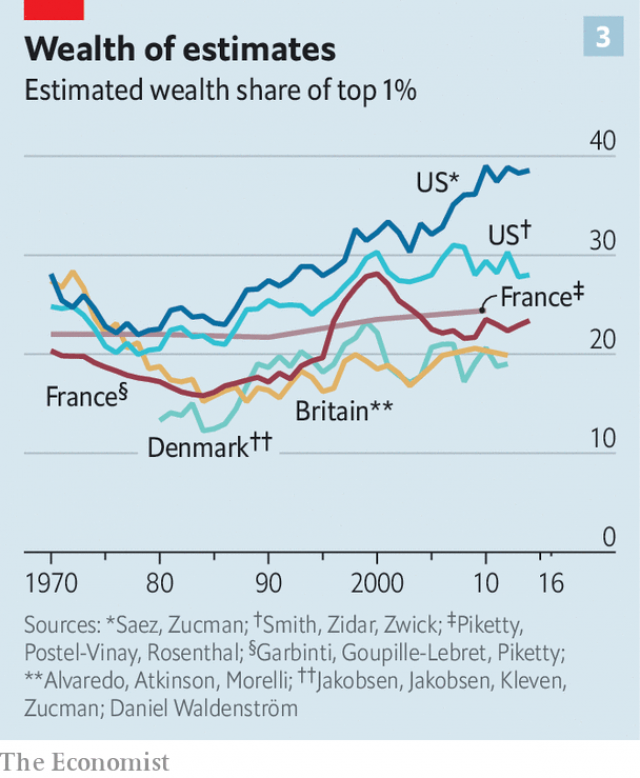

###### Measuring the 1%

# Economists are rethinking the numbers on inequality 

 

> print-edition iconPrint edition | Briefing | Nov 30th 2019 

OVER A DECADE before thousands of protesters gathered in Zuccotti Park in New York in 2011, a little-known researcher in France sat down to write about income inequality in a new way. “The focus of our study consists in comparing the evolution of the incomes of the top 10%, the top 1%, the top 0.5%, and so on,” Thomas Piketty wrote in a paper in 1998. With his long-term co-author, Emmanuel Saez, Mr Piketty pioneered the use of tax data over survey data, thereby doing a better job of capturing the incomes of the richest. He revealed that “the 1%” had made out like bandits at the expense of “the 99%”. His research gave Occupy Wall Street its vocabulary. 

What followed was an explosion of research into the causes and consequences of a surge in inequality across the rich world. In “Capital in the Twenty-First Century”, a bestseller first published in 2013, Mr Piketty argued that under capitalism rising inequality was the normal state of affairs. 

Mr Piketty’s research, and more like it, became part of the political discourse in America and much of the West. Two leading candidates for the Democratic nomination for the American presidency, Elizabeth Warren and Bernie Sanders, have proposed taxes on wealth to tackle inequality—pledges cheered on by Mr Saez and Mr Piketty’s other co-author, Gabriel Zucman. In a new book, “Capital and Ideology” (currently available only in French) Mr Piketty calls for a 90% tax on wealth, such is the scale of the inequality crisis. 

Many things have indeed gone wrong with contemporary capitalism. In many countries social mobility is falling; too many companies enjoy excessive market power; and housing is too pricey. All these factors and more also help explain why economic growth in the rich world is weak. 

Yet just as ideas about inequality have completed their march from the academy to the frontlines of politics, researchers have begun to look again. And some are wondering whether inequality has in fact risen as much as claimed—or, by some measures, at all. 

It is fiendishly complicated to calculate how much people earn in a year or the value of the assets under their control, and thus a country’s level of income or wealth inequality. Some people fail to complete government surveys; others undercount income on their tax returns. And defining what counts as “income” is surprisingly difficult, as is valuing assets such as unquoted shares or artwork. Legions of academics, not to mention government officials and researchers in think-tanks, are devoted to unpicking these problems. 

The conventional wisdom to have emerged from these efforts revolves around four main points. First, over a period of four to five decades the incomes of the top 1% have soared. Second, the incomes of middle-earners have stagnated. Third, wages have barely risen even though productivity has done so, meaning that an increasing share of GDP has gone to investors in the form of interest, dividends and capital gains, rather than to labour in the form of wages. Fourth, the rich have reinvested the fruits of their success, such that inequality of wealth (ie, the stock of assets less liabilities such as mortgage debt) has risen, too. 

Each argument has always had its doubters. But they have grown in number as a series of new papers have called the existing estimates of inequality into question. 

Start with top incomes. The idea that they have surged has always been shaky outside America. In Britain the share of after-tax income of the top 1% is no higher than it was in the mid-1990s. Across Europe the ratio of the post-tax income of the top 10% to that of the bottom 50% has changed remarkably little since the mid-1990s, according to Thomas Blanchet of the Paris School of Economics and his colleagues. 

 

In America the story seemed more solid, based on the analyses of tax data produced by the likes of Messrs Piketty, Saez and Zucman. However, a recent working paper by Gerald Auten and David Splinter, economists at the Treasury and Congress’s Joint Committee on Taxation, respectively, reaches a striking new conclusion. It finds that, after adjusting for taxes and transfers, the income share of America’s top 1% has barely changed since the 1960s (see chart 1). 

They are not the first to have adjusted for taxes and transfers. America’s Congressional Budget Office (CBO) does the same; its statistics show that top incomes rose a lot in the 1980s and 1990s. Typically, after-tax-and-transfer figures are greatly affected by the growing provision of means-tested health insurance. In 1997 the Children’s Health Insurance Programme (CHIP) expanded federal funding for health insurance for many youngsters. In 2014 Barack Obama’s health-care reform expanded eligibility for Medicaid, a health-insurance programme for the poor, in most states. According to the CBO’s data, Medicaid and CHIP account for over 80% of the growth in real-terms means-tested transfers to poor households between 1979 and 2016. 

Messrs Auten and Splinter’s innovation is to correct step-by-step for what they say are a series of errors in the most famous existing inequality estimates. For instance, they change how people are ranked. Messrs Piketty and Saez’s most influential paper, from 2003, was concerned with the top 1% of “tax units”, typically meaning households who file their taxes on a single return. But this introduces a bias. Marriage rates have declined disproportionately among poorer Americans. That increases top-income shares by spreading the incomes of poorer workers over more households, even as the incomes of the top 1% of households remain pooled. Messrs Auten and Splinter therefore rank individuals. 

Another correction concerns the tax reforms passed under Ronald Reagan in 1986. Apparent changes in top incomes around this reform account for about two-fifths of the total increase between 1962 and 2015 in the pre-tax incomes of the top 1% in Messrs Piketty and Saez’s estimates. Messrs Auten and Splinter say this is an illusion. Reagan’s tax reform created strong incentives for firms to operate as “pass-through” entities, where owners register profits as income on their tax returns, rather than sheltering this income inside corporations. Since these incentives did not exist before then, top-income shares before 1987 are liable to be understated. 

Money inside corporations does eventually show up in Messrs Piketty and Saez’s numbers—but possibly in the wrong years. As firms retain earnings (ie, do not pay out their profits as dividends), they become more valuable. When shares in those businesses subsequently change hands, the sellers must therefore report capital gains on their tax returns—something Messrs Piketty and Saez keep track of. 

But capital gains also reflect the chosen timing of the seller and movements in the stockmarket, making them volatile. For these reasons, Messrs Auten and Splinter ignore capital gains and instead count corporations’ retained earnings from year to year. They allocate those earnings to individuals, both before and after the 1986 tax reform, in proportion to their share holdings. And whereas taxable capital gains are concentrated among the rich, workers own lots of shares through their tax-free retirement accounts. 

New methodology introduced by Messrs Piketty, Saez and Zucman in a paper last year ranks by individuals and replaces capital gains with retained corporate earnings. But it still finds the share of pre-tax income of the top 1% to have surged from about 12% in the early 1980s to 20% in 2014. That is because they count a wide array of new income sources. The new methodology tries to trace and allocate every dollar of GDP in order to produce “distributional national accounts”—a project that Mr Zucman hopes will eventually be taken over by government statisticians. It is a tricky exercise because two-fifths of GDP does not show up on individuals’ tax returns. It is either deliberately left untaxed by government or illegally omitted from tax returns by those who file them. 

Allocating this missing GDP to individuals is as much art as it is science (which is why Messrs Piketty and Saez’s original, more conservative method remains influential). How to do it properly is the source of the most important disagreement between the two groups of economists. 

One chunk of missing GDP is found in the pension system as retirement savings grow—often inside tax-free accounts. Broadly, both sets of economists agree that this income should be allocated to individuals in proportion to the size of their pension savings. But the distribution of those savings must itself be estimated. 

Messrs Auten and Splinter say that while attempting this Messrs Piketty, Saez and Zucman mishandle the data. Their alleged error is to identify some flows as retirement income when in fact they are existing savings being shifted—or “rolled over”, in the jargon—between pension accounts. Mr Zucman told The Economist that this error does not in fact exist (and that he disagrees with all of Messrs Auten and Splinter’s adjustments to his work). 

Another chunk of GDP goes missing because of tax evasion. But the two sets of economists disagree about the identity of the perpetrators. Messrs Auten and Splinter rely on the leading study of tax evasion, which was written by Andrew Johns of the Internal Revenue Service (IRS) and Joel Slemrod of the University of Michigan in 2010. It uses the results of audits from the IRS to estimate tax evasion by income group. At first Messrs Piketty, Saez and Zucman alleged that these figures understate tax evasion by the rich, which they say is too sophisticated for IRS audits to catch. More recently they have written that it is in fact their methods that are most consistent with Messrs Johns and Slemrod’s work. Other economists are generally unwilling to wade in to say who is right. Most just point out that allocating missing income is tricky. Mr Slemrod says he has not yet studied the disagreement. 

In line with the prevailing theories on inequality, Messrs Auten and Splinter ultimately find that the top 1% share of pre-tax income has risen since the 1960s, though by less than other estimates. 

But it is inequality in incomes after taxes and benefits that really conveys differences in living standards, and in which Messrs Auten and Splinter find little change. Some economists argue these figures are distorted by the inclusion of Medicaid. But it is hard to deny that the provision of free health care reduces inequality. The question is whether “non-cash benefits” should properly count as income. 

Many of these debates also spill over into criticism of the second part of the conventional wisdom on inequality: that middle incomes have stagnated. Messrs Piketty, Saez and Zucman argue that the rising share of the top 1% of earners has come at the expense of the bottom 50%. It follows that if the top 1% have not done as well, someone else must have done better. 

Sure enough, just as a wide range of estimates of inequality exist, so too is there an enormous variation in estimates of the long-term growth of middle incomes. A literature review by Stephen Rose of the Urban Institute, a think-tank, describes six possible figures for American real median income growth between 1979 and 2014, ranging from a fall of 8% using Messrs Piketty and Saez’s methodology from 2003 to an increase of 51% using the CBO’s. 

The third part of the conventional thinking on inequality—that productivity growth has outstripped incomes—was a central thesis of Mr Piketty’s bestseller. Indeed, it gave the book its title. He argued that at the top of the income distribution a new rentier class was emerging which made most of its money from investing or inheriting rather than working. That has seemed consistent with data across the rich world showing a rising share of GDP going to capital rather than to workers. But those data are also coming under increasing scrutiny. 

Not long after the publication of “Capital in the Twenty-First Century”, Matthew Rognlie, now of Northwestern University, argued that the rise in America’s capital share was accounted for by growing returns to housing, not by the shares and bonds which are held disproportionately by the top 1% of American households. 

In another paper published in February, another group of economists examine sources of income among the top 1% of American earners. Much of their income comes from pass-through businesses, whose profits are easily mistaken for income from investments. But the authors—Matthew Smith of the Treasury, Danny Yagan of the University of California, Berkeley, Owen Zidar of Princeton and Eric Zwick of the University of Chicago—find that the profits of pass-through firms fall by three-quarters after their owners retire or die, suggesting that most of the earnings depend on labour. Many doctors, lawyers and consultants run pass-through firms—people who should probably be considered self-employed. Including their income in the capital share overstates its rise. 

 

Lately economists have broadened these criticisms internationally. In a recent working paper, Gilbert Cette of the Bank of France, Thomas Philippon of New York University (NYU) and Lorraine Koehl of INSEE in France adjust for distortions in the data caused by self-employment and property income. They find that the labour share has declined in America since 2000, but that there has been no generalised decline among advanced economies. Another working paper by Germán Gutiérrez of NYU and Sophie Piton of the Bank of England finds the same thing (see chart 2). 

The final and fourth part of the conventional wisdom to come under attack concerns wealth inequality, which has long been the most difficult type of inequality to judge. Measures of inequality of any kind tend to suffer from the fact that they do not track individuals, but slices of the population which are made up of different people at different points in time. For individuals a good predictor of high income growth in future is being poor, and vice versa, owing to the statistical phenomenon known as reversion to the mean. 

For example, a study from 2013 by Mr Auten and his Treasury colleagues Geoffrey Gee and Nicholas Turner tracked the incomes of individuals who were aged 35-40 in 1987 over two decades. Median earners in the lowest quintile in 1987 saw their real income grow by 100% over that period, while median earners in the top quintile suffered a 5% fall. Of earners in the top 1% in 2002, fewer than half were in the top 1% five years later. According to research by Thomas Hirschl at Cornell University, 11% of Americans will join the top 1% for at least one year between the ages of 25 and 60. 

With wealth inequality this compositional problem is turned up a notch. Wealth is accumulated as people save for retirement. That means it tends to increase with age, especially during careers, and many people can therefore expect to appear relatively wealthy, on a population-wide measure, at some point in their life. Moreover, the need for poorer individuals to save and accumulate wealth may be lessened by the provision of pensions or public services. That helps explain the puzzle of why socially democratic Sweden appears to have extremely high wealth inequality, and why hardly anyone there seems bothered by it (see article). 

A paper by Messrs Saez and Zucman published in 2016 finds that the wealth share of the top 0.1% of American households rose from 7% in 1978 to 22% in 2012, which is almost as high as it was in 1929. Messrs Saez and Zucman have used their estimates of wealth at the top to project how much revenue the annual wealth taxes proposed by Ms Warren and Mr Sanders would generate. Ms Warren’s wealth tax originally kicked in on fortunes in excess of $50m, and reached 3% on the wealthiest households, generating annual revenue worth 1% of GDP, they said. (Ms Warren has since doubled the top rate.) 

That estimate has attracted substantial criticism. Messrs Saez and Zucman’s paper has come under scrutiny, too. Their wealth estimates are reached in part by studying investment income on tax returns. Within a given category of income, such as equities or “fixed income” investments like bonds, they assume an average rate of return, and use it to impute individuals’ wealth. For example, were the assumed return on an investment 5%, income would be multiplied by 20 to come to an estimate of the investment’s size. 

In a working paper Messrs Smith, Zidar and Zwick expand on this methodology. But they allow for more variation in the assumed rates of return. In particular they cite survey data showing that the returns earned on fixed-income investments differ substantially. For example the bottom 99% say they hold nearly 70% of their fixed-income wealth in bank deposits (which tend to pay little interest). But the figure for the top 0.1% is no more than one-fifth. 

Those with the most fixed-income wealth are more likely to hold corporate bonds, which, because they are riskier, bring higher returns. A higher yield means researchers need to use a smaller number to multiply up to estimate wealth. When interest rates are low, as they have been in recent years, this can make a big difference. A return assumption of 1%, for example, generates an estimate of wealth that is only half as large as a return assumption of 0.5% (whereas a difference between 4.5% and 5% would matter much less). 

Making this change, and also some other adjustments, such as to account properly for pass-through businesses, Messrs Smith, Zidar and Zwick construct a new ranking of households by wealth in which the share of the top 0.1% is only 15%. More significantly, they find that the rise in top wealth shares since 1980 falls by half. Messrs Saez and Zucman dispute their assumptions. But at the very least the debate shows how tricky it is to estimate wealth, and how sensitive estimates are to changes in assumptions about uncertain factors. And that makes the revenue that any wealth tax would raise equally uncertain. 

Few dispute that wealth shares at the top have risen in America, nor that the increase is driven by fortunes at the very top, among people who really can be considered an elite. The question, instead, is by just how much. 

 

Internationally, the picture is murkier. According to Daniel Waldenström of the Research Institute of Industrial Economics, in Stockholm, good data on the distribution of wealth exist for only three countries beside America—Britain, Denmark and France. In these places it is difficult to discern any clear trends in inequality over the past few decades (see chart 3). One study from Katrine Jakobsen of the University of Copenhagen and co-authors (including Mr Zucman) finds that the wealth share of the top 1% in Denmark rose in the 1980s but has remained fairly constant since then. In France whether or not wealth inequality appears to be rising depends on whether you track capital income or inheritances, says Mr Waldenström. 

 

Will this flurry of new research change people’s minds about inequality? That will depend, ultimately, on which scholars prevail as economists thrash out the various debates. There is plenty of room to improve the data, meaning Messrs Piketty, Saez and Zucman’s critics may yet be proven wrong themselves. And even if inequality has not risen by as much as many people think, the gap between rich and poor could still be dispiritingly high. 

While that long and bloody academic battle takes place it would be wise for policymakers to proceed cautiously. Proposals for much heavier taxes on high earners, or a tax on net wealth, or the far more radical plans outlined in Mr Piketty’s latest book, are responses to a problem that is only partially understood. ■ 

