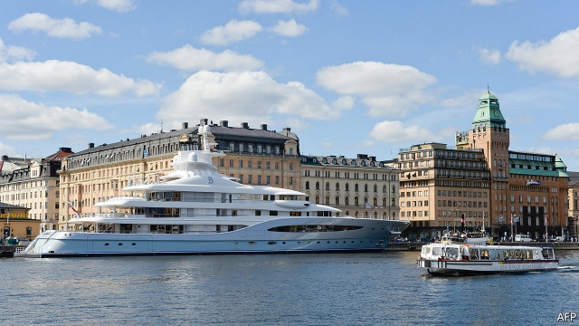

###### The rich man’s world

# In Sweden, billionaires are surprisingly popular 

 

> print-edition iconPrint edition | Briefing | Nov 30th 2019 

AS IS PERHAPS appropriate for the country which produced the song “Money, Money, Money”, Sweden has one billionaire for every 250,000 people, one of the highest rates in the world. It is also one of the world’s most unequal countries in terms of the distribution of wealth. An estimate from The Economist finds that the value of Swedish billionaires’ fortunes is equivalent to a quarter of the country’s annual GDP. Only in tax havens such as Cyprus or Monaco, or captured economies such as Russia or Georgia, are plutocrats more dominant. 

Yet among ordinary Swedes, billionaires are surprisingly popular. “Only the royal family, Astrid Lindgren, Abba and Bjorn Borg could compete in popularity,” wrote one newspaper in 2018 on the death of Ingvar Kamprad, the founder of Ikea. Talk of levying harsh taxes on the wealthy is met with a shrug. “The debate that you have in America or Britain about taxing the super-rich just doesn’t exist here,” says Janerik Larsson of Timbro, a free-market think-tank. 

The popularity of billionaires is partly owing to the perception that they have made their money not by exploiting ordinary Swedes, but by creating multinationals such as H&M, Volvo and Spotify. They are also relatively modest. Even on posh streets there are few fancy cars; rich people eat Smørrebrød in popular restaurants along with everybody else. Many rich families set up foundations to dispense vast sums to good causes. The offices of the Wallenberg Foundations, linked to one of Sweden’s most powerful dynasties, are in a nondescript building in Stockholm (though this week the family defended its bank amid allegations of money-laundering). 

If surprisingly few Swedes hanker for punitive taxes on the rich, that is also because many have concluded that they do not work. Sweden introduced wealth taxation in 1911, followed by three big increases in 1934, 1948 and 1971. By the early 1980s Swedes with a household wealth of about $600,000 (in today’s prices) faced a marginal tax rate of 4%. Combined with heavy taxation of income, the effective tax rate on investment exceeded 100% in some cases. 

Despite these punitive rates, wealth taxation only made a minor contribution to Sweden’s generous welfare state—at most during the post-war period, it raised 0.4% of GDP. From the 1970s onwards its popularity waned. Kamprad fled to Switzerland in 1973; Hans Rausing, whose father founded Tetra Pak, a packaging firm (and who died earlier this year), escaped to Britain in the 1980s. By that decade “people could with impunity evade the tax,” argue Magnus Henrekson and Gunnar Du Rietz, two economists, not least because of the relaxation of foreign-exchange controls in 1989. 

The inclusion of various exemptions—including the exemption of holdings of land and forest from 1991—increased the complexity of the administration of the tax. With bipartisan support, Sweden abolished the inheritance tax in 2005 and the wealth tax in 2007. Before long, Kamprad returned. 

