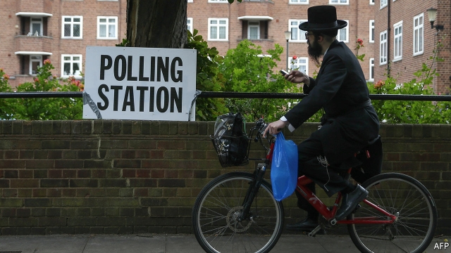
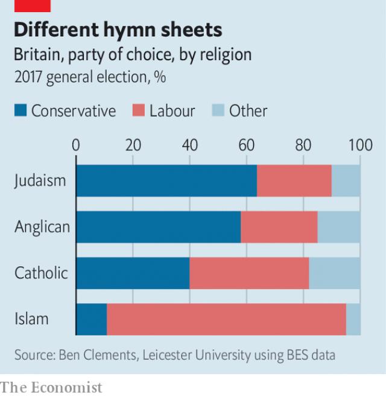

###### Pick your poison

# Britain’s potential prime ministers both face accusations of prejudice 

 

> print-edition iconPrint edition | Britain | Nov 30th 2019 

AT A RABBI’S home in London, a dozen or so guests take their seats for Shabbat dinner, a Friday staple of Jewish households. Before digging in to hunks of challah bread and home-made hummus, each answers a question from their host: “Which non-politician should be prime minister?” One guest nominates Greta Thunberg, a climate-change activist. Another plumps for Prince Andrew on the grounds that he has time on his hands and has already managed to unite the country. The oldies are baffled by a teenager’s choice of Lizzo. “A pop star,” she explains. 

This jolly ice-breaker is also a calculated dose of escapism. Like many other Britons, the guests are not thrilled that the next prime minister will be Boris Johnson or Jeremy Corbyn. Jews have particular reason to take against Mr Corbyn, who has been accused of turning a blind eye to anti-Semitism in Labour ranks. On November 25th Ephraim Mirvis, the chief rabbi, wrote in the Times that a “poison—sanctioned from the top” had spread. The next day Mr Corbyn declined four times in a BBC interview to apologise for the long-running sore. 

Mr Johnson faces his own charges of failing to confront prejudice, in the form of Islamophobia. His affection for well-paid hyperbole in his former side-gig as a newspaper columnist has not helped. A suggestion that women wearing burqas “look like letterboxes” caused particular offence. This week the Muslim Council of Britain issued a statement accusing the Tories of allowing Islamophobia to “fester in society”. 

Religious leaders often speak out, but they tend to stop short of telling people how to vote, says Nick Spencer of Theos, a think-tank. Mr Mirvis’s remarks suggest he “considers this issue sufficiently serious as to break the unwritten protocol”, he adds. 

Such warnings have travelled well beyond Britain’s 260,000 or so Jews, just as Mr Johnson’s comments have offended more than merely Muslims. According to one poll, 30% of Britons think Mr Corbyn is an anti-Semite, and the same share consider Mr Johnson a racist. Prejudice has become an electoral liability for both men. 

As for Jews and Muslims themselves, most have already made up their minds. British Jews once favoured Labour, in common with other minority groups. But they began to drift rightward in the 1980s when Margaret Thatcher, then prime minister, held the north London seat of Finchley. Its sizeable Jewish population approved of her lack of prejudice towards Jewish ministers and her rapport with the then chief rabbi. 

 

Growing affluence led others to switch sides. By 2010 half of Jews voted Tory, according to an analysis by Ben Clements of British Religion in Numbers, a specialist website. Mr Corbyn has persuaded others to follow suit. In 2017 more than six in ten Jews voted Tory (see chart). Only one in ten has a positive view of Mr Corbyn, according to a study by academics at Manchester University. Nearly two-thirds say they are unlikely ever to vote Labour again, 20 points more than among the overall electorate. 

Nor will Tory Islamophobia persuade many Muslims to vote Labour, since most already do. In the degree of their attachment to Labour and distrust of the Tories, Muslim voters are a “mirror image” of their Jewish counterparts, says Maria Sobolewska, one of the Manchester academics. The intensity of their support has been growing in recent years, too. According to Mr Clements’s analysis, 66% of Muslims voted Labour in 2015. In 2017, 85% did so. 

This does not reflect a reaction against Mr Johnson, who became leader only this year. In any case, Nicole Martin, also of Manchester, points out that many Muslims have long perceived the Tories to be prejudiced against them. Instead, the rise points to their personal endorsement of Mr Corbyn, a long-standing advocate of Palestinian statehood and critic of Western adventures in the Middle East. In the end, both sets of worshippers may be thinking of Mr Corbyn as they cast their ballots. ■ 

Dig deeper:Our latest coverage of Britain’s election 

