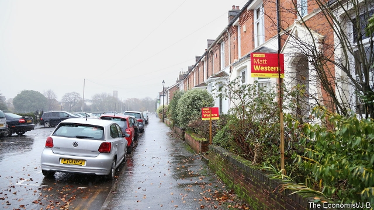
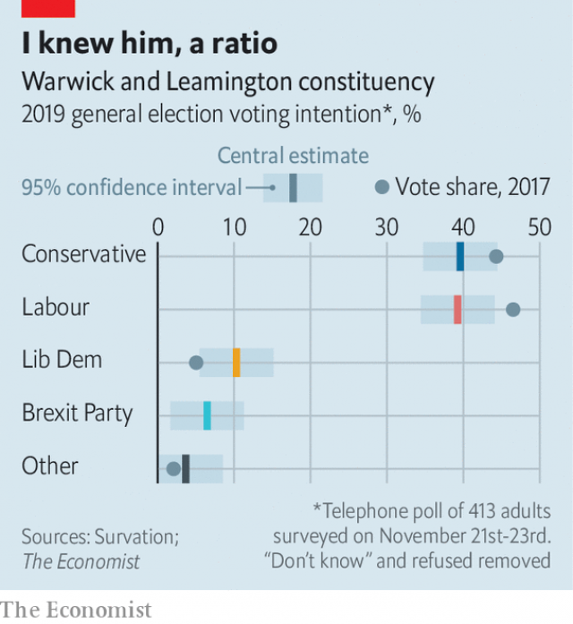

###### Swing seats: Alas, poor Warwick

# In Warwick, Remainers prepare to vote tactically 

 

> print-edition iconPrint edition | Britain | Nov 28th 2019 

THE CONSTITUENCY of Warwick and Leamington was once known as the Garden of Eden, not because it is beautiful—though it is—but because it was the Conservative stronghold of Anthony Eden, who won the seat nine times over 34 years. The first Labour candidate ever fielded in the constituency was Daisy Greville, Countess of Warwick, who campaigned from the back seat of a Rolls-Royce in 1923, says Wyn Grant of Warwick University. Labour took the seat only in 1997, and held it until the end of the Blair-Brown era in 2010. 

Few foresaw the victory of Labour’s Matt Western in 2017. “It wasn’t a surprise,” says Mr Western, who clinched the seat by 1,206 votes. “It was a shock.” In a constituency that backed Remain by 58% to 42% in the referendum of 2016, Brexit was the Tories’ undoing. The pattern was repeated in enough Tory-held seats to deprive Theresa May of her majority. 

 

This time there are fears among anti-Brexit campaigners that the Remain vote could be fatally split, in Warwick and constituencies like it. Twenty seats in England that backed Remain by more than 55% have surmountable majorities of under 5,000. If enough Labour voters frustrated with Jeremy Corbyn’s neutrality on Brexit defect to the Lib Dems, many of those seats could go to the Tories. Yet a poll for The Economist by Survation suggests that, in Warwick at least, a certain amount of tactical voting is going on. The Lib Dem vote is up only five points on 2017, with Labour and the Tories as closely tied as they were last time (see chart). Voters seem to be organising themselves into Leave and Remain camps even in the absence of a formal pro-EU alliance. 

 

It is “fantastic to be in a constituency where your vote is valued”, says Mark Adams, a recent transplant from London. Mr Adams runs Vitsoe, a high-end furniture-maker that employs some 40 people in Warwick and exports about 70% of its goods. Although working with Germans for 35 years gave him “ample evidence to be a passionate Leaver”, he believes Britain is better off inside the EU. Who will get his vote? “I am checking all the tactical-voting sites to cast my vote to achieve Remain,” he says, even if it means “holding one’s nose” in the polling booth. 

The Lib Dem candidate, Louis Adam, who optimistically describes the seat as a three-way marginal, is nonetheless on track to keep his deposit—and perhaps to let in the Conservatives in the process. The Tories’ man, Jack Rankin, must overcome the suspicion of some locals that he is an out-of-towner, parachuted in as he was from Windsor, 70 miles away. 

The contest may come down to the student vote, which helped Mr Western last time. Warwick’s students’ union is littered with pamphlets encouraging its 27,000 students to vote; the university’s mobile app has been pinging notifications too. But the election is five days after term ends, and many students will have gone home by then. Daniel Ryan, a 20-year-old physics student from London, and James Cuttell, a classmate from Derby, say they and most of their friends are unsure whether they will vote at home or in Warwick. Mr Ryan considers Boris Johnson a “nutter”, Jeremy Corbyn “dangerous” and disagrees with the Lib Dems’ policy of simply disregarding the referendum. “I do feel like there are no good options,” he says. ■ 

Dig deeper:Our latest coverage of Britain’s election 

