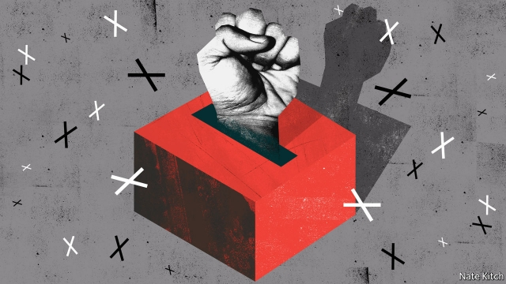

###### Bagehot

# Jeremy Corbyn’s political agenda is more radical than his economic one 

 

> print-edition iconPrint edition | Britain | Nov 30th 2019 

THIS IS AN age of political surprises. Donald Trump won the presidential election of 2016 after being treated as a no-hoper. The Brexiteers won their referendum despite being dismissed as cranks. Jeremy Corbyn is now widely seen as a lost cause, particularly after a week in which the chief rabbi accused him of anti-Semitism and a large poll suggested the Tories could win a majority of 68. But history could easily have another surprise up its sleeve. 

What happens if Mr Corbyn defies expectations and enters Downing Street next month? Most people have focused on the economic consequences. Labour boasts that it will “rewrite the rules of the economy” and jack up public spending. But just as significant will be the political consequences. The party plans nothing less than what Tony Benn, Mr Corbyn’s mentor, called an “irreversible shift in the balance of power in favour of the working people”. The political revolution is in many ways more central to the Corbyn project than the economic one. Economics is only the means to remaking Britain’s political soul. 

The two most obvious changes will be big increases in the power of the state and of the trade unions, reversing four decades of movement in the other direction. Labour’s manifesto bristles with government-powered solutions to every problem: the renationalisation of the utilities; a free, state-run British Broadband Service; a state-run drug company to provide cut-price medicines; a sustainable-investment board and a national energy agency; national commissions on food, health, working time, women, pensions; and agencies galore. Alongside this it contains a detailed list of promises to organised labour. The party would roll out sectoral collective bargaining across the economy, remove “unnecessary restrictions” on industrial action and grant “the biggest extension of workers’ rights in history”. 

But this is only the beginning. The two great watchwords of Labour thinking are “democracy” and “decentralisation”. The manifesto unveils plans for a democratic “revolution”, reducing the voting age to 16, extending full voting rights to foreign residents, creating a Constitutional Commission, advised by a citizens’ assembly, and a host of other measures to “put power in the hands of the people”. Democratisation goes hand in hand with decentralisation, to redress the lopsided balance of power between London and the rest of the country. Much of this sounds appealing. Britain’s version of representative democracy is broken. The political class is held in contempt. Parliament has spent three years deciding nothing. Dozens of MPs—including some of the brightest—are retiring from political life because it is too toxic. And much of the anger that is upending politics is driven by a revolt of left-behind regions against an over-mighty capital. 

Yet Labour’s version of people power promises to make a mockery of both democratisation and decentralisation. Two ideas lie at its heart. The first is extending the reign of democracy from the public sphere to the private sphere. John McDonnell, the shadow chancellor, told last year’s Labour Party conference that “the labour movement has always believed that democracy should not stop when we clock in at the factory gate, in the office lobby, or—like my mum in BHS [a department store]—behind the counter.” The second idea is handing power to activist groups in local government and in workplaces. In practice this doesn’t mean empowering ordinary people. It means handing control to highly motivated activists who are prepared to devote their evenings to passing composite motions. If ordinary folk try to get a look in they will either be ignored, as Mr Corbyn did when the majority of Labour supporters urged him to take a clear line on remaining in the EU, or shouted down. Some activists think nothing of resorting to bullying, misogyny and racism if they don’t get their way, driving dedicated MPs such as Luciana Berger out of the party and turning local party meetings into echo-chambers of extremist ideas. 

The manifesto opens up growing areas of British life to be treated to the same technique that Mr Corbyn has used to take over the Labour Party. Labour plans to force big companies to put 10% of their shares into Inclusive Ownership Funds, managed by employees. It wants to double the size of the co-operative sector, with a combination of incentives and subsidies. Mr Corbyn has even suggested that employees should have the power to elect the editors of newspapers and television news programmes. 

Labour regards activism as a way of subordinating both the state and the business world to the popular will. One of the sacred texts of Corbynism, “In and Against the State”, encourages radicals to get jobs in the public sector in order to turn it into an instrument of social activism and a funder of left-wing causes. Labour’s share-appropriation plan will make Inclusive Ownership Funds, which will probably be run by worker-activists, the biggest shareholders in blue-chip companies such as AstraZeneca, Tesco and Marks & Spencer. Again, some of this might sound attractive: too many civil servants live in a Whitehall bubble and too many managers overpay themselves for spouting claptrap. But Mr Corbyn’s ideas represent a threat to one of the basic principles of liberalism: that there is a limit to the power of politics. Liberals accept that the business world operates according to the principles of property rights and free exchange, rather than the popular will, and that individuals possess basic rights that cannot be overruled by democratic diktat. Mr Corbyn is having none of that. 

All this makes Labour’s political agenda even more dangerous than its economic plans. It injects politics into every corner of society. It whips up enthusiasm by demonising opponents (the stinking rich, the heartless Tories) and organising supporters into euphoria- or rage-fuelled rallies. And it feeds on itself—the more opposition it encounters, the more it relies on the sheer force of the people’s will. This could be Britain after December 12th. ■ 

Dig deeper:Our latest coverage of Britain’s election 

