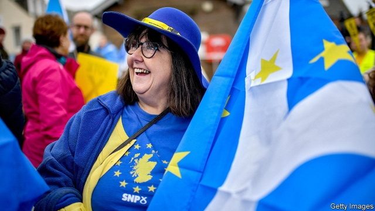
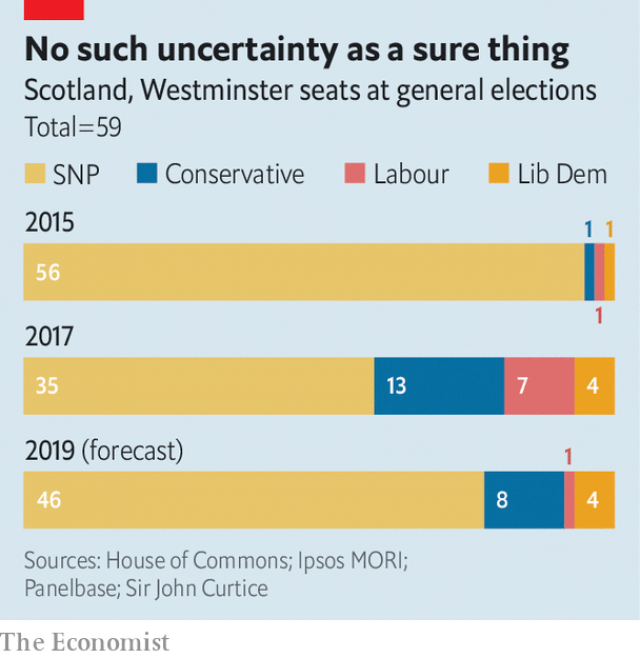
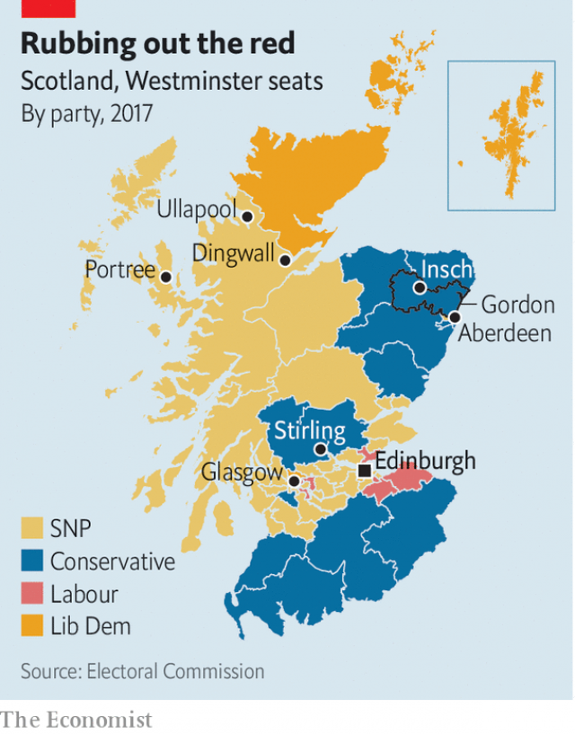

###### Scots forage votes

# Scotland’s three-dimensional election 

 

> print-edition iconPrint edition | Britain | Nov 30th 2019 

COWIE, A VILLAGE in the coal belt just south of Stirling, used to be a Labour stronghold. But all the 15 or so men in the bar-room of the Cowie Tavern (there are no women) will be voting for the Scottish National Party (SNP) on December 12th. The only remaining Labour supporters are the twin barmen, Steve and John Sneddon, and their father James, a former shop-steward in the brickworks who sits in the lounge area with a rug over his knees. Not even they are enthusiastic about the current state of the party. “Corbyn’s too left-wing and too indecisive,” says Steve. “The only good thing that will come out of this election is that he’s going to go.” 

Bannockburn, another former mining village and the site of the decisive battle in the 14th century in which Robert the Bruce rubbed the nose of the English King Edward II in Scottish dirt, is four miles away. But the two dozen drinkers in the Empire pub, all former Labour supporters, will to a man (and a woman—aside from the barmaid there is one) vote Conservative. “My father was a miner. He’d turn in his grave,” says Stewart Thomson, a retired electrician. But the vote is a tactical one: “I’m voting Tory to keep the SNP out.” 

The difference between the two villages, according to one of the drinkers in the Empire, is that “in Cowie, they’re Catholics”. Immigration in the 19th century has left bits of central Scotland with echoes of Northern Irish politics, in which nationalism is associated with Catholicism, and unionism with Protestantism. 

The two pubs illustrate the three main features of the campaign in Scotland. This election, like everything in Scottish politics, is ultimately about independence. Labour, which is trying to position itself in the middle ground on both Brexit and independence, looks like being roadkill. And while the English election is two-dimensional—left v right, Leave v Remain—the added Scottish dimension of independence makes it a Rubik’s Cube of complexity. Combined with small majorities—the margin of victory last time in 46 out of 59 seats was less than 10%—that makes the Scottish election highly unpredictable. 

The result is crucial to the national outcome. Without the gains the Tories made in Scotland in 2017, Theresa May would not have been able to form a government. It is also crucial to how the independence story plays out. If the SNP holds the balance of power next month, the price of its support will be another Scottish referendum. But if the SNP is knocked back, the cause of independence will be too. 

 

After the unionists won the 2014 referendum on independence, the Conservative government assumed that the nationalist movement would lose steam. Instead, it was galvanised, and the SNP won a stonking victory in the Westminster election of 2015, getting 56 out of 59 seats. Labour, which had run Scotland for half a century, went down from 41 MPs to one. 

In the SNP’s view, the EU referendum, in which the UK voted 52:48 to leave and Scotland voted 62:38 to remain, justified revisiting the independence question. But the decision to do so immediately is regarded as a mistake. “Sturgeon overplayed it,” says Mark Diffley, a pollster in Edinburgh. Support for independence, which jumped after the Brexit vote, dropped back again, and the SNP lost ground in the 2017 Westminster election, winning 35 seats. 

Its score is likely to improve this time. If Scotland’s voters are broken down into four groups, according to how they voted in the independence and EU referendums, the Yes/Remainers fit comfortably with the SNP and the No/Leavers with the Tories, but the No/Remainers (22% of voters) and the Yes/Leavers (8%) have no natural home. Support for independence is growing among Remainers, suggesting that the No/Remainers are drifting towards the SNP. 

In Stirling, according to Alyn Smith, the SNP candidate, who is visiting a group of damp activists standing on the bridge in Dunblane, the presence of the University of Stirling is shifting things in his favour. There are a lot of Europeans in the constituency, and “the university is enmeshed in the EU structure.” A passing voter, Annette Kupke, who was born in Lower Saxony, concurs, complaining of “lies and deceit” from the Tories. Sheltering from the rain in the cosy nearby Riverside pub, a psychologist will vote SNP “for tactical reasons: I want to stop Brexit”. 

 

But while the SNP is expecting a lift, the Tories, who two months ago looked like being wiped out in Scotland, may hang on to most of 13 seats they won in 2017. For a party that has held one seat, or none at all, for most of the past two decades, that would be quite a result. It will benefit from the perception that the SNP’s single-minded pursuit of independence has distracted it from the business of running Scotland. 

There is a regional dimension, too. The SNP’s centre of gravity is shifting. Its previous leader, Alex Salmond, a north-eastern MP, was credited with improving its infrastructure. Under Nicola Sturgeon, the party has become more identified with the urban, central belt around Glasgow and Edinburgh, and with higher social spending. That does not go down well in Scotland’s wealthiest region, home of its biggest industries—farming, fishing, oil and gas. 

A December election is testing the commitment of SNP canvassers in Gordon, which the Tories also took last time. “It’s a bit dreich [dreary],” says one of them, eyeing the weather in Insch, a grey Aberdeenshire village, where it has been raining, off and on, all day. “It’s the mizzle [cloud that is not quite drizzle] that’s worst,” responds another. “We’re like Eskimos,” says Richard Thomson, the SNP candidate, who is hoping to take the seat back from the Conservatives. “We have 50 words for rain.” 

Mr Thomson’s leaflets focus on the closeness of the race with the Tories in 2017, and feature a blond mop so recognisable that the face is unnecessary. Both the Tories and the SNP are presenting the election as a binary choice. The SNP wants to scoop up remaining left-wing voters by crushing Labour; the Tories want to corner the unionist vote. Ms Sturgeon “is framing the election exactly as I would want it to be framed,” says a Conservative member of the Scottish Parliament. “She’s turning the union into a Tory proposition. Labour isn’t getting a word in edgeways.” 

Current polling suggests that Labour, which won seven seats in 2017, may retain only one. A silent pact between the SNP and the Tories to crush it is not the only reason for its travails. Jeremy Corbyn, its leader, said this week that he is “neutral” on Brexit; and while not supporting Scottish independence he is leaving open the possibility of another referendum. By failing to take a stand on either of the great issues exercising Scotland, he has succeeded in alienating all four groups of voters. 

But Mr Corbyn is not the only politician who does not much appeal to Scots right now. According to Mr Smith in Stirling, the first issue that voters raise on doorsteps is neither Brexit nor independence: “It’s the scunner [disgust] factor, attaching to politics and politicians.” ■ 

Dig deeper:Our latest coverage of Britain’s election 

