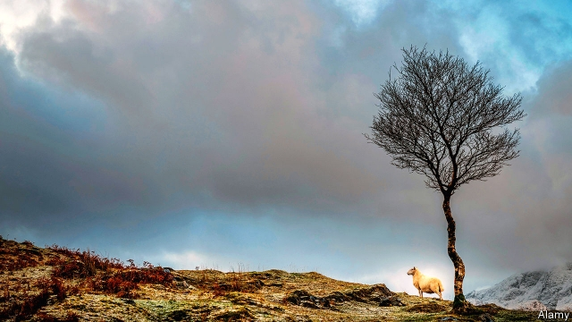

###### Skye news

# The battle for the biggest constituency in Britain 

 

> print-edition iconPrint edition | Britain | Nov 30th 2019 

THE PUMP whirrs as it sucks salmon from their pen. Then the prospective MP helps feed the fish into a stunner, which whacks them on the back of the head. Having slaughtered a hundred or so, Craig Harrow pauses for a photo with a suitably attractive specimen, before delivering a stump speech to a dozen taciturn, blood-spattered fish farmers. He apologises for taking up their time. “If there are any ardent nationalists here,” the Liberal Democrat candidate says, “I’m sorry about that, too, because I’m pro-EU and pro-UK.” And so begins the week’s campaign for Ross, Skye and Lochaber. 

At 12,000 square kilometres, only a bit smaller than Northern Ireland, the sparsely populated constituency is the biggest in Britain. It stretches from Skye, off Scotland’s west coast, to the Black Isle (which is neither black nor an island) on the east coast. Mr Harrow’s attempt to win it back for the Lib Dems from Ian Blackford, the leader in Westminster of the Scottish National Party (SNP), will therefore involve a lot of travel. After visiting the salmon farm near Ullapool, on the west coast, he ends the day in Dingwall, on the other side of Scotland, pressing the flesh with farmers at a union meeting. 

With both the SNP and the Lib Dems opposing Brexit, Mr Harrow must unite the unionist vote behind him. Mr Blackford is confident he will be able to hold him off. The Lib Dems held the seat until 2015, but fell more than 7,000 votes short of unseating Mr Blackford at the last election, two years ago. The SNP’s man may be a former banker, but he is also a keen crofter and has a national profile. Before he heads out leafleting in Portree, Skye, he asks an activist to help him get 16 of his sheep to market. 

A winter election is tough for activists across the country, but it is particularly bitter in northern Scotland, where the sun sets before 4pm. The only way across parts of the constituency is by single-track roads, which feel perilous at the best of times. Online campaigning helps, but candidates are still keen to show their faces. And as Mr Harrow notes, the evening, “the time when most people would be in, is the time when you don’t want to knock on their door because it will be dark.” Which means that to have any hope of overturning Mr Blackford’s majority he will have to make every daylight hour count. 

Dig deeper:Our latest coverage of Britain’s election 

