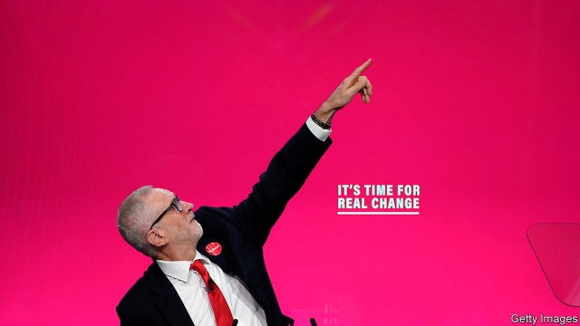
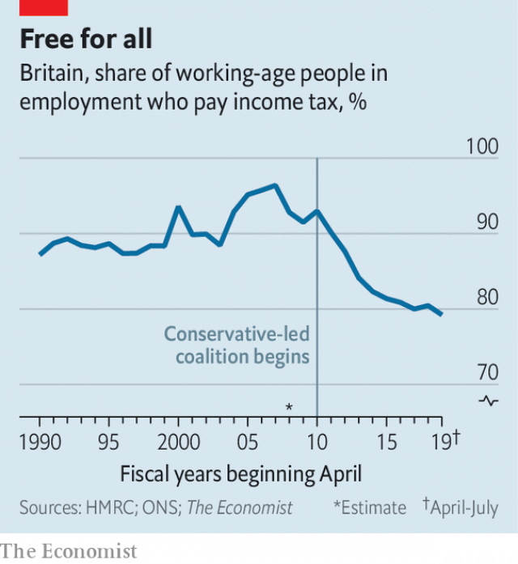

###### Something for nothing

# The curious case of the missing British taxpayer 

 

> print-edition iconPrint edition | Britain | Nov 30th 2019 

EVEN AS BOTH main parties promise more spending, they insist that most voters will not pay a penny for it. Labour says those earning under £80,000 ($103,000) will see no rise in income tax, despite its promise of more than £80bn a year of extra day-to-day spending (equivalent to 4% of GDP). The Conservatives, who plan a more modest spending rise of £3bn, say they can afford to do this while reducing the number of workers who have to pay national-insurance contributions, a payroll tax. Can taxpayers really get something for nothing? 

For most of the past century, Britain’s tax burden has become more evenly spread. Between 1920 and 1970, as demand for public services grew, the share of citizens liable for income tax more than tripled. But recently the tax base has been shrinking. A decade ago 95% of workers paid at least the basic rate of income tax. Now only 80% do. That is a result of reforms by the Conservative-Liberal Democrat coalition of 2010-15, which decided the best way to help the poor was not to increase welfare, as Labour had, but to raise the threshold above which workers paid income tax. Since 2010 the tax-free allowance has increased from £6,475 to £12,500. Boasts of “taking people out of tax” have become a staple of Tory budgets. 

 

Meanwhile, the burden on the richest has grown. The top 1% of income-tax payers contribute 30% of the total take, up from 22% in the mid-2000s. Labour would rely on them still more heavily. The party claims (dubiously) 95% of people would pay no more in tax for the free broadband, better health care, free university and other goodies it promises. 

Both parties’ plans are flawed. Taking the poor out of tax, as the Tories promise, is an expensive way to help them, since higher earners also benefit from increases in the allowance. And Labour’s dependence on the rich is risky. High earners are the most responsive to tax, and their incomes are among the most volatile—as Britain discovered in the financial crisis, which whacked bankers’ bonuses and with them tax receipts. 

Only the Lib Dems admit that their spending plans would require most people to chip in. They propose an extra 1% on all income-tax bands. Other parties will surely need to drop the something-for-nothing approach soon. An ageing population and the need to decarbonise are heavy responsibilities that cannot be borne by ever fewer people. 

Dig deeper:Our latest coverage of Britain’s election 

