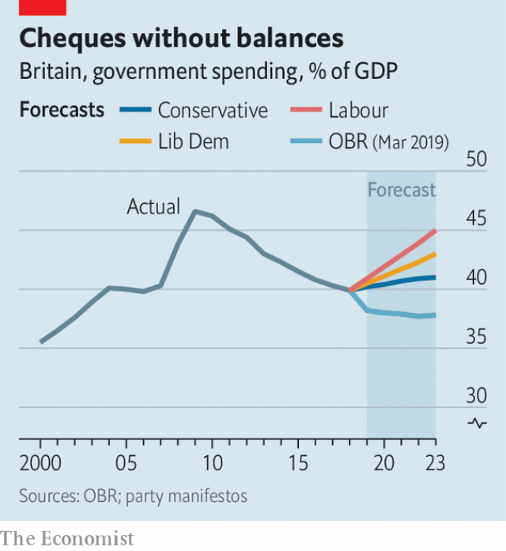

###### Manifestos compared

# Whoever wins Britain’s election, the state will expand 

 

> print-edition iconPrint edition | Britain | Nov 30th 2019 

SO LONG AS they disappear within 48 hours, manifestos seldom matter. Yet everyone recalls the 2017 Tory “dementia tax” to fund social care that was hastily dropped days later—one reason why this year’s Conservative prospectus is so bland. And manifestos count in government, as well as setting the tone for an election. This time, the three main ones offer two related themes—and, in the shape of Brexit, one big elephant in the room. 

The first theme is of a bigger state. It is not just that austerity is over, but that public spending (and, more slowly, tax) seems on an inexorable upward course. Linked to this is the notion that, with long-term interest rates so low, more borrowing to finance infrastructure or green investment is not just easy but positively desirable. Worries about excessive public debt have been forgotten, though the Liberal Democrats chart a path to a current budget surplus. Ironically, given Brexit, the resultant size of the state puts Britain closer to other European countries like Germany—and well above America or Japan. 

 

The second theme is that differences between the parties are huge. Labour is out on its own in terms of spending, with a radical plan for European-style socialism and a huge rise in current spending of over £80bn ($103bn) a year. The more cautious Tories are the least lavish, though they too prefer spending to tax cuts, while the Lib Dems come in between (see chart). This break with the centrist consensus is historically unusual. In both 1997 and 2010, opposition parties carefully matched the government’s spending plans. 

That said, the parties’ spending priorities are similar. All three promise to pay extra tribute to the insatiable National Health Service, to education and to policing. There is new enthusiasm for help with child care, with the Lib Dems being the most generous. Labour reveals a fondness for universal freedom in scrapping prescription charges and university tuition fees and promising free broadband for all. It even proposes a “right to food”, perhaps to match the Tories’ promise to fill the nation’s potholes. As the creator of the NHS, Labour also plans a national education and national care service. 

Although Labour has long attacked Tory cuts in benefits for the poor, it proposes to restore only a quarter of them. Its plans to replace universal credit, the Tories’ unpopular welfare system, are vague. And it is notable how many goodies go to the old. All three parties keep the costly “triple lock” that more than inflation-proofs pensions. Labour wants to scrap plans to raise the pension age beyond 66 and to compensate the so-called WASPI women, a cohort whose retirement age was raised from 60 at short notice, at a one-off cost of £58bn. Torsten Bell of the Resolution Foundation, a think-tank, suggests that politicians still think, wrongly, that the old are poorer than the young (they certainly vote more). The Tories notably sidestep the time-bomb of under-funded social care, though a promise that nobody should ever be forced to sell their home to pay for it looks potentially expensive. 

When it comes to financing all this, the parties come over all coy. The message to most taxpayers is that somehow others—companies, the rich, tax-avoiders—will bear most of the burden (see article on next page). The Lib Dems are at least honest in suggesting a 1p rise in income tax, plus a tax on frequent flyers. Labour relies more optimistically on higher taxes on top earners, a big rise in the corporate-tax burden (to the highest level in the G7), heavier taxes on capital gains, dividends and inheritance, plus a financial-transactions tax. 

As for the tax-cutting Tories, they want to raise the threshold for national-insurance contributions (NICs), but only in stages, and they too would reverse some planned corporation-tax cuts. They also renew their promise of no increases in income tax, value-added tax or NICs. Paul Johnson of the Institute for Fiscal Studies, another think-tank, calls this irresponsible given the prospective rising tax burden to cope with demographic change. No party has a sensible plan for tackling the mess of property taxes and stamp duties that help to gum up the housing market. 

All three manifestos nod to the environment, with talk of a green industrial revolution and uncosted promises to advance targets for net-zero carbon emissions. But most striking of all is Labour’s economic programme. The party not only promises to nationalise water, rail, mail and part of BT (at prices set by Parliament, not the market), but also to set up a national investment bank and even a state drugmaker. It promises to transfer 10% of big firms’ shares to a fund managed by employees, as well as giving workers a third of seats on company boards. This, the most left-wing challenge to a capitalist, mixed-economy system since François Mitterrand’s in France in 1981, fully justifies the manifesto title of “real change”. 

And then there is Brexit, which is little discussed beyond the slogans of “Stop Brexit” (as urged by Lib Dems and Scottish Nationalists) and “Get Brexit done” (the Tories’ mantra). Labour promises another referendum, in which Mr Corbyn would be neutral. But the riskiest promise is the Tory one not to extend the transition period beyond December 2020. No expert believes a trade deal with the EU can be done by then, raising once again the prospect of a no-deal exit at the end of next year. And what happens on Brexit may be more consequential than any number of manifesto pledges. ■ 

Dig deeper:Our latest coverage of Britain’s election 

