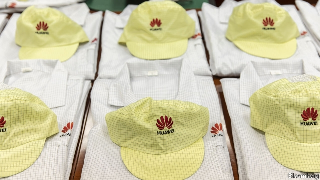

###### Where there’s a will

# Huawei keeps on going 

 

> print-edition iconPrint edition | Business | Nov 30th 2019 

“GENUINELY FRIGHTENED” by Huawei. That was the verdict of Wilbur Ross, America’s commerce secretary, delivered recently to an audience of diplomats. The Chinese tech giant is the world’s biggest supplier of mobile-network equipment. American officials worry that it could use that position for electronic spying or sabotage on behalf of Beijing. 

With that in mind, in May Mr Ross’s department placed Huawei on the “entity list”, restricting the ability of American firms to do business with it. Many analysts expected the results to be painful. Huawei spends more than $10bn a year on buying software, processors and the like from American firms. So far, though, the pain has failed to materialise. Sales of Huawei’s smartphones, which can no longer ship with Google’s popular apps, have flatlined outside China. But on the whole, the firm seems in robust health. On October 16th it announced revenues of 611bn yuan ($89bn) for the first nine months of 2019, up by 24% year-on-year. It said it had signed over 60 contracts to install zippy 5G phone networks around the world. 

Two things explain that resilience. The first is that enforcement has been less fierce than feared. On the same day that Mr Ross was describing his fears, his department issued its first set of licences permitting some American companies to restart sales to Huawei. Among the licensees was Microsoft, whose Windows operating system is used in Huawei’s laptops. 

The second is that the law has proven more porous than expected. When Huawei was first placed on the entity list, it led to corporate panic. Lawyers at American tech firms dived into obscure branches of export law that their firms had never before had to consider. A leaked internal memo from Arm, a chip-design company based in Britain but with a big presence in America, created the perception that its licensing of crucial chip designs to Huawei had completely ceased. Yet after the dust had settled, many of the tech firms concluded that the international nature of their supply chains would allow them to carry on serving Huawei even without a special licence of the sort awarded to Microsoft. 

Nvidia, a chipmaking company based in Santa Clara, California, offers an example. The firm designs graphics processing units (GPUs). These chips specialise in the sorts of mathematics required to draw whizzy graphics for modern video-games. A stroke of serendipity means they are also well-suited to artificial-intelligence work. But Nvidia does not physically make anything in America. Instead it sends its designs, which are not themselves subject to the export controls, to the Taiwan Semiconductor Manufacturing Company, which undertakes the expensive, high-tech process of manufacturing the silicon. Under the law, that leaves Nvidia free to sell the resulting chips to Huawei. 

Many other American companies share this offshore-manufacturing structure. It exists because Western technology firms have largely outsourced manufacturing and assembly to countries such as Taiwan, which have built up large, specialised industries around the task. Only the highest-margin design work is still undertaken at home. For Huawei, this counts as a happy accident. For American security hawks, it is infuriating. 

The status quo may not last. The Department of Commerce is drawing up two lists of technologies, one “foundational” and one “emerging”, whose export will be subject to much more severe restrictions than those imposed by the entity list. Depending on how strictly the lists are drawn, the new rules could do serious damage. 

In the meantime, though, the main effect of the sanctions seems to have been to accelerate Huawei’s push towards technological independence from America. Analysis of its phones by UBS, a bank, shows they now contain fewer American-sourced components (some appear to contain none at all). The firm has said that similar efforts are being made across the company. Huawei is still not immune to determined American action. But it is less vulnerable than it was. ■ 

