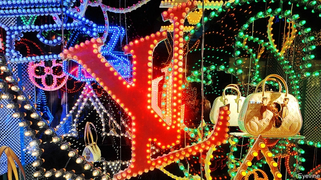
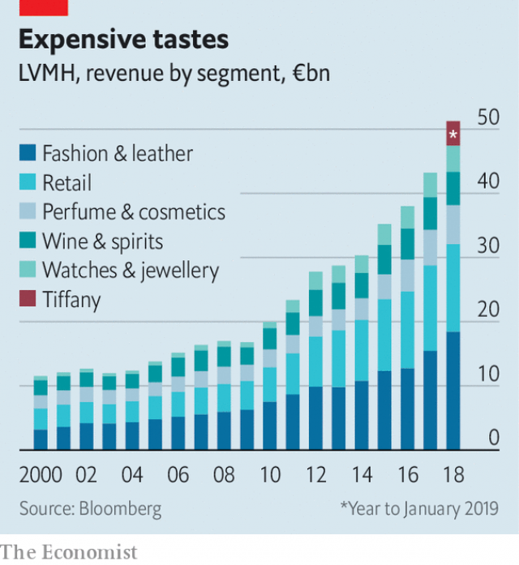

###### The everything-that-shines store

# LVMH tests the limits of luxury 

 

> print-edition iconPrint edition | Business | Nov 30th 2019 

WHAT DO YOU buy the luxury group that has everything? More diamonds, apparently. On November 25th LVMH, already the biggest beast in global luxury, announced it was taking over Tiffany & Co, where Wall Street bond traders sink a few bucks to improve their chances of turning girlfriends into fiancées. The American marque will become the 76th maison of the Parisian group, joining Louis Vuitton, Dior and Veuve Clicquot champagne. How many more can fit under the corporate umbrella of Bernard Arnault, LVMH’s boss and biggest shareholder? 

The deal is as richly priced as a flawless gem. LVMH will pay $16.9bn including net debt, equivalent to nearly four years’ sales at Tiffany. Nonetheless, the takeover was greeted with the enthusiasm befitting a suitable engagement. Luxury, once little more than a cottage industry dominated by family firms in Europe, has become the preserve of a few giant conglomerates. In recent decades there has been a sense of inevitability when another well-known company has fallen into the clutches of LVMH or its rivals, Kering (home of Gucci and Balenciaga among others) and Richemont (which owns Cartier and Montblanc). 

The acquisition cements the place of LVMH at the peak of the luxury world. Its rise has been nothing short of dazzling since Mr Arnault took it over three decades ago. Its shares have risen threefold in the past five years, including a 60% run since January. Worth around €206bn ($227bn), LVMH now vies with Royal Dutch Shell as the most valuable firm based in the EU. 

Mr Arnault, whose family owns nearly half of LVMH (and a solid majority of voting rights), is said to be Europe’s richest man. From the gritty town of Roubaix in northern France, he turned a family construction firm to property, then luxury. He snapped up Dior as part of a package of distressed textile assets in the 1980s, then seized control at LVMH. The “wolf in cashmere” has all the trappings of a $100bn fortune, from a public art collection housed in a Parisian museum designed by Frank Gehry to his impeccably tailored Christian Dior suits and a couple of newspapers. 

“LVMH dominates a structurally favoured sector, buoyed by globalisation and income inequality,” says Luca Solca of Bernstein, a research firm. Its success is the result of being the right size—big—in the right business at the right time. 

Start with the industry. Sales of luxury goods, such as handbags, posh watches and Hermès scarves, have grown by about 6% a year since 1996 according to Bain, a consultancy. It estimates the industry will be worth €281bn this year. Chinese shoppers, who barely featured in 2000 but now account for a third of all sales, have added much of the fizz. 

 

Size has brought more rewards. In an industry with high fixed costs—spent on marketing, but also on eye-watering rents for shops on flashy thoroughfares—selling more translates into better margins. LVMH has achieved nearly double the industry’s growth rate in the past two decades, and last year sold over €46bn-worth of extravagance (see chart). That is more than three times the figure for Kering and Richemont, its nearest rivals. 

Mr Arnault emerged as the most obvious buyer for Tiffany in part because scale begets advantages not available to smaller bauble-peddlers. That might seem odd at first. Compared with lesser industries, mergers in the luxury world kick up few opportunities for cost-cutting or synergies. Nobody expects Tiffany watches to be sold in Louis Vuitton stores, for example. 

But analysts think brands can do better within a conglomerate. Take Tiffany. Its shareholders had pestered management to improve margins and raise sales fast, unduly hurrying its turnaround efforts. LVMH says it will give Tiffany time and money, for example to renovate stores and push upmarket. It did something similar with Bulgari, an Italian jeweller. Mr Arnault this week said profits there had risen five-fold since LVMH took it over in 2011. The group does not disclose how each brand is doing (its annual report contains more pictures of jewel-laden models than financial minutiae), easing the pressure on creative types to meet quarterly targets. 

Scale has more mundane advantages, too. Conglomerates have more clout when negotiating, for example, with landlords of new malls in China. They can browbeat magazines for better advertising rates. Hefty costs associated with building e-commerce sites can be shared. 

Such advantages suggest more consolidation. But there are limits for LVMH and others. One is supply. The timeless brands that conglomerates crave by definition need a long history, and these are relatively few. Those that remain independent, such as Chanel or Rolex, preserve that status fiercely. Mr Arnault has got round this by subtly expanding the scope of luxury, for example by branching out into hotels. 

Another limit, which is particular to LVMH, is whether any group can handle so many different businesses. In other industries, conglomerates are regarded as unwieldy and have fallen out of fashion. Kering slimmed down by spinning off Puma, a sportswear brand, last year. So far the mood is for building empires, not dismantling them. Some wonder if Richemont and Kering might merge to boost their prospects. 

LVMH is not without challenges. The luxury sector’s future is uncertain. Growth in China will not last for ever, especially if trade tensions continue. Even Dom Pérignon drinkers feel the impact of recessions. Marketing has had to evolve to attract millennials who care about Instagram and sustainability. More shopping is happening online, where mastodons like Amazon and Alibaba lurk. 

Perhaps half the firm’s profits come from a single brand, Louis Vuitton. Mr Arnault has made it clear that LVMH is a family firm and that one of his children (four of whom work in the business) will take over. At 70, he remains firmly in charge. But as time passes, the question of whether his heirs have inherited his talent for flogging objects of desire will come into focus. 

And can luxury continue to sell to ever more people yet retain its cachet? So far it has. But the industry Mr Arnault helped create is young, despite the timeless quality it seeks to exude. It has thrived by spending extravagantly to get people to buy beautiful foreign things they do not need. It is the archetypal business model of the times. But what if times change?■ 

