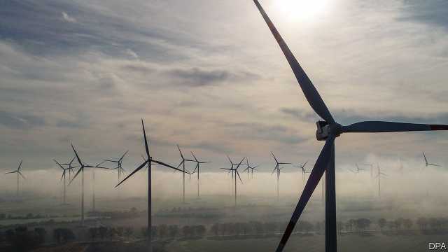
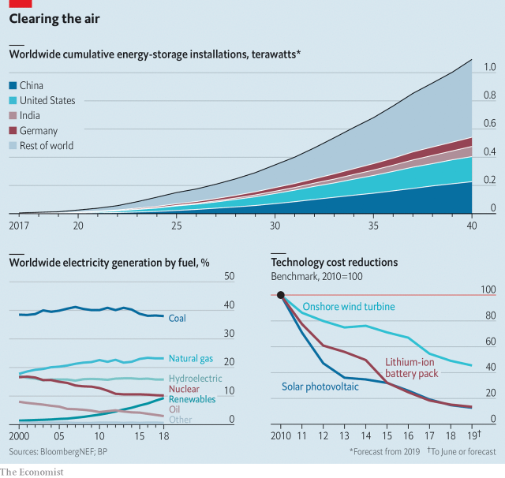

###### To have and to hold

# Supplying clean power is easier than storing it 

 

> print-edition iconPrint edition | Business | Nov 30th 2019 

IT SOUNDS SIMPLE: lift heavy blocks with a crane, then capture the power generated from dropping them. This is not an experiment designed by a ten-year-old, but the premise of Energy Vault, which has raised $110m from SoftBank, a big Japanese tech investor. The idea has competition. A cluster of billionaires including Bill Gates, Jack Ma, Ray Dalio and SoftBank’s Masayoshi Son are backing other schemes to capture power. A firm incubated at Alphabet, Google’s parent company, wants to store electricity in molten salt. Such plans hint at one of the power business’s hardest tasks. Generating clean power is now relatively straightforward. Storing it is far trickier. 

Solar and wind last year produced 7% of the world’s electricity. By 2040, that share could grow by over five times, according to the International Energy Agency, an intergovernmental forecaster. The trouble is, a lull in the wind leaves a turbine listless. Clouds have a habit of blocking the sun. That means that solar and wind cannot, on their own, replace coal and gas plants, which produce continual power reliably. 

One answer is to store power in batteries, which promise to gather clean electricity when the sun and wind produce more than is required and dispatch it later, as it is needed. In 2018 some 3.5 gigawatts of storage was installed, about twice the amount in 2017, according to BloombergNEF, an energy data firm. Total investment in storage this year may reach $5.3bn, it estimates. As this grows it could drive an extraordinary expansion (see chart). However at present only about 1% of renewable energy is complemented by storage, reckons Morgan Stanley, a bank. There are still plenty of hurdles to clear. 

 

The most common method of storage so far has been to pump water into an elevated reservoir at times of plenty and release it when electricity is needed. This type of hydropower is not the answer to providing lots more storage. Building a new reservoir requires unusual topography and it can wreak environmental havoc. 

Batteries offer an alternative and availability should improve as electric cars become ever more popular. “The whole production supply chain for lithium-ion batteries for electric vehicles is gearing up,” says Andrés Gluski of AES, an electricity company, “so we’re going to piggyback on that.” As greater demand led to greater manufacturing scale, the cost of batteries dropped by 85% from 2010 to 2018, according to BloombergNEF. That makes batteries cheap enough not only to propel mass-market electric cars but for use in the power system, too. 

And as electric cars become more widespread their batteries could serve as a source of mobile storage, feeding power back into the grid, if required, when the vehicles are parked and plugged in. With the right infrastructure in place, fleets of electric cars could substitute for new dedicated storage capacity. 

Batteries do a variety of things. A firm called Sunrun sells residential solar panels paired with batteries, a particularly appealing proposition for Californian homeowners desperate for an alternative to fire-induced blackouts. Within the broader grid, batteries can act as a shock absorber to deal with variations in supply from one minute to the next. Other uses include shifting electricity supply from the day, when solar panels often produce a surfeit of power, to the evening, when demand rises. 

The growth of storage is becoming a headache for old-fashioned power generators that rely on gas or coal. NextEra Energy Resources, which builds clean-power installations, is increasingly pairing large solar farms with batteries. AES, which has battery-storage facilities in 21 countries and territories, runs a scheme in Hawaii that combines solar with storage to meet peaks in demand. The Rocky Mountain Institute, a clean-energy research group, warns that solar and battery projects, combined with measures such as smarter appliances to control demand, may turn gas-powered plants into stranded assets. 

Nevertheless, the battery industry faces several barriers to broader deployment. To start with, if a battery overheats it can catch fire, producing gases that might explode. In the past year installations in South Korea have caught fire. A fire and explosion in April damaged a storage site in Arizona run by Fluence, a joint venture between AES and Siemens, a German engineering giant. The causes are still under investigation. As the industry matures, safety measures are likely to become more rigorous. 

In the meantime, the industry will have to cope with a patchwork of other rules and regulations. South Korea has offered incentives for storage, in part to create a market for its domestic battery-makers, which are among the world’s leaders. Some states in America, such as New York and New Jersey, have mandated storage to help reduce emissions. In others, America’s federal electricity regulator is trying to open markets to storage, but the details of how that will work in practice are unclear. In Britain, batteries are deemed “generation assets”, which exposes storage developers to extra fees and costs, says Michael Folsom of Watson Farley & Williams, a law firm. 

Even if electricity regulations were smoothed, lithium-ion batteries would eventually reach their limits. Breakthrough Energy Ventures (BEV) is a fund backed by Messrs Gates, Ma, Dalio and other billionaires to invest in transformational technologies. The cost of lithium-ion batteries is falling quickly, but to store power for days let alone weeks “lithium-ion is never going to get cheap enough”, says Eric Toone, BEV’s head of science. 

Alternatives include flow batteries, that use electrolytes in tanks of chemical solution, as well as mechanical means such as Energy Vault’s falling blocks. Hydrogen can also be made using clean power and turned back into electricity in gas-fired power plants or fuel cells. In the future liquefied gases might provide a solution (see article). Unlike solar panels, which have become standardised, different batteries are likely to serve different purposes on a grid. “All batteries are like humans, equally flawed in some specific way,” says Mateo Jaramillo, who led storage development at Tesla, an electric carmaker. 

Mr Jaramillo now leads Form Energy, a firm that is developing an electrochemical alternative to lithium-ion batteries. Investors include BEV and Eni, an large Italian oil and gas firm. Mr Jaramillo declines to predict when his work will be commercialised. But the goal is clear. “If you can develop a long-term storage solution,” he says, “that’s how you retire coal and that’s how you retire natural gas.”■ 

