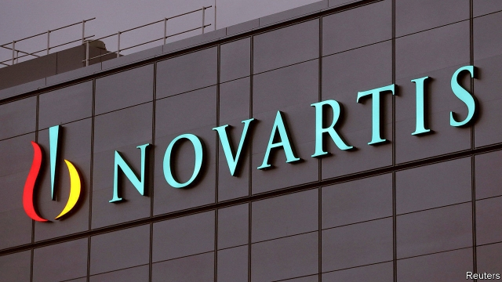

###### Affair of the heart

# The reinvention of Novartis 

 

> print-edition iconPrint edition | Business | Nov 30th 2019 

THE BOSS of Novartis is on a buying spree. Vas Narasimhan has been shopping for new medicines that will reinvent his drug company. His aim is to turn a stodgy European conglomerate into a cutting-edge pharmaceuticals firm by decluttering it of unwanted assets and placing big bets on advanced medicines. These are more precise in the way they work and are likely to play an increasing role in health care in the future. By shuffling the deck, Mr Narasimhan says he is focusing on “transformative innovation”. All bosses of pharma firms like to boast about that kind of thing. Nonetheless, there is substance to the changes afoot at Novartis. 

The latest acquisition, announced on November 24th, of the Medicines Company for $9.7bn, brings with it a promising cardiac drug that targets bad cholesterol, and which can be given in only two annual shots. In less than two years at the helm, Mr Narasimhan has also snapped up an eye drug from Takeda for up to $5.3bn, Endocyte, a small biopharma firm, for $2.1bn, and AveXis, a gene-therapy firm, for $8.7bn. He has boasted about having a pipeline of 25 blockbuster drugs. If they all come good it would be remarkable. 

Out has gone the firm’s stake in a joint consumer health-care venture with GSK, a British pharma firm, for $13bn. Alcon, its eye-care division, has been spun off into a separately traded company. 

Pharma firms have been slow to adopt the digital transformations that have brought innovation (and disruption) to finance, shopping, banking and airlines. The new Novartis is more intent than rival drug firms on using big data and digital technologies to improve productivity and offer new services. If it can harness big data, the firm could become more adept at drug development. This would, for example, allow Novartis to hone the way it runs clinical trials. It could also allow the firm to identify subgroups of patients within sufferers from diseases such as multiple sclerosis, who will respond better to particular drugs, significantly lowering the cost of treatment. The firm is also opening digital health labs, including one in San Francisco, to tap into start-ups in the health-technology field. 

Even as it tries to reshape itself for the next era of medicine, Novartis still faces some criticisms familiar in the drug industry. One is high prices. Its gene-therapy drug, Zolgensma, is expected to cure spinal muscular atrophy, but costs $2.1m per treatment in America. Novartis has also been sharply admonished by regulators and lawmakers for being slow to reveal that falsified data were used to gain approval for the drug. The firm says it was standard procedure to investigate before informing authorities. The dodgy data seem to have no bearing on the safety or efficacy of the drug. 

When it comes to the new heart drug Mr Narasimhan has bought, he will have less pricing power than with Zolgensma. Although the medicine may be better than its rivals, the market is crowded with similar drugs that are not selling well. But while its transformation is under way at least Novartis, like its rivals, can rely on a booming Chinese market, where the government is now paying reasonable prices for foreign drugs. Novartis talks of doubling sales in Asia over the next five years. Investors who are worried about the high price paid for the Medicines Company can take heart. ■ 

