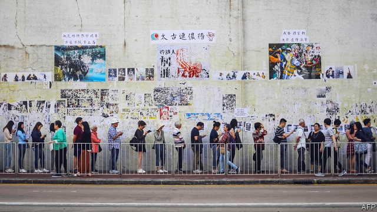

###### No time for the party line

# Hong Kong’s democracy movement has gained a big electoral boost 

 

> print-edition iconPrint edition | China | Nov 30th 2019 

AFTER NEARLY six months of unrest in Hong Kong, involving increasingly violent protests, vandalism and transport chaos, the government had reason to hope that public opinion might have turned against the demonstrators. No such luck. Instead, voters handed a stunning victory to pro-democracy candidates in district elections on November 24th. The message was plain: for all the recent mayhem, Hong Kongers strongly dislike their government and its backers in Beijing. The result was a strong endorsement of the protesters’ campaign for political freedoms. 

Ostensibly the election was merely about picking 450-odd representatives to district councils—bodies that recommend policies relating to humdrum local problems. This time, however, the turnout was huge—a record, indeed, for any kind of election in Hong Kong that involves a public vote. Nearly 3m voters—more than 71% of those registered—took part, up from 47% four years ago (some are pictured queuing). After casting her own ballot, Hong Kong’s chief executive, Carrie Lam, dismissed the idea that this was a vote of confidence in her leadership. Perhaps she had sensed the approaching electoral avalanche. Pro-democracy politicians won almost 90% of the seats and took control of 17 of the 18 councils. Previously they had dominated none of them. 

Mrs Lam has promised to “seriously reflect” on the results. Many people will expect her to do more than that—at a minimum, by reshuffling her cabinet and advisory boards to include voices from outside the establishment, and by launching independent judge-led inquiries into the causes of the protests and police handling of them. Since the elections, however, Mrs Lam has given no hint that she will agree. 

That will surprise few of the protesters. Mrs Lam—probably at the urging of officials in Beijing—has shown little inclination to make further concessions after her decision early on to abandon the draft extradition bill that triggered the unrest (it would have allowed suspects to be tried by courts in mainland China). But democrats will take heart nonetheless. They hope the outcome of the elections will help their side gain strength in other, more important, bodies. 

One of these is the Legislative Council (Legco), to which elections will be held next September. Only half of Legco’s 70 members are directly elected, using a system of proportional representation that allows pro-establishment candidates to gain seats despite not having pluralities, let alone majorities. Other seats are mostly filled by so-called “functional constituencies”, in which the electorate is limited to people working in certain jobs. Pro-government candidates do well in these. But six of the seats are reserved for district councillors. The pro-democracy camp can now expect to capture them as well as more of the others. They may even be able to gain a majority of Legco’s seats. 

Opposition politicians also hope to increase their hitherto minuscule influence over the selection of chief executives. This is done by an “election committee” comprising 1,200 people chosen by methods designed to marginalise democrats, who have previously made up less than 30% of the membership. But nearly 10% of the seats are reserved for district councillors. That bloc will now be controlled by supporters of greater democracy. Democrats will still fall well short of a majority, and there is no chance that a critic of the Communist Party could become a candidate for chief executive. But it is now more possible that democrats could play a king-making role if they align with other factions to back a certain contender. 

Leaders in Beijing should be worried. Unlike the mayhem of the past few months, the orderly voting and the clear verdict it delivered cannot easily be spun to the Communist Party’s advantage. The mainland’s media have avoided highlighting the results. Instead they have tried to portray the elections as unfair, with pro-establishment candidates unable to campaign properly because of a “black terror” unleashed by Western-backed protesters, who have adopted that colour as their symbol. On November 27th President Donald Trump’s signing of laws supporting democracy in Hong Kong gave added impetus to China’s denunciations of Western plots. The election results are likely to confirm Chinese officials’ belief that Hong Kong needs to be ruled with a firmer hand. 

Mrs Lam appears safe, for now. She says the central government does not blame her for the results. But she will find it tough to keep her grip amid widespread grumbling in the pro-establishment camp that her failings—including her handling of the extradition bill—caused the electoral rout. Her term is due to end in 2022. Some of the government’s supporters privately say they want her gone before then. 

A few democrats would like to reopen discussion about a proposal in 2014 by the Chinese government that would allow the public to vote for the next chief executive, but only from a list of candidates approved by the election committee. This was voted down by pro-democracy legislators in 2015, because they felt it would allow the Communist Party to control the outcome. Some now see merit in such a reform, given the party’s resolute refusal to allow full democracy. But Benny Tai, a lawyer and prominent pro-democracy activist, says that even if the proposal were to be revived, the public would not accept it. 

The elections have shown that in spite of the Communist Party’s obduracy and the economic harm that the protests have caused, Hong Kongers still have a strong appetite for democracy. When The Economist went to press, a week had passed without large protests on the streets. But activists say the lull is temporary. Unless Mrs Lam makes a convincing move to satisfy their demands, they will soon be back. ■ 

