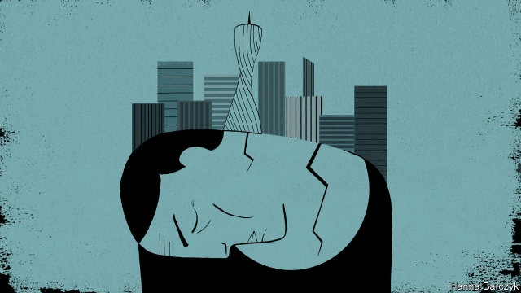

###### Chaguan

# The migrants who made China an industrial giant face a grim retirement 

 

> print-edition iconPrint edition | China | Nov 30th 2019 

EVEN IN A China filled with the shiny and the new, the southern city of Guangzhou stands out. A generation ago it was a smoggy, sweltering sprawl of factories and workshops, a bit embarrassed by its history as a semi-colony of Western powers, who knew it as Canton. Now Guangzhou aspires to be a hub of global commerce. It boasts the 600-metre tall Canton Tower, an opera house designed by Zaha Hadid and high-speed trains that can reach Beijing, 2,300km to the north, in just eight hours. Yet Guangzhou’s rise had human costs. The province of Guangdong, of which it is the capital, is a hotbed of worker unrest, with 129 strikes and protests logged this year by China Labour Bulletin (CLB), a Hong Kong-based monitor of workers’ rights. A growing number involve workers reaching retirement age, who discover that—because they fall through gaps in the welfare safety-net, or because employers skimped on pension contributions—a meagre future awaits. 

China’s migrant workers, who for 30 years have left inland villages and townships for coastal boomtowns, are growing old. Their average age is now over 40. Nearly a quarter are over 50. More than a tenth of all strikes, sit-ins and protests recorded by CLB in 2018 and 2019 involved rows over pensions and social insurance. The latest national survey on living conditions of the urban and rural elderly, published in 2018 on the orders of the Communist Party’s Central Committee, describes startling inequalities. About 100m retired Chinese covered by the unified basic urban pension system, to which most full-time urban workers contribute, received average monthly benefits of 2,600 yuan ($369) in 2016. But about 150m retirees had to make do with a state pension scheme open to both urban and rural residents. They received on average 117 yuan ($17) a month, a pittance even in a poor region. 

There are 288m migrant workers in China, of whom 173m work far from their home towns. In theory, they should enjoy the same social protections as urban Chinese with permanent residence permits who live in big cities like Guangzhou. They do not. Today’s 40- and 50-something Chinese migrants are a “lost generation”, argues Mark Frazier of the New School in New York. They fall between the oldest, pioneering migrant workers who were expected to head back to the countryside in retirement to eke out a living from tiny plots of land, and today’s 20-something workers, who are less inclined to seek distant factory jobs and are more likely to be covered by social-security protections from a patchwork of new labour laws and insurance schemes. Few see the current system as sustainable, amid gloomy statistics about falling birth rates and the shaky finances of the main urban pension fund: the Chinese Academy of Social Sciences predicts it will go bust by 2035. Plans are afoot to increase China’s retirement age, which is normally 60 for men, 55 for women in white-collar jobs and 50 for female blue-collar workers, though the rules vary by region. 

None of those plans will help a group of older workers who spoke to Chaguan recently in Guangdong. The seven women and one man showed hands too damaged by factory work to pour tea without shaking. They shared stories of parental guilt after failing to return home for two or three years at a time, leaving children to be brought up by grandparents. Even during the spring festival, an occasion for family reunions, there was valuable overtime to be earned, said a 50-year-old woman from Hubei province. Besides, returning to the village would have involved long train journeys and buying clothes, shoes and other gifts for many relatives. “We spent 20 spring festivals here,” she said wistfully. Unfortunately, before she reached retirement age in September, she learned that she could not draw her full pension in Guangdong because she began to make social-insurance payments after she was 40. If she had local residency she could make back-payments towards the 15 years of contributions needed. As a migrant, her only option was to return to Hubei, where her pension might come to 600 yuan ($85) a month. She compared her fate to an old, bitter saying: “Unharness the donkey from the grindstone, then butcher it.” 

Another woman had worked at a handbag factory owned by Simone, a South Korean firm, for nearly 20 years. She alleged that her employer had failed to make the correct payments into a state housing-savings fund that serves as a second pension for many. After she complained, she said the firm had denied her overtime and warned other workers to avoid her. Simone denies these allegations. It says it takes employee benefits seriously and “strictly follows” and even exceeds China’s labour-law requirements. 

The eight workers had varied problems, but all described a system in which social stability is the authorities’ guiding obsession. That preoccupation can offer workers slivers of power if they make just enough trouble, perhaps by staging a respectful sit-in at a government office or party-controlled trade union (China bans independent ones). If enough workers complain, companies will often “budge and pay”, one of the workers said. When they go further and organise, for instance through social-media groups, repression follows. In March, during meetings of the national legislature in Beijing, some workers in Guangdong used social media to discuss submitting a petition to the central government. The term “petition” triggered an algorithm. Police dragged workers from dormitory beds and humiliated them with strip searches, Chaguan was told. Other workers were reportedly evicted after landlords were told they were “problematic” by officials. 

Many of the hardships described around that table in Guangdong would cost only small sums to resolve. Alas, it would also involve those who wield power deferring to the rights of individual workers. Instead, those workers must navigate a ruthless system in which they must plead and bargain for what they have earned. A remarkable generation of migrants built the new China. They are still paying the costs, in broken hands, backs and hearts. ■ 

