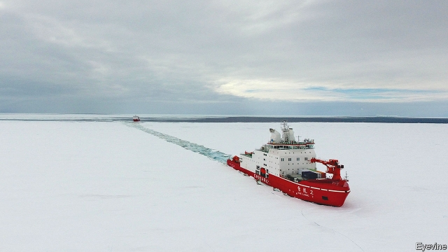
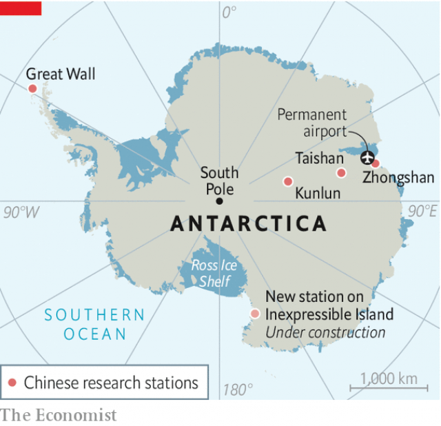

###### Heading south

# The voyage of two icebreakers have been creating headlines in China 

 

> print-edition iconPrint edition | China | Nov 30th 2019 

FOR WEEKS Chinese state media have been proudly reporting the progress of two icebreakers, Xue Long and Xue Long 2, on their voyage to Antarctica. China has maintained research bases in the Earth’s southernmost region since the 1980s, but the approach of these vessels (their names mean “snow dragon”) has been described as the start of a “new era” for the country’s exploration there. Of about 20 countries that have year-round bases on the continent, China’s activities are growing fastest. 

After crashing through 12-foot waves and nearly 200 nautical miles of ice floes, the two ships drew close to one of China’s stations, called Zhongshan, on Antarctica’s eastern rim (they are pictured, led by Xue Long 2). On November 20th members of the mission’s Communist Party committee flew the final stretch by helicopter, bearing fruit and vegetables for the base’s occupants. It was a moment that China relished. Xue Long is a Ukrainian vessel built in 1993. But the newer of the “twin dragons”, as China’s media calls its only two civilian icebreakers, was launched just last year. It is far more powerful and manoeuvrable. And crucially, as the country’s media keep pointing out, it was made in China. 

The country’s leader, Xi Jinping, says China should become a “polar great power”. At the other end of the world, this ambition has long been evident. The country is excited by possibilities in the Arctic as the Earth warms: fish, minerals, oil and gas that will become easier to extract; new shipping routes that will open up and shorten journeys between China and Europe. To facilitate this, China has been mulling the idea of building ports and other infrastructure in the Arctic. 

 

The Antarctic has fewer obvious potential benefits for China’s economy. But it is abuzz with Chinese activity. Last year China began building its first permanent airport in the region. Chinese tourists have been piling in: between 2015 to 2018, their numbers more than doubled to about 8,100—second only to the number of American sightseers. In July an American air-force general warned that Antarctica was “just a number of years” away from becoming as competitive an area as the Arctic, where great powers are jostling for economic and strategic advantages. 

Such rivalry is supposed to be absent in Antarctica. It is governed by the 54 signatories of the Antarctic Treaty, which China joined in 1983. One aim of the 60-year-old pact is to keep Antarctica free of military activity (unlike the Arctic, which is teeming with it). China says it supports that. 

But some Western analysts are suspicious. Elizabeth Buchanan of the Australian National University says the treaty has loopholes. It allows countries to use legitimate scientific study as a cover for military and economic projects. China has installed equipment in Antarctica related to its satellite-navigation system, Beidou—which since this year has been operating more satellites than its American equivalent, GPS. The kit boosts the accuracy of weather maps but also improves missile precision, says Anne-Marie Brady, author of “China as a Polar Great Power”. Some Western military analysts believe that the crew on China’s icebreakers, though dressed as civilians, are really military personnel. 

China has made it clear it wants more say in governing Antarctica. It resents the West’s sway there—evident, as it sees it, in attempts by Western countries to designate protected areas where fishing is limited or banned. China sees these as a bid by Western countries to “re-exert their dominance over the southern ocean”, says Klaus Dodds, who is a co-author of “The Scramble for the Poles”. 

China has a controversial proposal of its own. It wants to establish an area under its management in Dome A, a region of nearly 20,000 sq km to which Australia has a largely symbolic claim. It includes the highest point on the Antarctic ice sheet—ideal for astronomical observation. China’s plan, however, has no backers. 

Western polar experts are divided over how much to worry about China’s Antarctic moves. Some believe the country’s main aim is to develop “soft power”, such as by co-operating with other countries in scientific research. All agree on one thing, however. China wants a high profile there. ■ 

