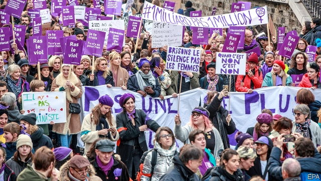

###### In cold blood

# Big demonstrations in Paris over the murder of women 

 

> print-edition iconPrint edition | Europe | Nov 30th 2019 

AURÉLIE, AGED 50; Justine, 20; Martine, 64; Safia, 35; Denise, 58; Monique, 72; Aminata, 31. The names on the placards, carried by tens of thousands of protesters through the streets of Paris and other cities on November 23rd, were those of women murdered by their partners in France so far this year. Strangled, stabbed, suffocated, shot or beaten to death, the victims now total 138. The grim phenomenon, which campaigners call féminicide, has long been under-reported and poorly handled in France. The government now recognises the country’s “collective failure” on the matter. 

France has one of the worst records in the EU for the toll of women murdered by their partners. In 2017, the most recent year for which comparative data exist, 108 women were killed in such circumstances in France, up from 92 two years previously. Germany saw worse, with 153 such murders in 2017, but the record in both countries is far worse than in Britain (75) or Italy (56). In France they constitute over 10% of all murders each year. In the past, as if to excuse them, such killings were often treated as crimes passionnels. Today, campaign groups want it known that these are in reality unspeakable cold-blooded murders. 

Although Frenchwomen did not get the vote until 1944, France has since come a long way on women’s rights. More recently it has passed legislation to promote more women into the boardroom and elected office. In the wake of the #MeToo movement, France has become more attuned to what constitutes sexual harassment and aggression. Yet the country has had a blind spot when it comes to handling complaints about domestic violence. On March 3rd this year, for example, Julie Douib, aged 35 and a mother of two small children, was shot dead by her partner. (He is now awaiting trial for her murder.) Before her death, she had filed five complaints of domestic violence to the police, according to Lucien Douib, her father, who has since become a campaigner against féminicide. Her case is not atypical. 

Pushed by such activists and by a vigorous junior minister for equality, Marlène Schiappa, the government has just finished a consultation on domestic violence. On November 25th Edouard Philippe, the prime minister, concluded that this has helped “break this chain of silence”, and expose the “indifference”, “major dysfunction” and “systematic underestimation” of the problem in France. A damning report commissioned by the justice ministry reveals that two-thirds of the murdered women were victims of previous acts of domestic violence. In September President Emmanuel Macron overheard the dysfunction at first hand when he sat in, anonymously, on a call to an emergency helpline. 

Mr Philippe has now promised a series of measures to try to ensure better detection and prevention of domestic violence in France. They include training the police in handling complaints, opening more women’s shelters, making different bits of the judicial system liaise better, and possibly loosening the rules on medical confidentiality in certain cases. “Silence kills,” declared Mr Philippe this week, adding that “The attitude of an entire society must be changed.”■ 

