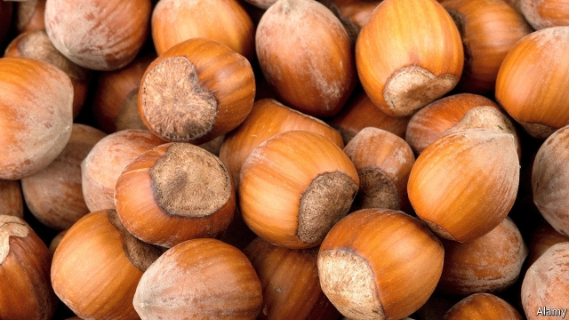

###### The nuts of wrath

# Hazelnut-planting bothers the Italians 

 

> print-edition iconPrint edition | Europe | Nov 30th 2019 

IN THE DISTANCE, Orvieto’s cathedral sits majestically on the massive outcrop over which the city spreads. Nearby, at the edge of the Alfina plateau, stands a castle encircled by fields—part of the landscape, between Orvieto and Lake Bolsena, in which Alice Rohrwacher, an Italian director, set her prize-winning film “The Wonders”. After a long absence, Ms Rohrwacher returned to find it transformed. “Fields, hedges and trees [had vanished] to make way for hazel plantations as far as the eye could see,” she wrote to the regional governors of Umbria and neighbouring Lazio. 

Around the castle, 200 hectares are earmarked for intensive hazelnut cultivation, says Vittorio Fagioli, a local environmentalist. This is largely to satisfy the world’s appetite for Nutella, the sugary nut-and-chocolate gloop that has helped transform the producer, Ferrero, into a multinational with turnover of more than €10bn ($11bn) last year. Under a deal signed with a local farming consortium, 700 hectares are to be given over by 2023 to the growing of hazelnuts. It is part of a plan to boost the area in Italy devoted to hazelnuts from 70,000 to 90,000 hectares, extending it for the first time to Umbria and other regions. 

On the Alfina plateau, however, the firm’s strategy is meeting vigorous opposition. According to Mr Fagioli, each tree will need 30 litres of water a day, pesticides to deter insects and fertilisers to boost yields. Campaigners fear that all those chemicals will drain into Lake Bolsena, since it receives most of its water from the plateau. They look apprehensively at Lake Vico in Lazio, ringed for decades by hazel plantations, where in 2009 a build-up of chemicals produced carcinogenic algae that required the installation of a costly water-treatment plant. Ferrero disagrees, saying that hazelnut cultivation around Lake Bolsena is “marginal” and that crops such as olives, grapes and apples need even more chemicals. Nuts to you, in short. 

