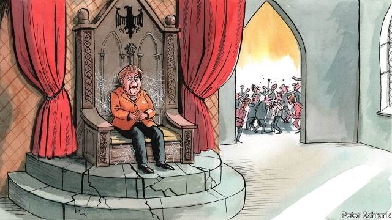

###### Charlemagne

# Post-Merkel syndrome 

 

> print-edition iconPrint edition | Europe | Nov 30th 2019 

NO ONE EVER got rich betting against Angela Merkel. Germany’s chancellor has outlasted every prediction of her premature demise. She has survived domestic and international crises galore. Having won four elections on the trot, she is now on her fourth French president, her fifth British prime minister and her seventh (and counting) Italian prime minister. As she enters her 15th year in office, she remains one of Germany’s most popular politicians. 

Yet, as an eccentric German saying has it: everything has an end; only a sausage has two. Mrs Merkel’s vow to stand down by autumn 2021, when Germany’s next election is due, has created a power vacuum that was apparent last weekend in Leipzig, at the annual conference of Mrs Merkel’s centre-right Christian Democratic Union (CDU). The chancellor was a distant presence, spending most of the event glued to her phone while early skirmishes in the war to succeed her played out. Suggestions that Friedrich Merz, a favourite of the party’s conservative wing, might launch a coup against Annegret Kramp-Karrenbauer, who replaced her mentor Mrs Merkel as CDU leader a year ago, turned out to be so much hype. Mr Merz declared his fealty, and Ms Kramp-Karrenbauer will fight another day. But reckoning averted is merely reckoning delayed, for Germany is now in the grip of post-Merkel syndrome. 

This era, which may run all the way to the next election, will be characterised by uncertainty, rancour and a Germany even more inward-looking than usual. Every utterance that spills from a major politician’s lips will be parsed for what it means for the “K-question”—who will the CDU choose as its Kanzler (chancellor) candidate in a year’s time? Germany’s coalition, a partnership of the CDU plus its Bavarian sister party, the Christian Social Union (CSU), and the Social Democrats (SPD), will get bogged down in trivial rows as politicians jostle to position themselves as Mrs Merkel’s rightful heir. Voters will grow frustrated, as will Germany’s partners; Emmanuel Macron has already made his irritation apparent. The chancellor is not always as absent as her detractors suggest—she was deeply engaged in coalition talks over a recent climate package, for example, and she has big ideas for Germany’s presidency of the EU Council in the second half of 2020. But on matters of domestic politics, she checked out some time ago. 

Mrs Merkel’s long goodbye reshuffles the deck for the other big parties, too. The success of the Greens, who briefly topped polls earlier this year, forces that party to field endless questions over which of its two telegenic leaders will stand as chancellor, rather than the meaty policy matters they would prefer to discuss. A more immediate anxiety attends the troubled SPD, which on November 30th elects a new leader and a week later must decide whether or not to quit the coalition as part of a scheduled review. If it does, an early election could follow. That would instantly shake Germany’s political kaleidoscope. 

Yet should the coalition limp on into 2020, as most expect, the theatre of operations will shift to the CDU. For now the party finds itself in wary limbo. As its leader, Ms Kramp-Karrenbauer has a target on her back. Since taking over she has made a string of unforced errors, has struggled to get a grip on the party administration and has presided over state-election losses and a polling slump. As a result she is now one of Germany’s least liked politicians. True, she responds to pressure: her long speech in Leipzig was good enough to see off her rivals, for now, and from her new perch as defence secretary she has had a semi-decent stab at injecting life into Germany’s moribund foreign-policy debate. Having won the leadership fair and square, she will not leave quietly. 

But the gossip in Leipzig was ominous for Ms Kramp-Karrenbauer. Many party grandees, reportedly including Mrs Merkel, do not think she can crawl out of the pit she has dug herself. A large chunk of CDU members harbour a belief—or perhaps a grudge—that Mrs Merkel has warped the party out of recognition, sacrificing conservative edge for sludgy centrism, and fear her protégée may offer more of the same. And so enemies are circling. Beyond Mr Merz, aspirant CDU chancellor-candidates include Armin Laschet, the moderate premier of North Rhine-Westphalia, Germany’s most populous state; Markus Söder, leader of the CSU and premier of Bavaria, whose punchy speech in Leipzig brought the house down; and Jens Spahn, a young firebrand who has been quietly expanding his networks as Germany’s health minister. As these pretenders, and perhaps others, square off they must bear two things in mind. The CDU hates the disunity of internecine squabbles—that is what the SPD is for—but it also loves winning. Which of these tendencies prevails over the next year is likely to shape the future of the CDU—and of Germany. 

There could be a fruitful path ahead. Assuming the SPD does not deliver a shock in December the CDU, which has always prided itself as a big tent, could use next year to revive debates suppressed by Mrs Merkel’s long, largely ideology-free chancellorship. There were faint signs of this in Leipzig. Ms Kramp-Karrenbauer’s combative insistence that the CDU must wake up to the challenges of disruptive technologies, from 5G networks to artificial intelligence, was a useful jolt to a party on whose watch Germany has become a digital laggard. There are also flickers of fresh thinking on how to make Germany’s social-market economy more climate-friendly. That will matter if, as many observers predict, the CDU begins coalition talks with the Greens after the next election. 

Yet all this could fall apart in power struggles. Mr Laschet fears for Germany something like the American fate, where primaries leave candidates bruised by their own side before they can take the fight to the opponent. When Mrs Merkel passed the mantle to Ms Kramp-Karrenbauer last year it looked as if the chancellor would succeed where all her predecessors had failed: in stage-managing her own exit. Her own party may yet deny her that wish. ■ 

