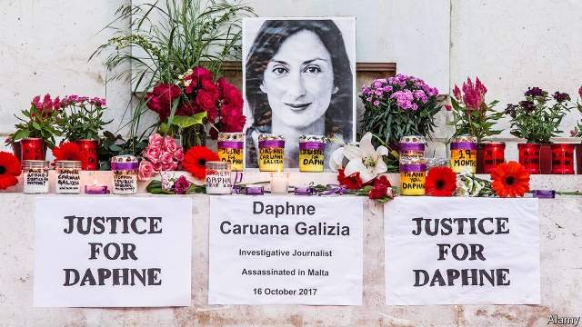

###### Daphne’s shadow

# The murder of a journalist in 2017 still haunts Malta’s government 

 

> print-edition iconPrint edition | Europe | Nov 28th 2019 

THE RESILIENCE of Joseph Muscat’s Labour government has been a wonder to behold. For six years, fortified by the support that comes with rapid economic growth (Malta’s GDP rose by 6.8% in 2018), it has withstood sleaze allegations that would have toppled other administrations. 

But on November 26th the government reeled. One of his ministers, Konrad Mizzi, resigned. Another, Chris Cardona, said he was “suspending himself”. Hours earlier, Mr Muscat’s chief of staff, Keith Schembri, stepped down. That was hardly surprising: Mr Schembri had been interrogated by police investigating a murder. He is now believed to be under arrest. Mr Cardona had also been questioned in connection with the case. Both deny any wrongdoing. 

The murder victim was a journalist, Daphne Caruana Galizia, killed by a car bomb in 2017. Her blog was the source of many of the corruption allegations. One was that Mr Schembri and Mr Mizzi had Panama-registered companies and trusts in New Zealand which, Ms Caruana Galizia reported and they denied, had received kickbacks from Russians in return for Maltese passports. She also claimed the politicians’ firms were due to receive payments from a Dubai-registered company, 17 Black. Ms Caruana Galizia died before discovering who was behind 17 Black, but last year a journalists’ collective set up to continue her work reported that the owner was one of Malta’s richest men, Yorgen Fenech, who has interests in gaming, property and energy. Mr Mizzi and Mr Schembri deny any connection to him or to 17 Black. 

Three men have been arrested and charged with Ms Caruana Galizia’s murder. Few in Malta believe they were more than hired assassins. Who, if anyone, ordered her killing remains unknown. Earlier this month, however, police investigating a separate case arrested a 41-year-old taxi driver, Melvin Theuma, who offered information on the murder in exchange for a pardon. On November 19th the pardon was approved on condition he supplied evidence to police. The next day, Mr Fenech was arrested as he headed out to sea on his yacht. He has been given bail, but is under 24-hour police surveillance. 

In a blog post Ms Caruana Galizia’s son, Paul, said his mother had been investigating possible links between Mr Fenech, the two politicians and a gas-supply agreement with Azerbaijan when she died. It was to be “my mother’s next big story”, he wrote. “Weeks before she was killed, she began receiving thousands of internal documents from Fenech’s energy company, Electrogas.” Police had until November 29th to bring charges against Mr Fenech. 

Recent events have stirred plenty of anger in Malta. Following the resignations, there were chaotic scenes in parliament as opposition lawmakers taunted Labour MPs with cries of “robbers” and “Mafia”. A crowd pelted the deputy prime minister with eggs and coins as he left the building. Whether the fury will bring down Mr Muscat remains uncertain. On November 25th he called a meeting of his parliamentarians. They gave him their unanimous backing. But a statement added cryptically that the meeting was “part of a process that will continue and lead to decisions”. ■ 

