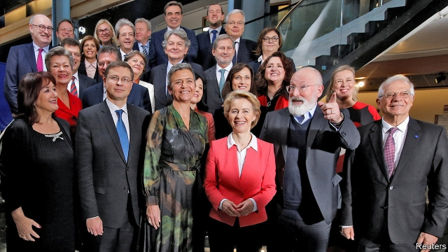

###### Better late than never

# The new European Commission is approved 

 

> print-edition iconPrint edition | Europe | Nov 30th 2019 

IT HAS NOT been the easiest of starts for Ursula von der Leyen. In July the EU’s government heads alighted on the former German defence minister as their surprise choice to run the European Commission, Brussels’s largest institution. She immediately suffered a series of reverses. The European Parliament approved her candidacy by the slimmest of margins. Of 26 proposed commissioners—one from each EU member government except for Britain, which refused to make a nomination despite having failed to Brexit—three were rejected. But on November 27th the parliament nodded through Ms von der Leyen’s commission by 461 votes to 157. It will take office on December 1st, one month later than planned. 

The commission is an odd hybrid of executive, civil service and watchdog. It has extensive powers in some areas, such as competition and product regulation, but few in others. Ms von der Leyen will oversee the work of 32,000 civil servants from her office on the 13th floor of the Berlaymont building in Brussels, which the hard-working president has also converted into a small flat. In one sense she arrives at a more propitious moment than her predecessor, Jean-Claude Juncker. The European economy is sputtering along and the crises that marked so much of his tenure are receding into the past. 

Yet the global context looks more challenging. The transatlantic bond has frayed, and Chinese commercial and strategic ambitions are lapping at Europe’s shores. In response Ms von der Leyen says hers will be a “geopolitical commission”. She promises initiatives on defence, migration and industrial policy (which some fear could tip into protectionism). Sabine Weyand, who runs the commission’s trade department, told an audience in Berlin this week that the EU would use trade as one weapon in its international policy arsenal rather than merely “following economic logic”. 

The new president will also face challenges from within. The fractured parliament that emerged after the European elections in May will not always prove so obliging as it did this week. Ever-present splits among governments will deepen as rich and poor countries bicker over the EU’s seven-year budget, which must be agreed on in 2020. And fresh divides are emerging over Emmanuel Macron’s disruptive ideas for EU reform, which spook status quo powers like Germany. 

An early test will come on EU enlargement. Mr Macron’s recent veto of membership talks with North Macedonia and Albania infuriated other EU governments. It falls to the commission early next year to propose changes to the existing process, as France’s president wants. 

Ms von der Leyen has promised a flurry of early initiatives, including on pay and the “human and ethical implications” of artificial intelligence. The first of her blockbusters will be a “European Green Deal”, a set of climate proposals that are planned for mid-December. Ms von der Leyen aspires to turn Europe carbon-neutral by 2050 and to tighten the 2030 emissions target. That implies tweaks to the EU’s carbon-trading market as well as a tax on imports from less green places. These will be subject to the usual wrangling among governments with diverging interests and priorities. The EU’s leaders may have put Ms von der Leyen in place, but they will not do her bidding. ■ 

