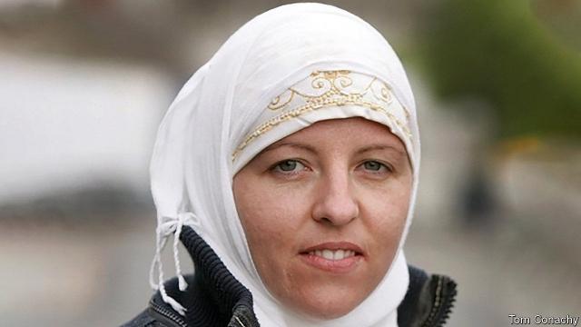

###### From caliphate to courtroom

# Turkey deports Islamic State fighters 

 

> print-edition iconPrint edition | Europe | Nov 30th 2019 

LISA SMITH’S path from Dundalk, a town in Ireland halfway between Belfast and Dublin, to the murderous caliphate of Islamic State (IS) and back, has taken a few turns. A former soldier, Ms Smith converted to Islam and travelled to Syria in 2015 to live under IS rule. Detained by Kurdish fighters who helped bring down the caliphate, she escaped when Turkey launched an offensive against the Kurds in October, only to be captured by Turkish proxies. Now Ms Smith and the two-year-old daughter she had with a British extremist are poised to come home. “If all goes well,” says a Turkish official, the two will be on a plane to Ireland “in a matter of days”. 

Many others are expected to follow. Since the start of the invasion, Turkey has fast-tracked the deportations of foreign IS fighters and sympathisers captured in Syria or locked up in Turkey. President Recep Tayyip Erdogan recently warned he would send all of them packing. “These gates will open and these IS members will continue to be sent,” he said on November 12th, addressing European countries. “Then you can take care of your own problem.” 

Over the course of its offensive, Turkey has captured 287 people linked to IS, most of them women and children, adding to the 1,500 or so foreign fighters already held in Turkish prisons and deportation centres. Hundreds of other militants are said to have escaped during the fighting. Most of Syria’s north-east remains in Kurdish hands, along with the area’s prisons and camps, home to tens of thousands of militants and their families. Outside powers would like to keep things that way; both America and Russia say the Turkish assault has already offered IS a chance to regroup and plot attacks in Syria and elsewhere. Turkey itself remains vulnerable to IS resurgence. The head of Iraq’s military intelligence branch recently said that some of the group’s main financiers had found refuge in southern Turkey after bribing their way through Kurdish-held territory. 

The deportations are not new. Turkey has already expatriated some 7,600 suspected fighters over the past several years, officials in Ankara say. But Mr Erdogan’s decision to speed up the process, as well as the Turkish invasion, have focused minds on the fate of the thousands of foreigners, ranging from hardened extremists to toddlers, who are packed into prisons and camps across the whole region. 

Many European countries would prefer them to stay there. Some have stripped dozens of their nationals of citizenship. Governments fear the political backlash that allowing returns would provoke, not to mention the devastating electoral consequences of any attacks by those returning, says a recent report by the International Crisis Group (ICG). Collecting evidence and prosecuting them also poses a headache. Strict requirements for obtaining a conviction mean that those returning to some European countries may walk free, the ICG says. Already, dozens of women and men have come back from Syria without serving time in detention. 

Deporting Ms Smith should be easy, though DNA tests may be needed to confirm her daughter’s identity. Prosecuting her will be much harder. The next front in the war against Europe’s jihadists will be back home, and in court. ■ 

