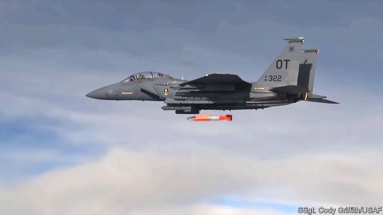

###### Over here

# Turkey’s Syria move highlights America’s tactical nukes in Europe 

 

> print-edition iconPrint edition | Europe | Nov 30th 2019 

GERMANY OWNS no nuclear weapons. It renounced the very idea when it reunified in 1990. But if war were to break out in Europe today, German pilots could clamber into German planes, take off from Büchel Air Base in Rhineland-Palatinate and drop nuclear bombs on Russian troops. 

The Luftwaffe can do that thanks to NATO’s nuclear-sharing scheme, under which America quietly stations nuclear bombs across five countries in Europe. The arrangement is decades old. But it has raised questions for some time—and clashes involving one of those nuclear hosts, Turkey, are making matters worse. As NATO leaders gather in London for a summit next week, Turkey’s bombs will be on many minds. 

In 1950 America moved its first bombs to Britain. In the subsequent decades it stashed a vast trove of nuclear weapons across Europe, numbering over 7,000 at their peak in 1971. Many were small devices known as tactical, or non-strategic, nuclear weapons. They were capable of exploding with yields of as little as a fraction of a kiloton—far smaller than the 15-kilotonne bomb dropped on Hiroshima. The smallest of them could fit into a backpack. 

Today only about 150 remain. These are B61 free-fall bombs whose yield can be set anywhere from a third of a kilotonne to more than 170. They remain in American custody in peacetime and could be released only by a presidential order—but European pilots still train to drop them. Italy and Turkey are thought to have the most, perhaps 60 to 70 each, with smaller numbers in Belgium, Germany and the Netherlands. 

The bombs that most worry American officials are stored in vaults at Incirlik air base in southern Turkey, a few hours by road from the Syrian border. During a military coup in 1960 and a diplomatic spat in 1975, America considered removing the bombs. During the failed coup against President Recep Tayyip Erdogan in 2016, Incirlik hosted the refuelling tankers that allowed renegade F-16 fighter planes to threaten Istanbul and Ankara. Mr Erdogan’s regime responded by cutting power to the base and arresting its commander. 

That prompted alarm in Washington about the security of its weapons and the risk that they could become hostages in the strained relationship with Turkey. Senior officers were sent to Incirlik, only to conclude that the bombs did not need to be removed. The warheads can be armed only by a code, and the vaults are automatically sealed if power is cut off, giving American forces time to fight their way onto the base if required. Nevertheless, in recent years America has considered spiriting away the bombs and replacing them with dummies. 

Nukes were taken out of Greece in 2001 and from Ramstein air base in Germany in 2005. Pulling bombs out of Incirlik would remove vulnerable targets and implicit leverage. But if done clumsily it could worsen the diplomatic crisis and even prompt Mr Erdogan to pursue a nuclear-weapons programme of his own, something he hinted at in September. It would also restart a fraught debate over the presence of B61s elsewhere in Europe. 

Opposition to nuclear-sharing has been simmering in Germany, in particular. Although Angela Merkel, Germany’s chancellor, has defended the practice, her coalition partners over the past decade have repeatedly asked for the bombs to be withdrawn. Keeping them is tricky for technical reasons, too. Europe’s current dual-capable aircraft (DCA)—those wired up to carry nukes as well as ordinary bombs—are approaching the ends of their lives. Belgium, Italy and the Netherlands are all buying America’s F-35 as a replacement, but Germany ruled this out in January. 

That was partly in deference to France, which wants to build its own next-generation warplane with Germany. The Luftwaffe could instead buy the F-18, an older American DCA. Or it could retrofit the European-built Typhoon to accommodate B61s. But as well as being expensive and time-consuming, that would expose European technology to American eyes. And neither plane is especially stealthy. 

Nor is Incirlik the only cause for security concerns. In 2008 an American air-force review concluded that most European bases hosting weapons did not meet its standards. Support buildings, fencing, lighting and security systems were all deemed in need of repair. Two years later, peace activists entered a base in Belgium and roamed near its B61 vaults for an hour. 

If the bombs are politically troublesome and vulnerable, why keep them in Europe at all? Some NATO planners fear that if Russia attacked an ally like Estonia and then conducted a limited nuclear strike to stave off a Western counter-attack, it would not make sense for the alliance to respond with “strategic” weapons—those on longer-range missiles and aircraft that have much higher, city-destroying yields. Smaller bombs like the B61s are thought to allow a proportional response. 

It is not entirely clear that the enemy would appreciate the distinction, however. And the military case for B61s is dubious for other reasons. The planes—if not destroyed on the ground—would struggle to get through Russian air defences. So America would probably use stealth bombers dispatched from across the Atlantic or submarine-launched missiles armed with a new low-yield warhead built under the Trump administration. NATO acknowledges that its “supreme guarantee” is provided by American, British and French strategic forces in this way, rather than by the Europe-based B61s. 

In truth, the purpose of the nuclear-sharing scheme is more political than practical. The aim is to create a tangible and symbolic link between America and Europe. Allies who enjoy American nuclear protection must share the moral burden of nuclear use—and the cost of potential retaliation. At the same time, Europeans get a larger (if still modest) say in how American nukes might be used. That is thought to assuage their fear of abandonment. 

That reassurance comes at a price. President Barack Obama toyed with the idea of bringing the bombs home, but ultimately deferred the decision. Instead, he authorised a $10bn programme to extend their lives and increase their accuracy. The total cost of American tactical nuclear weapons will run to $25bn between 2017 and 2046, about $1bn a year. And if Turkey’s relationship with allies continues to crumble, Europeans may feel less soothed than alarmed by the several megatonnes of weaponry sitting at Incirlik. ■ 

