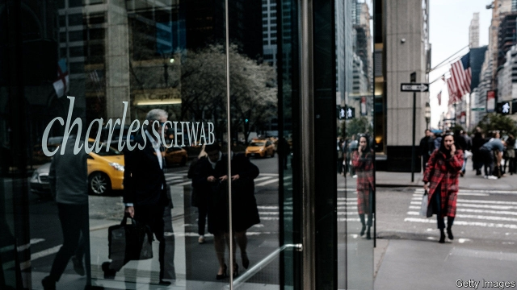
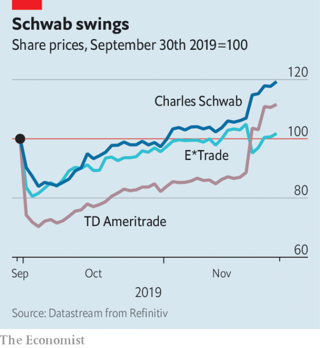

###### Going for broker

# Charles Schwab agrees to buy TD Ameritrade for $26bn 

 

> print-edition iconPrint edition | Finance and economics | Nov 30th 2019 

THE PRICE war was swift and brutal, lasting less than eight weeks. On October 1st Charles Schwab said it would no longer charge retail customers for trading shares, exchange-traded funds or options online, forgoing $4.95 a trade. The share price of America’s biggest discount broker dropped by nearly a tenth. That of its big rival, TD Ameritrade, suffered more, plunging by a quarter (see chart). TD Ameritrade followed in eliminating commissions two days later. It had little choice, though it reckoned the move would cut its revenue by $220m-240m a quarter, or 15-16%. 

On November 25th came a truce, and surrender: Schwab agreed to buy TD Ameritrade for $26bn in shares. The deal combines Schwab’s 12.1m brokerage accounts with TD Ameritrade’s 12m. It will unite two platforms used by independent financial advisers—7,500 on Schwab’s, 7,000 on TD Ameritrade’s—for trading, market information and regulatory updates. 

 

Investors in both companies will be relieved. On November 21st, when it was first reported that a deal was imminent, TD Ameritrade’s shares jumped by almost 17% and Schwab’s by 7.3%. Yet the takeover is as much a sign of the strains on big brokers as a demonstration of their market clout. 

Founded in 1971, Schwab became a thorn in the sides of established stockbrokers after America’s regulators abolished fixed commissions in 1975. Ameritrade was founded the same year. In the 1990s, by then joined by E*Trade, a smaller rival, the upstarts ventured online. Ameritrade joined forces with TD Waterhouse, the discount-broking arm of Canada’s Toronto-Dominion Bank, in 2006. 

But in recent years digital technology has enabled an even cheaper, wholly digital, discount-broking model. The most prominent exponent is Robinhood, a six-year-old Silicon Valley startup, which boasts 6m clients and charges nothing for trades. It makes money from payments from marketmakers to whom it sends trades for execution, interest from cash in clients’ accounts, charging for premium services and lending stocks on margin. It has also applied for a banking licence. 

Schwab could not go on charging $4.95 a pop. Still less could TD Ameritrade keep asking $6.95. Admittedly, both have more strings to their bows than execution. They have their adviser platforms; they hold a combined $5trn-plus in client assets; Schwab owns a bank with $208bn in assets. But no one expects the combined firm to start charging again for online trades. 

To stay competitive, the established discount brokers will have to drive costs down, spread those costs over a broader base and spend more on technology. Christopher Harris, an analyst at Wells Fargo, estimates that in past takeovers of discount brokers, cost savings have amounted to 50% of the target’s expense base. Schwab and TD Ameritrade expect to save $1.8bn-2bn a year, about two-thirds of TD Ameritrade’s operating costs. 

As elsewhere in finance, the biggest are likeliest to endure. They can afford to spend oodles on technology and to maintain branches as a national branding presence. And when margins are wafer-thin, volume is king. The importance of scale may help to explain why E*Trade’s share price fell by more than 9% on the day news broke of its rivals’ probable tie-up. It had also been buoyed by a takeover premium; now E*Trade looks a little lonely. 

America’s antitrust authorities are certain to scrutinise a deal between the two biggest discount brokers. Whether they will block it, says Matthias Memminger of Bain, a consulting firm, is less sure. Americans buying and selling shares have plenty of choice. They can invest, for example, using Fidelity or Vanguard, two mighty asset-managers that push their own funds, or through their tied advisers. Banks’ broking divisions are also keen for their custom. And Schwab and TD Ameritrade will doubtless argue that they have fintechs to look out for too. If they didn’t, they would have had less of an urge to merge.■ 

