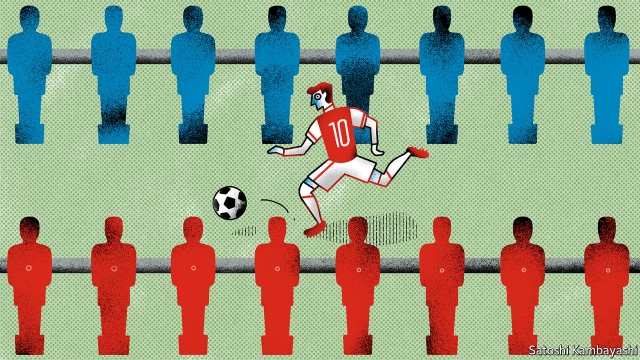

###### Buttonwood

# Do not write off the macro hedge-fund manager just yet 

 

> print-edition iconPrint edition | Finance and economics | Nov 30th 2019 

IF YOU WATCH much too much televised football (soccer, if you must), you will often hear a particular lament. Whatever happened to the playmakers, the socks-rolled-down mavericks whose individualism could alter the course of a match? The question is invariably posed by grizzled ex-pros. They are saddened but also puzzled by the systematising of the modern game. Players go through a series of prescribed moves (“automatisms”) when they get the ball. Passages of play are minutely choreographed. 

This leads us smoothly to Louis Bacon, a game-changer in the world of “macro” hedge funds, which make bold bets ahead of predicted shifts in the macroeconomic climate. Mr Bacon is to close Moore Capital, the hedge fund he founded in 1989, to outside investors following poor returns. Many of his peers have already quit the game. Hedge funds are bleeding institutional capital. 

Cue much sad shaking of heads by grizzled ex-pros. The markets game has changed, they grumble. It is now a playing field for well-drilled algorithmic traders or for index funds which passively hold a basket of leading stocks. The minutely choreographed policies of central banks act to suppress the market volatility that hedge funds thrive on. There is no place for the individualist who makes a variety of bets at his own discretion. A lot of this is true. But the prognosis is too bleak. Many of the greatest hedge-fund trades have been bets that official efforts to suppress volatility, such as exchange-rate pegs, would ultimately fail. Playmakers of Mr Bacon’s stamp will surely make a comeback. 

To understand why, go back to the 1970s when a first wave of macro traders, including George Soros and Michael Marcus, made their names and a lot of their money. The end of the Bretton Woods system of fixed exchange rates created opportunities. There were newly volatile currencies to wager on. Inflation also surged. This, along with advances in the pricing of commodity futures and options, spurred interest in the trading of grains, beans and metals. A new school of macro traders, which later included Mr Bacon, emerged from the Commodities Corporation, a trading company founded in 1970. Commodity markets provided a great training for trading currencies and bonds. Supply veered from shortage to glut. Official price controls added to the fun. The shifting forces of global economics and politics amplified the volatility. 

Betting that a currency peg would break became a signature hedge-fund trade. An early example was a bet made by Michael Marcus in 1975 that a surge of oil revenue would force Saudi Arabia to revalue its currency. The exchange-rate crisis that brought hedge-fund managers blinking into the limelight was their bet made in September 1992 that Britain would abandon the pound’s peg against the Deutschmark. The Bank of England was obliged to sell its foreign-exchange reserves to buy pounds at a fixed rate for as long as the London market was open. Mr Soros sold as many pounds as he could. By the time the peg broke, he had made £1bn ($1.8bn at the time). 

Mr Bacon was on that trade, too. Earlier, he profited from the stockmarket crash of 1987 by piling into the safety of bonds, which rallied in the aftermath. He also made a tidy sum by predicting the impact on oil prices and the stockmarket of Iraq’s invasion of Kuwait in 1990. 

Crunch situations like these are when the truly gifted macro traders come into their own. They have many of the qualities of great playmakers. They are able to see things that less gifted players cannot. They are unhurried under pressure. They know when to bide their time and when to go for the jugular. And they can imagine a world that might soon be arranged differently and work out the implications. “Don’t try to play the game better; try to figure out when the game has changed,” Mr Soros would tell colleagues. The most profitable trades would often come after periods of calm, when volatility had been suppressed either by complacency or official fiat. 

Macro traders are not comfortable during those placid periods. They have struggled for much of the past decade, which has seen a steady upward grind in asset prices. Inflation has been absent, so central banks have been free to respond to any signs of trouble in markets with easier monetary policy. But stability breeds instability. Over-coached footballers do not respond well when a game takes an unexpected turn. Investors schooled in calmer markets may similarly struggle with renewed volatility. One day, the playmakers will be back. 

