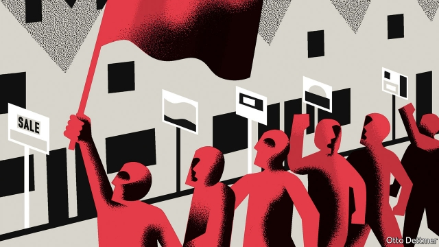

###### Can’t buy me love

# Does the economy affect elections any more? 

 

> print-edition iconPrint edition | Finance and economics | Nov 28th 2019 

“THE ECONOMY, stupid,” was the slogan of a strategist in Bill Clinton’s campaign for the presidency in 1992. It was a pithy encapsulation of time-honoured spin-doctoring wisdom: that a strong economy helps the incumbent and a weak one helps the challenger. When Mr Clinton took on George H.W. Bush in 1992, real wages were stagnant. Unemployment peaked just months before the poll—and, sure enough, Mr Bush failed to win a second term. The 2,000-odd studies on the “economic vote” since then have turned the pollsters’ hunch into political gospel. A cross-country analysis by Larry Bartels of Vanderbilt University, looking at 2007-11, found that each extra percentage point of GDP growth in the four quarters before an election was associated with a rise of 1% in the incumbent party’s vote share. 

But politics has changed. Today’s most heated debates concern issues of identity and culture—openness to immigrants or free trade; attitudes to abortion or transgender bathrooms. Has the economy stopped mattering to voters? 

Often it seems so. An analysis by The Economist earlier this year, for example, found that in America the correlation between consumer confidence and the public’s approval of the president had broken down. There are signs of the same trend in other rich countries, too. Boris Johnson, Britain’s Conservative prime minister, has tried to make the general election on December 12th a matter of identity by appealing to Brexit voters who want to “take back control” from a distant elite. In Dudley North, a marginal constituency in the Midlands, your columnist was struck by the Conservative Party’s confidence that it would take the seat from the opposition Labour Party. In a poor, Leave-voting area, voters support the privileged Mr Johnson because he has promised to get Brexit done. No one is talking about the country’s recent brush with recession. 

The state of the economy must still matter in extremis: would President Donald Trump’s approval rating really hold up if unemployment went from 4% to, say, 20%? But the old rules of thumb about the business cycle and voting patterns are being replaced by a new narrative. This holds that ups and downs in GDP or wages matter less in elections than they used to. Instead, economic factors that shape people’s sense of identity matter more—and could help explain the shift towards populism in many places. Two are particularly important. The first is the sense of insecurity that accompanies globalisation. The second is frustration about sky-high housing costs. 

The rapid growth of global trade during the 1990s and 2000s brought wide economic benefits, but also unnerved some voters, who now want to slow down the pace of change. Italo Colantone and Piero Stanig, both of Bocconi University in Milan, study election results in 15 European countries. They find that areas facing greater competition from Chinese imports were more likely to vote for nationalist parties. 

Robots also make many people uneasy. A paper in 2018 by Carl Benedikt Frey, Thor Berger and Chinchih Chen, all of Oxford University, focuses on anxiety about technological change in America. The authors calculate the share of the workforce in industries that have seen increasing automation. Even after accounting for a range of other factors (including education levels and exposure to Chinese imports), areas more affected by the use of robots were more likely to vote for Mr Trump, the outsider candidate in 2016. In a flight of reasoning that only an economist could dream up, the paper suggests that if the pace of automation had been slower in the years before the 2016 contest, Michigan, Pennsylvania and Wisconsin would have plumped for Hillary Clinton. 

A raft of new research, meanwhile, has drawn attention to the political consequences of the housing market. A house is most people’s biggest investment, so changes in its value determine satisfaction with the status quo. Homeowners in areas where the property market is buoyant feel richer than those where it is flat. The housing market also affects people’s perceptions of personal freedom. Those living in an area with low house prices may feel trapped, since they would struggle to afford a move to somewhere more vibrant. Such effects may well have strengthened in recent decades, since in many developed countries the gap between house prices in the richest areas and the poorest has widened. 

Ben Ansell of Oxford University and David Adler of the European University Institute analysed data from the Brexit referendum of 2016 and the French presidential election the next year. After controlling for factors such as demography and pay, they found that in an area where house prices had tripled in nominal terms, the Remain vote share was 16 percentage points higher than in one with no change. Similarly, areas of France with strong house prices were inclined to choose Emmanuel Macron over the far-right Marine Le Pen. Further work by Mr Ansell and others has found that areas with falling house prices tend to see rising support for populists, such as the Danish People’s Party, the Finns Party and the Sweden Democrats. Simply put, a home-owner on a nice street in Notting Hill, Saint-Germain-des-Prés or Östermalm is very likely to support candidates of “the establishment”. 

The old straightforward relationship between the economic cycle and elections could yet return. But the implication of the new research is that support for populism is a deeper-rooted feature of Western economies. People’s perception of the threat from cheap imports or robots, or of being trapped by high house prices, will not change overnight. Governments will need to find ways to compensate those who lose out from wrenching economic change, and to make housing more affordable. Voters care less than they used to about the economy’s immediate impact on their wallets. But they care more than ever about how the economy shapes their identity—their sense of security, and their freedom. ■ 

