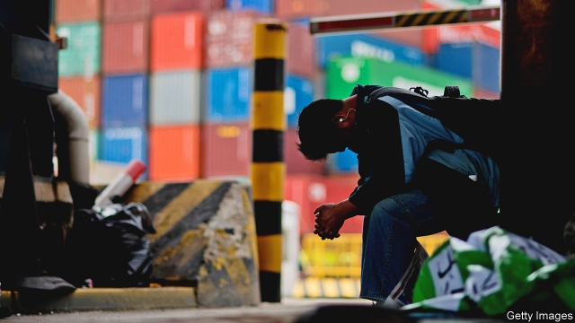
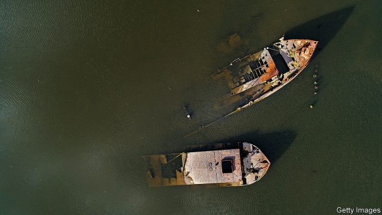
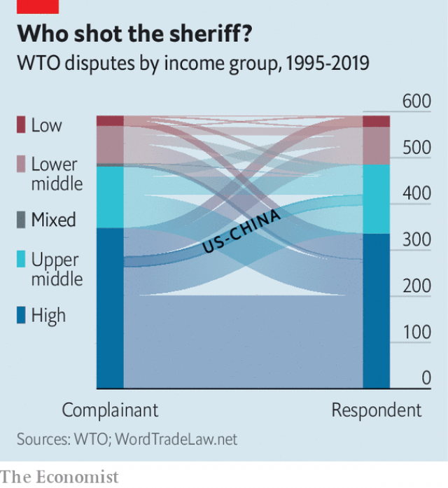

###### Who shot the sheriff?

# It’s the end of the World Trade Organisation as we know it 

 

> print-edition iconPrint edition | Finance and economics | Nov 30th 2019 

“WINTER IS COMING,” warned a Norwegian representative on November 22nd, at a meeting of the World Trade Organisation (WTO). The multilateral trading system that the WTO has overseen since 1995 is about to freeze up. On December 10th two of the judges on its appellate body, which hears appeals in trade disputes and authorises sanctions against rule-breakers, will retire—and an American block on new appointments means they will not be replaced. With just one judge remaining, it will no longer be able to hear new cases. 

The WTO underpins 96% of global trade. By one recent estimate, membership of the WTO or General Agreement on Tariffs and Trade (GATT), its predecessor, has boosted trade among members by 171%. When iPhones move from China to America, or bottles of Scotch whisky from the European Union to India, it is the WTO’s rules that keep tariff and non-tariff barriers low and give companies the certainty they need to plan and invest. 

The system is supposed to be self-reinforcing. Mostly, countries follow the WTO’s rules. But if one feels another has transgressed, then instead of starting a one-on-one trade spat it can file a formal dispute. If the WTO’s ruling displeases either party, it can appeal. The appellate body’s judgments pack a punch. If the loser fails to bring its trade rules into compliance, the winner can impose tariffs up to the amount the judges think the rule-breaking cost it. It is that punishment that deters rule breaking in the first place. 

It is no surprise that President Donald Trump has axed these foreign arbiters, given his general distaste for internationally agreed rules. On November 12th he declared himself “very tentative” on the WTO. But the problems run far deeper than dislike of multilateral institutions. They stem from a breakdown in trust over the way international law should work, and the more general failure of the WTO’s negotiating arm. Had the Americans felt that they could negotiate away their grievances, resentment towards the appellate body might not have built up. But with so many members reluctant to liberalise, including smaller countries fearful of opening up to China, that has been impossible. 

America has had some wins at the WTO: against the European Union for subsidies to Airbus, an aircraft-maker; and against China for its domestic subsidies; theft of intellectual property; controls on the export of rare earths, which are used to make mobile phones; and even its tariffs on American chicken feet. But it has also been dragged before the appellate body repeatedly, in particular by countries objecting to its heavy-handed use of “trade remedies”: tariffs supposed to defend its producers from unfair imports. Time after time, it has lost. In such cases, it has generally sought to become compliant with the rules rather than buy the complainant off. 

Though previous administrations had grumbled, and occasionally intervened in judges’ appointments, the Trump administration went further. Its officials complained that disputes often dragged on much longer than the supposed maximum of 90 days, and—more seriously—that the appellate body made rulings that went beyond what WTO members had signed up to. They made it clear that unless such concerns were dealt with, no new judges would be confirmed. 

Judicial overreach is in the eye of the beholder. Losers will always feel hard done by, and America has been quick to celebrate the WTO’s rulings when it wins. But plenty of others think that the appellate body had overstepped its remit. A recent survey of individuals engaged with the WTO, including national representatives, found that 58% agreed with that verdict. 

Getting so many countries to sign up to the WTO was a remarkable achievement. One way negotiators managed this was by leaving the rules vague, and papering over their differences with ambiguous language. Take “zeroing”, for example: using dubious mathematics to calculate defensive tariffs on unfairly traded imports. The Americans claim that the rules do not say they cannot do it. But others counter that the rules do not say they can. It is such long-running differences that have set the scene for the latest showdown. 

The American trade lawyers happy to kill the appellate body see a fundamental difference between their attitude to international law, and that of Europeans. Their position is that only clear contractual terms can be enforced, and they see Europeans as more comfortable with resolving ambiguities by going beyond what is written. Essentially, they regard the appellate body as too European. Moreover, in its eagerness to rule where terms are unclear, and in the American government’s willingness to change its laws in response, they feel an affront to America’s sovereignty. 

Under the GATT, which lacked a proper enforcement system, ambiguities were hashed out in smoke-filled rooms. But the WTO was supposed to make naked power politics over trade obsolete. Had it worked as intended, there would have been a balance between settling disputes and writing new rules. Policy is best made with a vibrant judiciary interpreting the law, and a functioning legislative arm to fix any mistakes. Whenever the appellate body made decisions that annoyed members, they could have resolved their differences at the negotiating table. Perhaps America could have got others to agree to higher tariffs on imported steel, or been granted some flexibility in its defensive duties. 

But the WTO’s negotiating arm has been broken for years. With the current count of members at 164, it has become more inclusive, but is unable to get much agreed. Each member has a veto over any further multilateral trade liberalisation. And without new negotiations, resentment towards the appellate body has built up. 

 

Had the multilateral system been more effective at dealing with the rise of China, perhaps the single biggest issue of its times, then calls to save it might be louder in Washington. Although various American administrations pursued and won several cases, the process was slow and occasionally frustrating. America can justly claim that, when it tried to hold China to account for its breaches of trade rules, it got little support. America has been responsible for more than half of all complaints against China. And other WTO members’ complaints were generally copycat, filed in America’s wake. 

Now that the Trump administration has bypassed the WTO and taken the fight straight to China, there is nothing remaining that it particularly wants from the WTO. And so the chances that it will relent and allow nominations to the appellate body by December 10th are slim to none. In response to proposals from other members to change the body’s rules, an American representative said that they were not persuaded that the rules would be stuck to. 

On November 26th the Trump administration suggested slashing the pay of members of the appellate body. In October Chuck Grassley and Ron Wyden, the top Republican and Democrat politicians on the Senate Finance Committee, published an editorial saying that while they saw the value of an appellate body, it “needs to operate as the members agreed”. 

 

Of the WTO’s 163 other members, 117 have signed a joint letter calling upon America to end the impasse. Although America has been the heaviest user of the dispute-settlement system, others will miss it too (see chart). Some have already begun preparing, for example by agreeing at the start of any disputes to forgo the right to appeal. The EU, Canada and Norway have agreed on an interim arbitration mechanism that will use retired members of the appellate body as judges. And the EU is considering beefing up its own enforcement mechanism to fill the hole left by the appellate body, though it would probably cleave more closely to the outcomes of first-stage rulings in WTO disputes. 

But some members are likely to shun such alternatives—especially those that expect to be sued a lot. And it is unclear how robust they will be if disputes turn nasty. Some WTO members may try to choose their dispute-settlement mechanism case by case. An organisation as ambitious as the WTO, for all its faults, will be easier to break than replace. 

All this means that global trade is about to become a lot less predictable and a lot more contentious. Without the appellate body to act as honest broker, disputes between the biggest members may escalate. Under the GATT America acted as global trade sheriff, launching investigations at will and bullying disputatious countries into submission. It is not impossible that it will resume this role. On November 27th the Trump administration announced that it had nearly finished an investigation into a French tax on digital services, which America reckons discriminates against its tech giants. That could lead to tariffs. 

In the 1980s American unilateralism was no fun for countries on the receiving end. But at least back then Uncle Sam could point to the lack of any other power even theoretically capable of doing the job. Now the absence of independent referees is America’s own doing. And of all Mr Trump’s trade policies, it may prove the hardest to reverse and have the longest-lasting effects. ■ 

