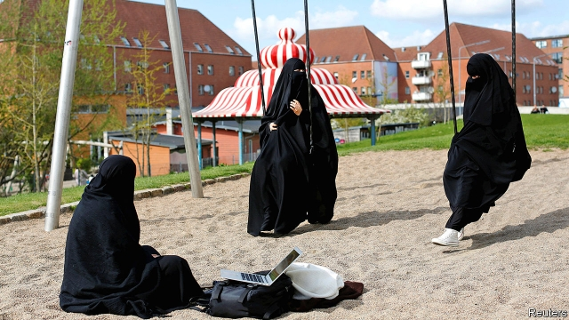
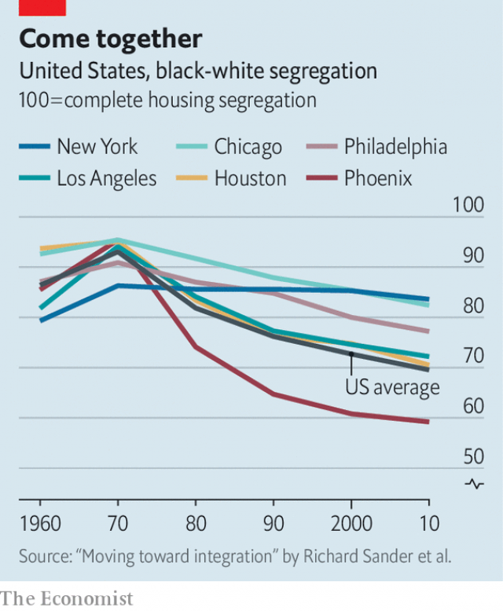

###### In the ghetto

# Denmark wants to break up ethnic enclaves. What is wrong with them? 

 

> print-edition iconPrint edition | International | Nov 30th 2019 

FOR A SO-CALLED ghetto, Mjolnerparken seems rather pleasant. The public-housing complex in Copenhagen contains well-tended playgrounds full of cavorting children and their Somali- and Pakistani-Danish mothers. But it is a bit of a maze, and it can be hard for outsiders to find people, especially if they plan to kill them. 

During Copenhagen’s gang wars in autumn 2017, this happened rather often. At one point, toughs from a drug-trafficking gang called Loyal To Familia arrived on motorbikes looking for members of Brothas, a rival group. They ended up shooting two plainclothes police officers instead. 

Such outrages were one catalyst for Denmark’s “ghetto” law. Lars Lokke Rasmussen, then the prime minister, came to Mjolnerparken in March 2018 to unveil new legislation that designated as “ghettos” areas dominated by immigrants with high levels of unemployment and crime. Crimes in such areas were to be punished more harshly and public day care for toddlers made mandatory to inculcate Danish values. Public-housing corporations were ordered to sell off some apartments to wealthier newcomers. Critics lambasted the law as bigoted, but it passed later that year with the backing of parties on the left and right. 

Denmark’s ghetto law reflects growing European discomfort with districts dominated by ethnic-minority groups. In 2018 the parliamentary leader of the Dutch governing party suggested adopting Danish-style ghetto laws in the Netherlands. The mayor of the Belgian city of Antwerp last year compared the growth of ethnically distinct communities in his city to a form of apartheid. When Emmanuel Macron, the French president, went on a nationwide listening tour this year in response to the gilets jaunes protests, officials in the banlieues, poor suburbs whose residents are mostly from ethnic minorities, denounced the areas’ growing “ghettoisation”. From Oslo to Milan, grumpy natives complain of districts that no longer feel like the country they grew up in. 

You hear similar complaints in countries with longer traditions of immigration, like America, Britain and Canada. But such countries fret less about the existence of neighbourhoods with distinct ethnic characters, even if those places are poor. Every metropolis boasts its own Chinatown, and some have special policies for protecting them. America worries about racially segregated ghettos but has made only half-hearted attempts to break them up. The Fair Housing Act of 1968 required local governments in America to fight residential segregation, but Richard Nixon refused to enforce what he termed “forced integration of housing”. In 2015 the Obama administration introduced more ambitious regulation, but it was shelved under Donald Trump. So who has the better case—the interventionist Europeans or the relaxed Anglo-Saxons? 

Danes and other Europeans raise two objections to ghettos. First, the very existence of poor immigrant districts undermines public support for their generous welfare systems. When groups lack solidarity with each other, “then it’s very easy to be annoyed about paying 45% in taxes,” says Kaare Dybvad, the Social Democratic housing minister, who took office after the leftist parties won the general election in June. That claim is hard to prove or disprove. But a second objection is easier to examine—that ghettos harm their residents, in part by keeping them poor. 

Most of Denmark’s designated “ghettos” are large housing developments outside city centres, far from well-paid jobs. The government steered both the guest workers recruited by Danish firms in the 1960s and 1970s and the refugees who arrived from the 1980s to such areas. The country’s ghettos are partly its own creation. 

The 15 areas designated as “hard ghettos” have serious problems. To qualify, they must meet two of the following four conditions: 40% of working-age residents must be out of the labour market and not in education; the proportion of residents with criminal convictions must be at least triple the national average; the share of people with no secondary-school diploma must exceed 60%; and the average taxpayer’s income must be under 55% of the regional average. Moreover (and this is where the law is most controversial) more than half the population must have a non-Western immigrant background. 

Denmark is delineating ghettos not to contain immigrants, as the original ghetto in Renaissance Venice was designed to contain Jews, but to push them out. In Mjolnerparken, the plan is to renovate and sell enough apartments to bring the share of subsidised units to below 40%. Tenants who are priced out will receive help to move into public housing in non-ghetto developments around the city. Mjolnerparken’s fortress-like courtyards will be opened up, to allow more flow-through to the wealthier surrounding areas. 

Such a bold policy suggests that the evidence for ghettos being bad is overwhelming. In fact, it is mixed. In the 1920s, at the end of a wave of immigration to America, sociologists at the University of Chicago argued that ethnic enclaves facilitated assimilation. Immigrants first settled in big cities, drawing on the knowledge and contacts of their former compatriots. Over generations, they adapted culturally and climbed the economic ladder, mixing with the native population. 

Later, economists weighed in. In a paper in 1997, “Are Ghettos Good or Bad?”, David Cutler and Edward Glaeser, both at Harvard, noted that theoretical arguments could point either way. On the one hand, ethnic enclaves limit their residents’ exposure to economic opportunities and cultural knowledge outside their own ethnicities. On the other, they give new immigrants access to information and connections acquired by earlier arrivals, and may provide them with role models. 

There is evidence to support both theories. In a paper in 2003, Per-Anders Edin, Peter Fredriksson and Olof Aslund, all economists, made use of a natural experiment in Sweden’s refugee policy. In 1985-91, facing a national housing shortage, the government settled refugees in any municipality that had room. Low-skilled migrants initially flourished when they moved to enclaves of their own ethnicity. For highly skilled ones, there was no impact. The lower-skilled members of an ethnic group may have benefited quickly from contact with the higher-skilled members of that group—more than they would have benefited from being dumped in a largely Swedish district. But the higher-skilled members of that ethnicity would have prospered surrounded by Swedes. 

Mr Cutler and Mr Glaeser’s research points in a different direction. They find that immigrants to America with higher levels of education did well in ethnic enclaves. Their incomes were higher, their children’s English results at school better. For ethnic groups with lower levels of education, living with their countrymen had the opposite effect. Temporary agglomeration into ethnic enclaves, as in Sweden, may help immigrants in the short run. In the long term, most will probably be better off mixing with the native population. 

That seems especially true for one long-established group in America. When Americans speak of ghettos, they often mean poor, crime-ridden African-American neighbourhoods such as West Baltimore. These formed largely owing to practices such as segregated zoning policies and government-encouraged discrimination by banks in mortgage lending, which continued until 1970. Segregation in public housing and whites’ refusal to live among blacks also mattered.  

Such ghettos harm their residents. Messrs Cutler and Glaeser found that young blacks in highly segregated cities had incomes 16% lower and dropout rates 19% higher than those in integrated ones. They also die younger. One recent study found that residential segregation largely accounts for the fact that black men are 14% and black women 9% less likely to survive from age 35 to 75 than whites. 

European worries about ghettos stem partly from scepticism about the American model of integration. “When people talk about New York, they say it’s a melting pot, but actually it’s not,” says Mr Dybvad, the housing minister. “You have one area with people of Chinese background and one with people of Lithuanian background, and they’re not melting together. I don’t want Copenhagen to be like that.” 

Sunset Park, a mostly working-class district of Brooklyn, suggests this fear is misplaced. In the early 20th century it was a Nordic immigrant ghetto full of sailors and dockworkers from Oslo and Helsinki. Patricia Marone, a 75-year-old local, remembers when Eighth Avenue was nicknamed Lapskaus Boulevard, after a Norwegian stew, and the church across from her house was Finnish Lutheran. 

That church is now called Principe de Paz, and the restaurants on Eighth Avenue are Chinese. By the 1960s Sunset Park had become largely Puerto Rican. By the 1980s Chinese-American families had moved in. Immigrants from China soon joined them. Since the 1980s there has been an influx from Mexico and Central America. Today the area is roughly 40% Hispanic, 33% Asian, 23% white and 2% black. 

A walk up from the docks traces this ethnic geography. Just above the waterfront, with its strip joints and auto-body shops, comes a mostly Hispanic neighbourhood. On Third Avenue a poulterer advertises live chickens in Spanish and Chinese. The American flag is omnipresent on houses and T-shirts—a token that allows any immigrant to stake a claim to citizenship, morally if not legally. 

 

Big cities across America are becoming less segregated (see chart), according to data from the Census Department. In 2000 the average white resident in America’s 100 largest metropolitan areas lived in a neighbourhood that was 79% white. By 2017 that figure had fallen to 72%. British cities are becoming less divided, too. According to work by Gemma Catney now of Queens’ University Belfast, between 2001 and 2011 (the two most recent British census years) every ethnic minority except the Chinese became less segregated. 

Gentrification is the main engine of free-market desegregation in cities these days. Even native Danes like some diverse districts. Mjolnerparken borders Norrebro, an ethnically mixed district where shops selling hijabs sit next to vegan cafés. Not all such areas are central or attractive enough to appeal to gentrifiers. But even in concrete banlieues, there are less punitive ways for governments to encourage integration than by labelling them ghettos and pushing some of their residents out. ■ 

