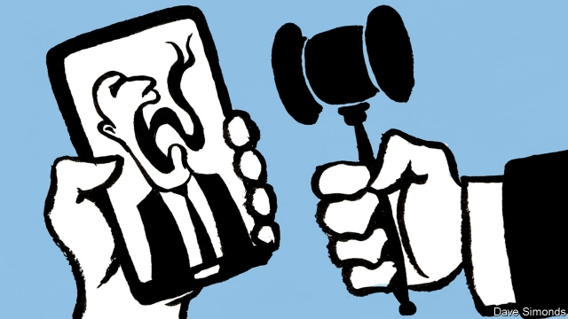

###### Democracy and the internet

# How to police political advertising 

 

> print-edition iconPrint edition | Leaders | Nov 30th 2019 

THE NEW YORK TIMES noted in 1859 that the telegraph was doing a lot to clean up politics. “The telegraph gives the speaker in the furthest East or West an audience as wide as the Union,” it wrote. That made it harder for politicians to promise to relax drinking laws in one city and impose Prohibition in another. 

A century and a half later the internet, the telegraph’s distant descendant, has once again transformed politics. Social networks have become the platforms of choice for politicians hoping to get their messages out and to give their opponents a kicking. The results can be seen in both the American and British elections. Online advertising, modest a decade ago, now accounts for around half the total. 

This time there is less happiness about the results. Elizabeth Warren, a contender for America’s presidency, has accused Facebook of “taking money to promote lies”, referring to the social network’s decision not to pass judgment on the content of the political ads it shows to its users. (To demonstrate her point, Ms Warren bought an ad stating, falsely, that Mark Zuckerberg, Facebook’s boss, had endorsed Donald Trump for re-election.) In Britain the ruling Conservative Party has embraced disinformation. During a televised debate on November 19th, the party’s Twitter account rebranded itself as “factcheckUK”, in an attempt to present party-political talking-points as disinterested truth. All this is merely one part of a greater worry that the internet, far from being a benevolent source of useful information, has become a swamp of lies, misdirection and conspiracy theories that is harming politics. 

Spooked—especially by the irritation of American politicians, who regulate them—some tech firms have changed their rules. Twitter is to ban nearly all political advertising. Google, which owns YouTube, says it will ban ads that make egregiously false claims, and restrict the precision with which political ads can be aimed at specific groups of people. For now, Facebook is sticking to its guns, saying it will not regulate political speech—though there are signs it is wavering (see article). 

Mr Zuckerberg is an unpopular man these days. Yet in this case he is right. The rules of digital democracy should not be set by unaccountable bosses in the boardrooms of a handful of American firms—let alone, in future, Chinese ones. If politicians want to change the behaviour of candidates, the levers are in their hands. It is their job to make the laws under which everyone else—technology firms included—must operate. 

Partisan rancour and short-term self-interest, particularly in America, may make that difficult. But history offers hope. Politicians have agreed in the past on whether and how to regulate other media technologies such as radio, television and newspapers. The rules created for analogue democracies offer a relatively uncontroversial starting-point for digital ones. In America, for instance, the source of political television ads must be disclosed. The same should be true online. Facebook’s decision to stand back looks more in keeping with the traditions of American democracy than Twitter’s or Google’s commitment to step in. Britain is much stricter. Political advertising is mostly banned on television and radio, with the exception of a limited number of tightly regulated “party-political broadcasts”. Again, it is not clear why the rules for online videos should be more relaxed than those for pitches that appear on television. 

New media offer new possibilities and hence raise new dangers. One is the ability to run “microtargeted” ads, aimed at small groups thought to be most receptive to their message. To the extent that it helps politicians deal with particular worries among voters, this can be beneficial. If abused, though, it could amplify exactly the sort of two-faced campaigning the telegraph was supposed to have banished. 

It is too soon to limit microtargeting. Not only would it be hard to draw clear lines but, more important, politicians should be reluctant to ban each other’s speech. As a first step, they should enforce transparency, ensuring that even narrowly targeted ads are available for anyone to examine. Rival politicians will have incentives to dig up evidence of foul play by their opponents, helping keep everyone honest. The tech giants are already making similar moves voluntarily. That could make it easier to convert them into legal requirements. 

Another difference between old media and new is that the tech firms are planet-spanning in a way that newspapers and television never were. Democracy, though, remains a local affair. America and Britain have different traditions; those of France, Australia or India are different again. If governments decide to tighten the rules around online advertising—and perhaps attempt to drain the digital swamp more broadly—the result will be a profusion of local laws for the tech firms to comply with. That will be a burden, but it is the price of success. ■ 

