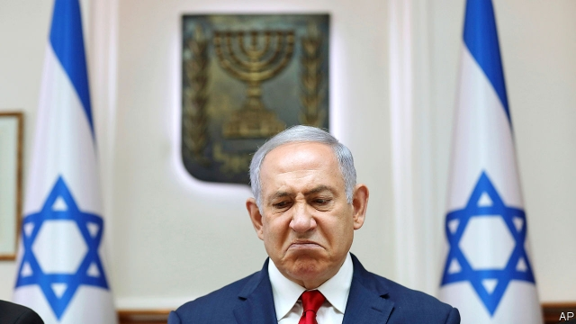

###### Israel’s charged politics

# Binyamin Netanyahu’s allies reconsider their indicted leader 

 

> print-edition iconPrint edition | Middle East and Africa | Nov 30th 2019 

THE RALLY’S organisers feared that turnout would be low. Even after a flurry of text messages and a big internet campaign, an underwhelming crowd of several thousand people showed up in downtown Tel Aviv on November 26th to protest against the “coup d’état”. That is how Binyamin Netanyahu, Israel’s prime minister, refers to the legal campaign against him. Five days earlier he was charged with bribery, fraud and breach of trust stemming from three corruption cases. Mr Netanyahu is the first sitting prime minister to be indicted. He denies all charges. 

The prime minister claims to be the victim of a left-wing conspiracy. Biased courts, police and media are to blame for his problems, he says. But after a decade in power, his grip on Israeli politics is weakening. His coalition of nationalist and religious parties failed to win a majority in two successive elections, in April and September. The opposition, led by the Blue and White party, has also come up short. Yet it has frustrated Mr Netanyahu’s attempts (and failed itself) to form a government, pushing the country towards another election. Cracks are even showing in his own Likud party, where he faces the most immediate challenge to his rule. 

Likudniks stuck with Mr Netanyahu even as it became clear earlier this year that the charges against him were coming. Many believe he is indeed a victim. Others think his political acumen gives them the best chance of winning elections. But some are starting to question both notions. It “isn’t an attempted coup,” says Gideon Saar, a former Likud minister. “Not only is it wrong to say that, it’s also irresponsible to say that.” He plans to challenge Mr Netanyahu for the party’s leadership: “I haven’t heard one person who thinks that after a third election, or a fourth, or a fifth, or a sixth, Prime Minister Netanyahu will succeed in forming a government.” 

Other Likud bigwigs are steering clear of the prime minister. The rally on November 26th was organised by the party, yet most of its members of the Knesset (parliament) didn’t show up. Mr Netanyahu has conceded that a vote on his party leadership is needed. Mr Saar wants it to be held immediately, so that a new leader would have a shot at negotiating a government with Blue and White before the December 11th deadline, after which another election must be held. Mr Netanyahu prefers to delay in order to guarantee himself more time in power. Even if he loses control of the party, he would remain prime minister until a new government is formed. 

Since its founding by Menachem Begin and Ariel Sharon in 1973, Likud has had only four leaders. It has never voted one out. Most have been successful: prime ministers from Likud have led Israel for 30 of the past 41 years. Having grown accustomed to power, some members now fear losing it. Mr Netanyahu no longer resembles the political “magician” who won four elections and became Israel’s longest-serving leader earlier this year. But he is still popular with the party’s rank and file. And, so far, no high-ranking Likudnik other than Mr Saar has called for him to go. 

Mr Netanyahu could lose his job in other ways. The law does not explicitly require an indicted prime minister to step down, but many Israelis question Mr Netanyahu’s ability to run the government while mounting his defence, and note the potential conflicts of interest that come with his power over the justice ministry and the police. His decision to remain in office is therefore likely to be challenged in court. Israel’s president, Reuven Rivlin, may also refuse to ask Mr Netanyahu to form a government even if he wins another parliamentary election. 

The prime minister is already preparing for one. His rhetoric is strikingly similar to that used by President Donald Trump, who is fighting his own battle against impeachment in America. “This is an attempted overthrow of a prime minister with a biased investigation,” says Mr Netanyahu, ignoring the fact that his former cabinet secretary, who is now attorney-general, brought the charges. Critics say Mr Netanyahu, like America’s president, is sowing division and damaging institutions—but perhaps not for much longer. ■ 

