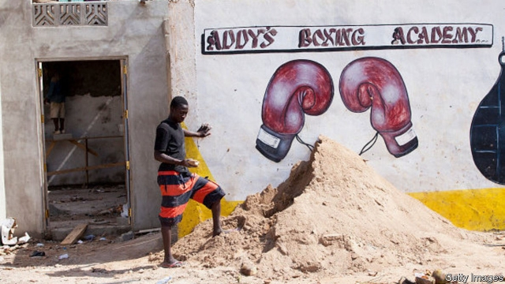

###### Ghana’s fight club

# Bukom boxers draw on a long fighting tradition 

 

> print-edition iconPrint edition | Middle East and Africa | Nov 30th 2019 

“THIS IS WHERE the magic happens,” says Carl Lokko, a boxing coach. His gym in Accra, the capital of Ghana, has two punchbags, a weights machine and a tin roof. A dozen young men, all sweat and sinew, are shadow-boxing or skipping furiously. “Everybody wants to be a boxer,” says one, fists thudding into an invisible opponent. He calls himself “Rich Man” Ashiley, a name which betrays his ambition. He says he fights for money and the chance “to go outside”, to Europe or America. 

The gym is one of about 30 in Bukom, a fishing district in Accra that is known as a cradle of champions. David Kotei, better known as DK Poison, fought his way off these streets; in 1975 he became the first Ghanaian to conquer the world. Another local boy, Azumah Nelson, is revered as the greatest African boxer of all time. The holder of the International Boxing Federation’s lightweight belt, Richard Commey, is one of Mr Lokko’s protégés. Most of Ghana’s ten world champions have passed through Bukom. 

The stars of today come from a “bloodline of warriors”, says Ekow Asmah, a sports journalist. In the early 20th century, boys from Bukom organised bare-knuckle brawls on beaches and moonlit streets. This asafo atwele (“group fighting”) helped to anchor the identity of the local Ga people in the fast-growing city. When colonial administrators cracked down, Ga fighters embraced Queensberry rules. From the traditional scuffles they inherited a whirling-fisted style and pugilistic pride. Mothers gave smaller dinner portions to sons who came home defeated and crying. Locals still boast that no one will separate two boys who start to fight. 

Aspiring champions rise at dawn, running past the fishing boats on the beach. In the muggy evenings they spar on street corners or train in open-air gyms. Some first pulled on the gloves when they were six years old. Bukom is one of the poorer parts of town, and boxing offers a route out of its congested alleys. “Most Ghanaian boxers come from adverse circumstances,” says Mr Asmah. “These are the real-life opponents that you must conquer.” 

Aficionados worry that Ghana is squandering its fighting talent. Although the previous government opened a 4,000-seat boxing arena in Bukom, a longstanding “soccer bias” crimps funding, complains Peter Zwennes, who heads the Ghana Boxing Authority. Promoters lack the means to stage big fights regularly. But Mr Lokko is not worried about the future. He points to the corner of his gym, where a posse of children watch with wide-eyed awe, their hands clenched into tiny fists. 

