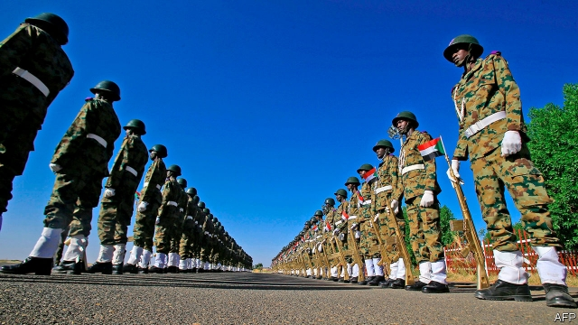
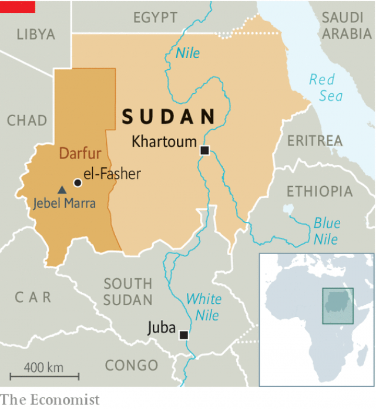

###### A slender chance for peace in Darfur

# Sudan’s revolution could end the conflict in Darfur 

 

> print-edition iconPrint edition | Middle East and Africa | Nov 30th 2019 

MEN WITH guns fill the town of el-Fasher in western Sudan’s troubled Darfur region. At the airport dozens are boarding or disembarking from planes, wearing uniforms of the Rapid Support Forces (RSF), a unit formed from Sudan’s murderous militia known as the Janjaweed. 

Down the road is the headquarters of UNAMID, the UN peacekeeping force that was brought in 12 years ago to stop a genocide by the Janjaweed and Sudan’s army, whose base is in the centre of town. Seven months after the fall of General Omar al-Bashir, the Sudanese president accused of orchestrating that genocide, el-Fasher still looks like a town on the edge of a war zone. 

But it has become more colourful of late. Mud walls along dusty streets are daubed with murals of the national flag and revolutionary slogans like “Sudan is for all”. They reflect a burst of optimism that a revolution that swept through Khartoum, the capital, in April may bring peace to a region synonymous with suffering. 

This hope has been fuelled by a power-sharing agreement signed in August between leaders of the protest movement and the generals who had staged a coup when it was clear that Mr Bashir would fall. The deal committed the interim government to negotiating a “comprehensive peace” in Darfur and other states afflicted by conflict within six months. The new government, headed by Abdalla Hamdok, an economist-turned-prime-minister, has since set up a peace commission and revived talks with rebel groups in Darfur. 

Sudan has been at war almost without interruption since its independence from Britain in 1956. For years an Arab-dominated Islamist government battled rebels from the Christian and animist south. Perhaps 2m people died in these wars before South Sudan was recognised in 2011 as Africa’s newest country. 

In 2003 armed groups began a rebellion in Darfur, a relatively prosperous region the size of Spain where black African locals complained that the government in Khartoum was oppressing them. In response, Mr Bashir armed nomadic Arab cattle-herders, turning them into the Janjaweed, a horse-mounted militia that was unleashed upon black farmers with such savagery that in 2010 the International Criminal Court (ICC) indicted Mr Bashir on charges of genocide. 

 

Many of those who were chased from their homes languish in camps near towns like el-Fasher or in neighbouring Chad. Their lands are occupied by armed Arab tribes that the victims still call the Janjaweed. Abdulrazig Abdallah, an elder in el-Fasher, says four people from his camp were killed in early September when they ventured to their farms for the harvest. Such incidents are commonplace. 

The new government has declared a ceasefire with rebels, which even the most recalcitrant seem to be observing. “This time both sides are serious,” says a UN official. Rebel leaders have been invited back from exile. And the government has markedly improved access for humanitarian organisations and journalists. 

Jeremiah Mamabolo, who heads the UN’s operation in Darfur, reckons a peace deal between the government and the rebels will be signed by early next year. But to have any chance of success it needs the support of Abdel Wahid al-Nur, the most influential but least compromising Darfuri rebel leader, who may soon return to the region after more than a decade in Paris. His faction of the Sudanese Liberation Army has, by some estimates, 2,000 fighters who are holed up in Darfur’s Jebel Marra. 

Resolving some of the issues fuelling the fighting will be tougher still. When the new prime minister visited a camp for displaced people in November, angry victims demanded their land and compensation. They also want to see the perpetrators of the attacks—in particular Mr Bashir—held to account. 

Whether any of these demands will be met depends on the balance of power between generals and civilians in the transitional government. Although Mr Hamdok runs a largely civilian administration, it is overseen by an 11-member Sovereign Council currently led by Lieutenant-General Abdel Fattah al-Burhan. The general is unwilling to hand Mr Bashir over to the ICC. 

Also on the council is Muhammad Hamdan Dagalo (known as Hemedti), an Arab Darfuri who controls the RSF, which added to its many crimes by slaughtering more than 100 protesters in Khartoum in June. The former camel-rustler has been steadily extending his influence over the peace process. When the two sides met in Juba, South Sudan’s capital, in October, Mr Dagalo led the government’s delegation. Diplomats note wryly that its two civilian representatives were not even introduced at the table. It is hard to see how Mr Dagalo would benefit from a peace agreement that might reduce the influence of the RSF, which he has recently been expanding, and could lead to scrutiny of his business interests—such as gold mines, an industry that has fuelled the conflict. 

Even if the talks lead to a lasting peace in Darfur, Sudan will need to address an issue that contributes to wider instability: little of the country’s wealth gets spread very far beyond Khartoum. Under Mr Bashir some 65-70% of state spending went on security. Almost nothing went to providing services such as schools in remote areas. “People in Khartoum don’t know anything about the rest of the country,” sniffs Said Shareef, a rebel commander. 

In recent months protesters in Darfur have begun demanding everything from free education to better public transport. “Until now we haven’t felt the change that has come to the rest of Sudan,” complains Haroun Nemir, a local leader. 

Each of Sudan’s previous uprisings against military dictatorships—in 1964 and 1985—failed either to produce stable democracy or to solve the problem of governing distant, unruly places whose inhabitants resent the rulers in Khartoum. Now the country has a chance to do things differently. But it is a slender one. ■ 

