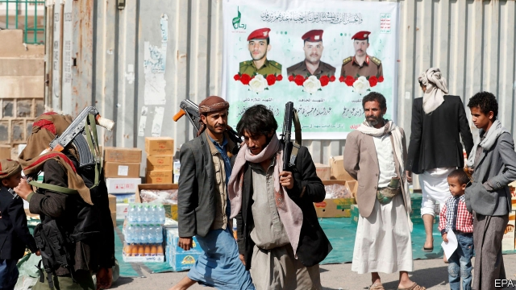
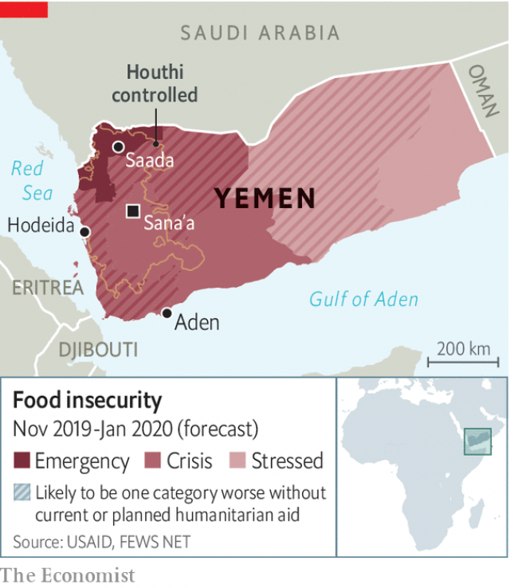

###### Food fight

# The Houthi rebels wrestle with the UN over food aid 

 

> print-edition iconPrint edition | Middle East and Africa | Nov 30th 2019 

TO THE HOUTHI rebels, aid workers are spies and food is a tool of espionage. For nearly five years the Houthis have waged war against the Yemeni government, capturing much of the country and helping to create what the United Nations calls the worst humanitarian crisis in the world. About half of the population relies on food aid. But instead of helping it reach the needy, the Houthis are getting in the way. Over the past two years they have detained dozens of relief workers. The UN accuses them of blocking aid of all kinds to some 5m people. 

As the Houthis see it, the UN is being used by their enemies, Saudi Arabia and the United Arab Emirates, which support the government. The two countries donate much of the $4bn that the UN spends each year in Yemen. In return, say Houthi officials, the body serves as their eyes and ears in the north. Houthi preachers accuse the UN of withholding aid for the hungry or sending rotten food. “If the Saudi-backed coalition doesn’t kill you, the UN will,” say the Houthis’ backers on social media. 

The UN used to blame a Saudi and Emirati blockade for malnutrition in the north. Its focus has shifted to the Houthis, though. The World Food Programme (WFP), which manages half of the UN’s budget in Yemen, imports enough food for 12m people. But the Houthis’ network of mushrifeen (supervisors) often determines who gets it. The families of supporters and those who go to the front are well fed. Some of the food is diverted to favoured traders, who sell it. Areas where the Houthis are unpopular tend to lose out. 

 

In November the Houthis unveiled a new body to oversee all humanitarian efforts. It is headed by a security official. Yemenis working for groups such as the UN must file reports on their activities. International aid agencies face pressure to hire Houthi loyalists, pay “customs taxes” and cover the rebels’ expenses. Those that do not do so risk losing their access or having their staff detained. 

Distributing aid is hard enough in Yemen without Houthi interference. The WFP relies, in part, on a census from 2004. Earlier this year it wanted to roll out a biometric system to identify those most in need, but when the Houthis realised it would bypass their supervision they balked. The system is already used in government-controlled areas. 

“Anywhere else, the UN Security Council would have gone nuts,” says a UN official in Sana’a, the Houthi-controlled capital. But the UN’s special envoy, Martin Griffiths, wants to keep the rebels at the negotiating table as he tries to achieve peace. Many of those involved with aid in the north are afraid to speak out, or are caught up in the Houthis’ schemes. UN officials suspect that a number of the organisation’s own workers have colluded with combatants on both sides of the war to get rich from aid. 

Some officials worry that if the UN condemns the Houthis too loudly, donors will walk away from aid programmes or the rebels will pull the plug on them. It may not seem like it, but things can actually get worse. 

