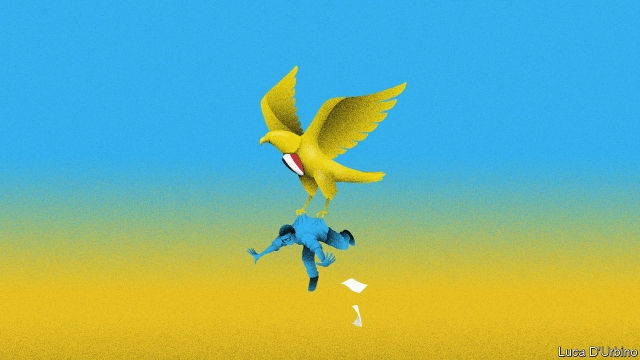

###### Sisi and son

# The authorities in Egypt raid Mada Masr—and reveal their fears 

 

> print-edition iconPrint edition | Middle East and Africa | Nov 30th 2019 

UNTIL LATE November the staff at Mada Masr, an online newspaper, would sometimes wonder, only half in jest, why they had not been arrested. These are bleak times for Egypt’s press. No country, except for China and Turkey, locks up more journalists. A private-equity firm with links to the security services has snapped up once-popular newspapers and television stations. Most media outlets are now controlled by the state or its allies. The regime dictates headlines to servile editors. 

Founded in 2013, Mada Masr (which means “the scope of Egypt”) is a rare exception. It is the last big venue for free, critical journalism in Egypt. Although its website has been blocked in the country for the past two years, its content can still be perused using a virtual private network (VPN) or on Facebook. Authorities have not moved to shut it down, perhaps in part due to its prominence abroad. Published in Arabic and English, it is a vital resource for diplomats and analysts. 

But just before dawn on November 23rd plainclothes officers arrested one of its editors, Shady Zalat, at his flat in Cairo. They did not have a warrant. The next afternoon police raided Mada Masr’s office, confiscating phones and detaining three of its staff, including the editor-in-chief, Lina Atallah. As police raids go in Egypt, this one was mild. All three were released within hours. So was Mr Zalat, dropped unceremoniously on the side of a highway. Still, the raid was a warning—one that reveals much about the regime’s fears. 

Egypt’s public prosecutor claimed that the website had links to the Muslim Brotherhood, a banned Islamist movement. That was a predictable assertion—the Brotherhood is blamed for everything in Egypt. It is also laughable. Mada Masr has a leftist bent, and many of its journalists sharply criticised the Brotherhood during its bumbling year in power. 

It seems more likely that the raid was triggered by a critical report about Mahmoud al-Sisi, the eldest son of President Abdel-Fattah al-Sisi, Egypt’s army-backed dictator. Mahmoud has risen rapidly through the ranks of the General Intelligence Service (GIS), a spy agency that reports directly to the president. According to Mada Masr, however, Mahmoud will soon be quietly packed off to Egypt’s embassy in Moscow. 

Branches of Egypt’s sprawling security apparatus have long competed for influence. Gamal Abdel Nasser, a former president, used the GIS as a tool to monitor rivals in the army. The elder Mr Sisi has tried to pack the agency with loyalists, many plucked from the military-intelligence service where he spent a career in uniform. That has rankled long-serving officers, as has Mahmoud’s prominent role. 

The son’s performance has not won many plaudits either, reports Mada Masr. One of his portfolios, as a sort of media tsar, seems to have left even his father unimpressed: Mr Sisi has criticised Egypt’s press for being insufficiently supportive. The last straw seems to have been Mahmoud’s handling of unexpected protests in September. These were triggered by videos shot by Muhammad Ali, a businessman and film star who claimed to know details of corruption in projects being overseen by the armed forces. 

The protests were small and fizzled out within a week. They posed no serious threat. But the regime reacted furiously. More than 4,000 people were arrested, a figure that may far exceed the number of actual protesters. For weeks, police in downtown Cairo would force passers-by to unlock their phones so officers could check their social-media accounts for subversive content. If anything, the crackdown brought more attention to the protests. 

The regime is trying to crush any other forms of dissent, too. This month police arrested a Coptic activist, Ramy Kamel, and charged him with terrorism for his work documenting attacks on Christians, which often go unpunished. Economists who question the official narrative can find themselves hauled in for a different sort of questioning. And earlier this month the government offered a tour of Tora prison, which is notorious for torture. Inmates, no doubt free to speak their minds, praised the quality of the food. 

Mahmoud, for his part, is not gone. His new assignment looks more like a cooling-off period than a permanent sidelining. Russia is hardly a backwater. But the move is a rare concession from a regime loth to admit failure. The elder Mr Sisi argues that Egypt needs a stable hand after years of political chaos. This stability has a Potemkin quality to it. He is repeating many of the mistakes of his predecessors, from a focus on state-led economic growth to a reliance on favourite sons. And his defences, in the face of rare but legitimate criticism, are increasingly threadbare. ■ 

